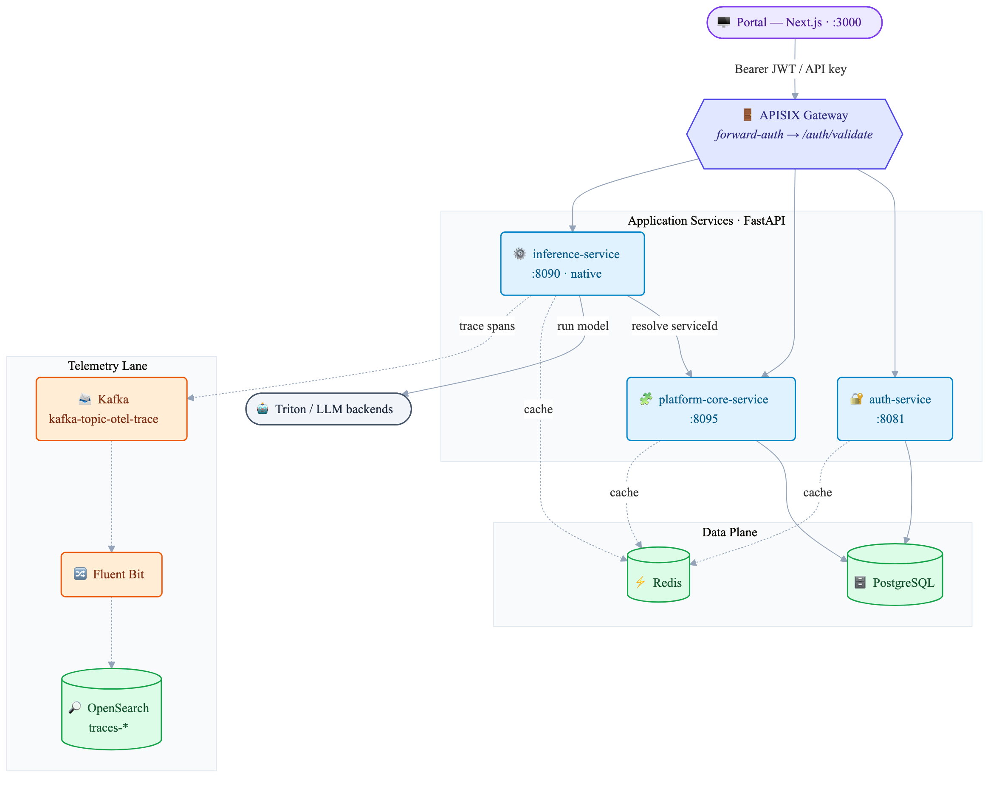
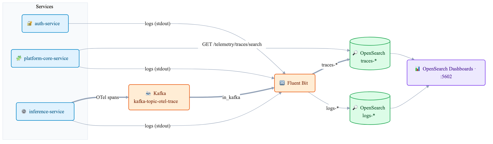

# AI4I-Orchestrate Microservices Platform

> **Open-source codebase** for building AI/ML microservices for Indic languages.
> Not a hosted service — you deploy and manage it yourself.

[](https://opensource.org/licenses/MIT)
[](https://github.com/COSS-India/ai4i-core/issues)
[](https://github.com/COSS-India/ai4i-core/stargazers)

---

## Table of contents

1. [What This Repository Provides](#-what-this-repository-provides)
2. [Who This Project Is For](#-who-this-project-is-for)
3. [Architecture Overview](#-architecture-overview)
4. [What's Included](#-whats-included)
5. [Core Services](#-core-services)
6. [Frontend](#-frontend)
7. [Technology Stack](#-technology-stack)
8. [Deploy Your Own Instance](#-deploy-your-own-instance) — [Prerequisites](#prerequisites) · [Install](#install) · [Configure](#configure) · [Run](#run) · [Service URLs](#service-urls-local) · [Troubleshoot](#troubleshoot)
9. [Documentation](#-documentation)
10. [Monitoring & Observability](#-monitoring--observability)
11. [Contributing](#-contributing)
12. [Releases](#-releases)
13. [License](#-license)
14. [Community & Support](#-community--support)

## 🎯 What This Repository Provides

An open-sourced and Digital Public Good (DPG) for Language AI services. It supports multi-lingual NLP models (NMT, ASR, TTS, OCR etc) and LLM with end to end observability, multi-tenancy, monitorinig, alerting and notification capabilities. This enable governments, ministries, national AI missions, and enterprises to operate AI as shared, governed infrastructure instead of isolated implementations by providing a common operational layer between AI model providers and AI-powered applications.
## 👥 Who This Project Is For

This project is intended for anyone who wants to **deploy and operate multilingual
language-AI services on their own infrastructure** rather than depend on a hosted API.

You will get the most from it if you are comfortable with Docker, Python, and running
backend services. It suits teams that need multi-tenant access control, a model/service
registry, and built-in observability out of the box, and that want full control over where
data and models run (for data-residency, cost, or customization reasons).

It is **not** a hosted service, a managed SaaS, or a set of pre-trained models. You bring
your own model servers (Triton or OpenAI-compatible backends) and deploy the platform
yourself.

### Stakeholders in the ecosystem

1. **Adopter** (Platform Owner) - Sets up and operates the Language AI platform: installs AI4I-Orchestrate, defines governance policy, onboards customers and models, and runs the deployment as national  infrastructure. 
2. **Tenant Organizations** - Departments, ministries, startups, or enterprises who build their own citizen- or customer-facing applications by leveraging the AI services offered by the Adopter's Language AI platform; they manage their own budgets and usage within the Adopter's policy. 
3. **Model Providers** - Publish NLP and models, manage versions
4. **End Users** - the citizens or customers who use the applications Tenant Organizations build (a portal, an app etc.,) They are unaware that AI4I-Orchestrate is the layer powering the AI services behind those applications. 


### Who are adopters
Any national, state, or institutional entity that takes AI4I-Orchestrate and runs it as their own governed AI layer 

1. National AI Operators — national governments or Ministries or digital missions standing up shared, sovereign AI infrastructure to serve public services across ministries and citizen-facing platforms
2. State AI Operators — state or regional governments running their own governed AI layer across departments, without depending on a central or external stack
3. Any organization serving AI to multiple departments/teams/ consumers — Enterprises running AI across business units, GPU/cloud providers layering governance on top of raw compute, universities and research consortia serving multiple affiliated groups

## 🏗️ Architecture Overview

The platform is **three application microservices** behind an APISIX gateway, sharing a
PostgreSQL/Redis data plane. Inference trace spans flow out on a **separate observability
lane** (dotted) so they never touch the business-data path.



<!-- Source: docs/images/architecture.mmd — regenerate with:
     npx @mermaid-js/mermaid-cli -i docs/images/architecture.mmd -o docs/images/architecture.png -b white -s 2 -->

> **Solid** arrows = request / business-data path; **dotted** = cache and the telemetry
> lane. Full diagrams (system, request sequence, telemetry lane) and code references:
> **[docs/architecture/00-overview.md](./docs/architecture/00-overview.md)** — start here.
> Every external request is authorized at the gateway via auth-service `/auth/validate`
> (forward-auth), which returns identity headers (`X-User-ID`, `X-Tenant-ID`) the
> downstream service trusts.

## 📦 What's Included

- ✅ **Source code** for all backend services and the frontend
- ✅ **Docker Compose** (`docker-compose-local.yml`) for local infrastructure
- ✅ **Alembic migrations** for the PostgreSQL schemas
- ✅ **Shared Python library** (`libs/ai4i_core`): logging + request middleware,
  observability (OpenTelemetry + Prometheus ASGI), bootstrap (API versioning, async DB),
  email, exceptions, request-scoped context
- ✅ **Code-anchored documentation** — every non-obvious claim links to a source path

> **Note on gateways:** the production infrastructure uses
> **APISIX** (external to this repo) for path routing and forward-auth.
> In the **local development setup** defined by `docker-compose-local.yml`
> there is no gateway container — the Simple UI's Next.js dev server proxies
> every `/api/v1/*` request through a catch-all API route
> (`frontend/simple-ui/src/pages/api/v1/[...proxy].ts`) that performs the same
> path routing and forward-auth (calling auth-service `/api/v1/auth/validate`)
> and forwards to the backend services directly. See
> [`docs/SETUP_GUIDE.md`](./docs/SETUP_GUIDE.md) for local-setup specifics.

## 🎯 Core Services

The AI/ML capabilities (NMT, ASR, TTS, NER, OCR, …) are **consolidated into a single
`inference-service`**, not separate per-modality services.

| Service | Port | Database | Purpose | Docs |
|---------|------|----------|---------|------|
| **auth-service** | `8081` | PostgreSQL `ai4iplatform_auth` | AuthN/AuthZ, users, tenants, RBAC, API keys, OAuth2; issues & validates JWTs | [README](./services/auth-service/README.md) · [Architecture](./docs/architecture/01-auth-service.md) |
| **platform-core-service** | `8095` | PostgreSQL `ai4iplatform_core` | Model & service registry, alerts, telemetry (trace) query | [README](./services/platform-core-service/README.md) · [Architecture](./docs/architecture/02-platform-core-service.md) |
| **inference-service** | `8090` | stateless | Unified inference orchestration over Triton / OpenAI-compatible backends (tasks below) | [README](./services/inference-service/README.md) · [Architecture](./docs/architecture/03-inference-service.md) |

> In local development all three application services run **natively** on the host (Docker
> hosts only the infrastructure). The `docker-compose-local.yml` file also includes
> container definitions for them, used by the alternative all-in-Docker workflow in
> `docs/SETUP_GUIDE.md` (where platform-core is published on host `8102`).

### Inference services

All inference services share one unified endpoint `POST /api/v1/inference` (routed by
`task_type`), each also exposed as a per-service alias `POST /api/v1/{task}/inference`. LLM
uses an OpenAI-compatible `POST /api/v1/chat/completions`.

| Service | `task_type` | Endpoint | Description |
|---------|-------------|----------|-------------|
| Machine Translation | `NMT` | `/api/v1/nmt/inference` | Neural machine translation |
| Speech Recognition | `ASR` | `/api/v1/asr/inference` | Speech → text |
| Text-to-Speech | `TTS` | `/api/v1/tts/inference` | Text → audio |
| Named Entity Recognition | `NER` | `/api/v1/ner/inference` | Entity extraction |
| OCR | `OCR` | `/api/v1/ocr/inference` | Image → text |
| Transliteration | `TRANSLITERATION` | `/api/v1/transliteration/inference` | Script transliteration |
| Language Detection | `LANGUAGE_DETECTION` | `/api/v1/language-detection/inference` | Text language identification |
| Audio Language Detection | `AUDIO_LANGUAGE_DETECTION` | `/api/v1/audio-lang-detection/inference` | Spoken-language identification |
| Speaker Diarization | `SPEAKER_DIARIZATION` | `/api/v1/speaker-diarization/inference` | Who-spoke-when segmentation |
| Language Diarization | `LANGUAGE_DIARIZATION` | `/api/v1/language-diarization/inference` | Multilingual audio segmentation |
| LLM Chat | — | `/api/v1/chat/completions` | OpenAI-compatible chat completions |

> Source of truth: `services/inference-service/orchestrator/task_service_registry.py`
> (`GET /api/v1/inference/tasks` lists what the running service has registered).

**PII detection & redaction is NOT served by the inference-service.** It lives in
**platform-core-service** (control plane) under `/api/v1/pii/*` — domain
policies, regex patterns, tenant-domain mappings, audit logs, and the
`redact-text` endpoint. Source:
`services/platform-core-service/app/routes/pii.py`. The `PIITaskService` stub
that still appears in `task_service_registry.py` is a 501 placeholder kept so
PII inference requests fail loudly instead of falling through.

## 🎨 Frontend

- **Simple UI** (`frontend/simple-ui`, port `3000`) — web interface built with **Next.js 14**,
  **React 18**, and **TypeScript** for exercising the platform's APIs.

## 🛠️ Technology Stack

### Backend
- **FastAPI** · **Python 3.11** — async microservices
- **PostgreSQL 15** — primary relational store (per-service databases)
- **Redis 7** — cache, rate-limit/session state, resolution cache
- **SQLAlchemy (async)** + **Alembic** — ORM & migrations
- **Pydantic** — validation/serialization
- **NVIDIA Triton** / OpenAI-compatible **LLM** backends — model serving

### Frontend
- **Next.js 14** · **React 18** · **TypeScript** · **zod**

### Gateway & Infrastructure
- **APISIX** — API gateway in production / staging / dev (forward-auth via `/auth/validate`; external to this repo). For local development there is no gateway container — the Simple UI's Next.js dev server proxies `/api/v1/*` through `frontend/simple-ui/src/pages/api/v1/[...proxy].ts`, which handles path routing and forward-auth.
- **Docker Compose** — local infrastructure (`docker-compose-local.yml`)
- **Kafka + Zookeeper** — OpenTelemetry span transport (telemetry lane)
- **Prometheus · Grafana · Alertmanager · Node Exporter** — metrics & alerting
- **OpenSearch + Dashboards · Fluent Bit** — logs & trace (`traces-*`) storage

## 🚀 Deploy Your Own Instance

Get started by installing the prerequisites, then follow **Install → Configure → Run**. For
the full walkthrough (per-service `.env` files, seed data, model endpoints), see
**[docs/SETUP_GUIDE.md](./docs/SETUP_GUIDE.md)**.

### Prerequisites
Docker runs the **infrastructure only**; the application services run **natively** on the host.
- **Docker 20.10+ / Docker Compose 2.0+** — for infrastructure (PostgreSQL, Redis, Kafka, OpenSearch, Prometheus, …)
- **Python 3.11 + pip** — for the application services (auth, platform-core, inference)
- **Node 18+** — for the Simple UI frontend
- ~16 GB RAM recommended for the full stack; Linux / macOS; **Windows requires WSL2** — run Docker, services, and frontend entirely inside WSL (see [docs/SETUP_GUIDE.md](./docs/SETUP_GUIDE.md#windows-wsl))

### Install
Clone the repository. Python and Node dependencies are installed per service in the [Run](#run) step.
```bash
git clone https://github.com/COSS-India/ai4i-core.git
cd ai4i-core
```

### Configure
Generate the environment files. This creates the root `.env` and per-service `.env` files.
```bash
./scripts/setup-env.sh
```
Set your model-server endpoints (`TRITON_ENDPOINT_*`) and any secrets before running. The full
list of variables and defaults is in [docs/SETUP_GUIDE.md](./docs/SETUP_GUIDE.md).

### Run
```bash
# 1. Start INFRASTRUCTURE in Docker (not the app services)
#    (add opensearch fluent-bit prometheus grafana for the full observability stack)
docker compose -f docker-compose-local.yml up -d postgres redis kafka zookeeper

# 2. Run database migrations and seed data (see docs/SETUP_GUIDE.md, Step 5)
./scripts/migrate.sh all upgrade

# 3. Run each application service NATIVELY (separate terminals)
cd services/auth-service          && pip install -r requirements.txt && uvicorn app.main:app --port 8081
cd services/platform-core-service && pip install -r requirements.txt && uvicorn app.main:app --port 8095
cd services/inference-service     && pip install -r requirements.txt && python main.py          # :8090

# 4. Run the frontend natively
cd frontend/simple-ui && npm install && npm run dev                                              # :3000
```

### Service URLs (local)
| URL | What |
|-----|------|
| http://localhost:3000 | Portal (Simple UI) |
| http://localhost:8081 | auth-service |
| http://localhost:8095 | platform-core-service |
| http://localhost:8090 | inference-service |
| http://localhost:3001 | Grafana |
| http://localhost:9090 | Prometheus |
| http://localhost:5602 | OpenSearch Dashboards |

### Troubleshoot
Common local-setup issues and fixes. Full details in the setup guides linked below.

| Issue | Solution |
|-------|----------|
| Frontend loads at `:3000` but API calls fail (Windows) | Run Docker, the Python services, and `npm run dev` all from the **same WSL2 environment** so they share `localhost`. See [SETUP_GUIDE.md#troubleshooting](./docs/SETUP_GUIDE.md#troubleshooting). |
| Service errors with connection refused on startup | The service `.env` must use `localhost`, not the Docker-internal hostnames `postgres`/`redis`. Check `grep -E "HOST\|PORT" services/<svc>/.env`. |
| `migrate.sh` fails with a database connection error | Ensure Postgres is running (`docker compose -f docker-compose-local.yml ps postgres`) and `POSTGRES_HOST=localhost` in the migrations `.env`. |
| Inference call returns an error for a seeded service | The service was seeded with a blank `endpoint`. `PATCH /api/v1/services` with a reachable model-server URL. See [SETUP_GUIDE.md](./docs/SETUP_GUIDE.md), Step 10. |

Other troubleshooting support:
- [docs/SETUP_GUIDE.md#troubleshooting](./docs/SETUP_GUIDE.md#troubleshooting) — local native setup
- [docs/END-TO-END-SETUP-GUIDE.md#troubleshooting](./docs/END-TO-END-SETUP-GUIDE.md#troubleshooting) — end-to-end setup
- [GitHub Issues](https://github.com/COSS-India/ai4i-core/issues)

## 📖 Documentation

### Architecture (code-anchored)
- [docs/architecture/00-overview.md](./docs/architecture/00-overview.md) — system overview (**start here**)
- [docs/architecture/01-auth-service.md](./docs/architecture/01-auth-service.md) — auth/RBAC, tenants, API keys, OAuth2, JWT
- [docs/architecture/02-platform-core-service.md](./docs/architecture/02-platform-core-service.md) — model/service registry, alerts, telemetry query
- [docs/architecture/03-inference-service.md](./docs/architecture/03-inference-service.md) — inference orchestration over Triton/LLM

### Setup & deployment
- [docs/SETUP_GUIDE.md](./docs/SETUP_GUIDE.md) — comprehensive local setup (Windows/WSL covered)
- [docs/END-TO-END-SETUP-GUIDE.md](./docs/END-TO-END-SETUP-GUIDE.md) — end-to-end setup walkthrough
- [docs/SINGLE_COMMAND_SETUP.md](./docs/SINGLE_COMMAND_SETUP.md) — single-command setup
- [docs/DEPLOYMENT.md](./docs/DEPLOYMENT.md) — production deployment guide
- [docs/DOCKER-COMPOSE-LOCAL-REFERENCE.md](./docs/DOCKER-COMPOSE-LOCAL-REFERENCE.md) — `docker-compose-local.yml` reference
- [docs/TRACING-OBSERVABILITY-LOCAL-SETUP.md](./docs/TRACING-OBSERVABILITY-LOCAL-SETUP.md) — local tracing & observability

### Usage
- [docs/USER_GUIDE.md](./docs/USER_GUIDE.md) — end-user guide (auth, inference requests, Simple UI, FAQ)

### Codebase & API
- [docs/CODEBASE_GUIDE.md](./docs/CODEBASE_GUIDE.md) — how the codebase is organized
- **Live OpenAPI 3.x per service** — Swagger UI at `/docs`, ReDoc at `/redoc`, raw spec at `/openapi.json` (auto-generated at runtime; no static spec files)

### Service READMEs
- [auth-service](./services/auth-service/README.md) · [platform-core-service](./services/platform-core-service/README.md) · [inference-service](./services/inference-service/README.md) ([design](./services/inference-service/ARCHITECTURE.md))
- [kafka-consumers](./services/kafka-consumers/README.md) — background span/telemetry consumers ([design](./services/kafka-consumers/ARCHITECTURE.md))

### Licensing
- [docs/THIRD_PARTY_LICENSES.md](./docs/THIRD_PARTY_LICENSES.md) — all third-party open source dependencies, versions, and licenses

### Privacy & compliance
- [docs/compliance/PII_DATA_INVENTORY.md](./docs/compliance/PII_DATA_INVENTORY.md) — inventory of all PII collected/stored, retention, access, and protection (DPG review)
- [docs/compliance/DPG_DOCUMENTATION.md](./docs/compliance/DPG_DOCUMENTATION.md) — DPG documentation summary and index of all docs

### Contributing & releases
- [CONTRIBUTING.md](./CONTRIBUTING.md) · [CODE_OF_CONDUCT.md](./CODE_OF_CONDUCT.md) · [RELEASE.md](./RELEASE.md) · [CHANGELOG.md](./CHANGELOG.md)

## 🤝 Contributing

1. Branch off `dev` (`git checkout -b feat/your-change origin/dev`)
2. Make changes following the existing patterns; keep migrations single-headed
   (validated by `scripts/validate-migrations.py`, run as a pre-commit hook)
3. Open a Pull Request against `dev`

See [CONTRIBUTING.md](./CONTRIBUTING.md) for full contribution guidelines.

## 🚀 Releases

New versions are published as a PyPI package (`ai4i-core`). Release notes are on the
[GitHub Releases](https://github.com/COSS-India/ai4i-core/releases) page.

- **[RELEASE.md](./RELEASE.md)** — branching model, versioning scheme, and step-by-step
  instructions for cutting a release
- **[CHANGELOG.md](./CHANGELOG.md)** — per-version history of notable changes

## 📊 Monitoring & Observability

- **Metrics** — services expose Prometheus metrics (scraped by **Prometheus**,
  visualized in **Grafana**, alerted via **Alertmanager**).
- **Logs** — structured JSON logs (`ai4i_core.logging`) shipped by **Fluent Bit** to
  **OpenSearch**.
- **Traces** — only **inference-service** emits OpenTelemetry spans; they flow
  **Kafka (`kafka-topic-otel-trace`) → Fluent Bit → OpenSearch `traces-*`**, queried via
  platform-core's `/telemetry/traces/search`.



<!-- Source: docs/images/observability.mmd — regenerate with:
     npx @mermaid-js/mermaid-cli -i docs/images/observability.mmd -o docs/images/observability.png -b white -s 2 -->

> **Logs** (thin arrows): every service writes structured JSON to stdout → **Fluent Bit**
> tails it → OpenSearch **`logs-*`**. **Traces** (thick arrows): inference-service spans →
> **Kafka** → Fluent Bit (`in_kafka`, lifts the span payload) → OpenSearch **`traces-*`**.
> Both are viewable in **OpenSearch Dashboards**; platform-core reads `traces-*` for the
> trace API. Metrics go the separate Prometheus → Grafana/Alertmanager route.

## 📄 License

Licensed under the **MIT License** — see [LICENSE](./LICENSE).

## 💬 Community & Support

Open-source project — support is community-based:
- **Issues:** [GitHub Issues](https://github.com/COSS-India/ai4i-core/issues)
- **Docs:** the [`docs/`](./docs/) directory
- **Debugging:** infrastructure logs via `docker compose -f docker-compose-local.yml logs <service>`;
  app-service logs appear in the terminal running each service; check per-service `/health` endpoints

> Provided as-is; no commercial SLA.
