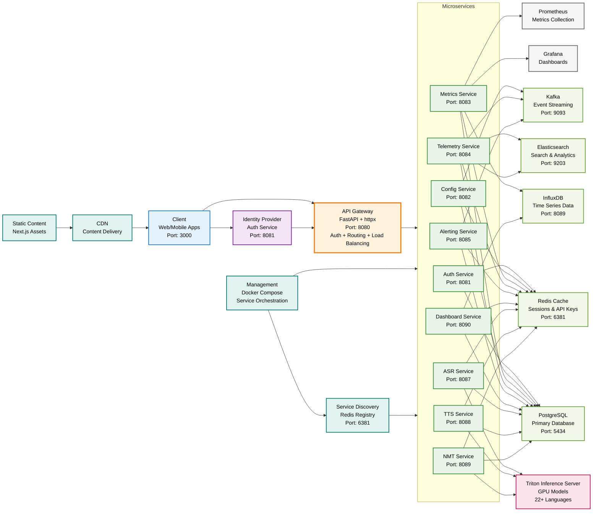
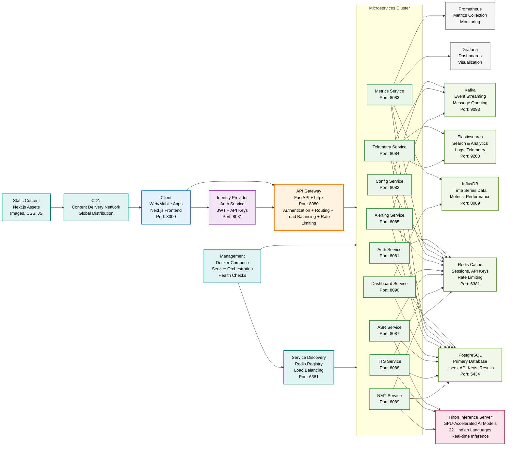
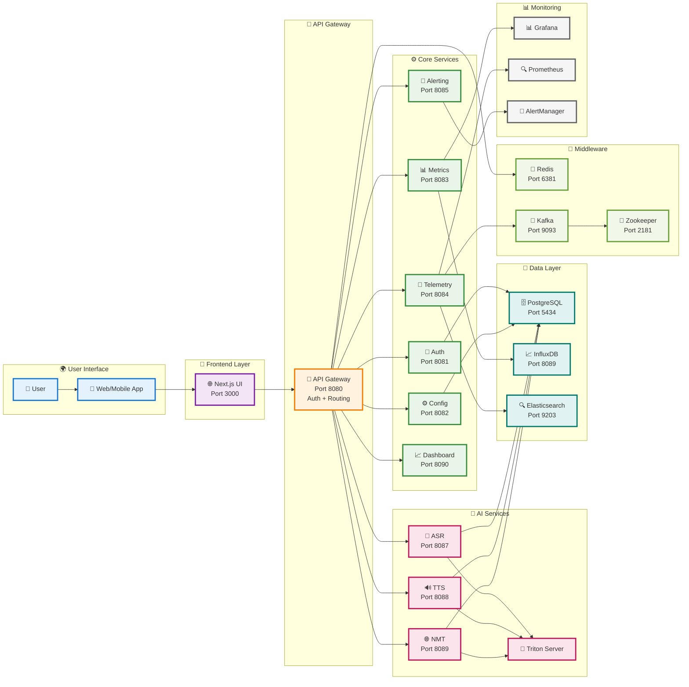
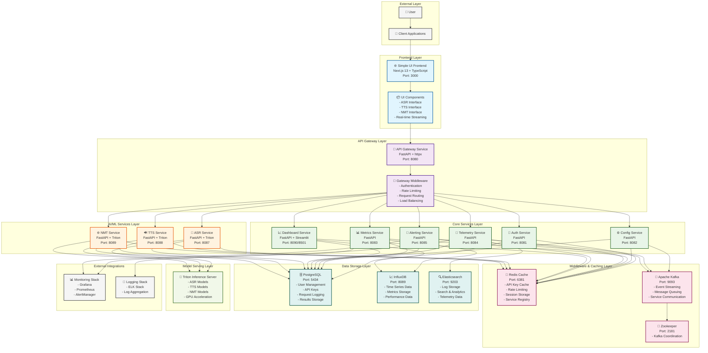
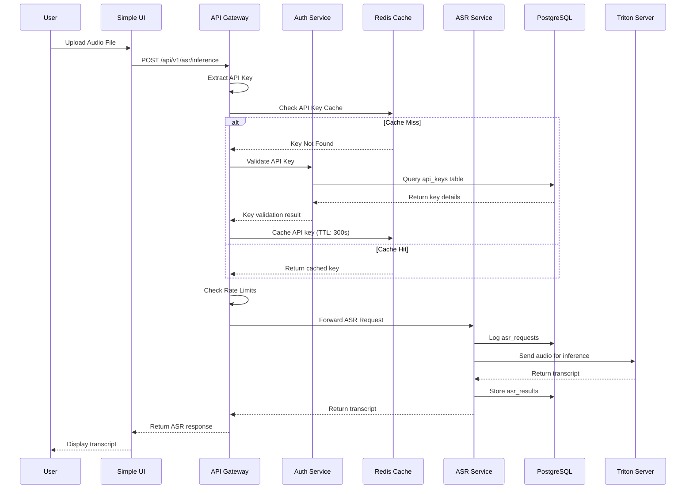
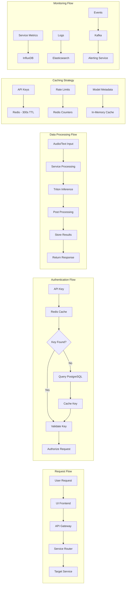
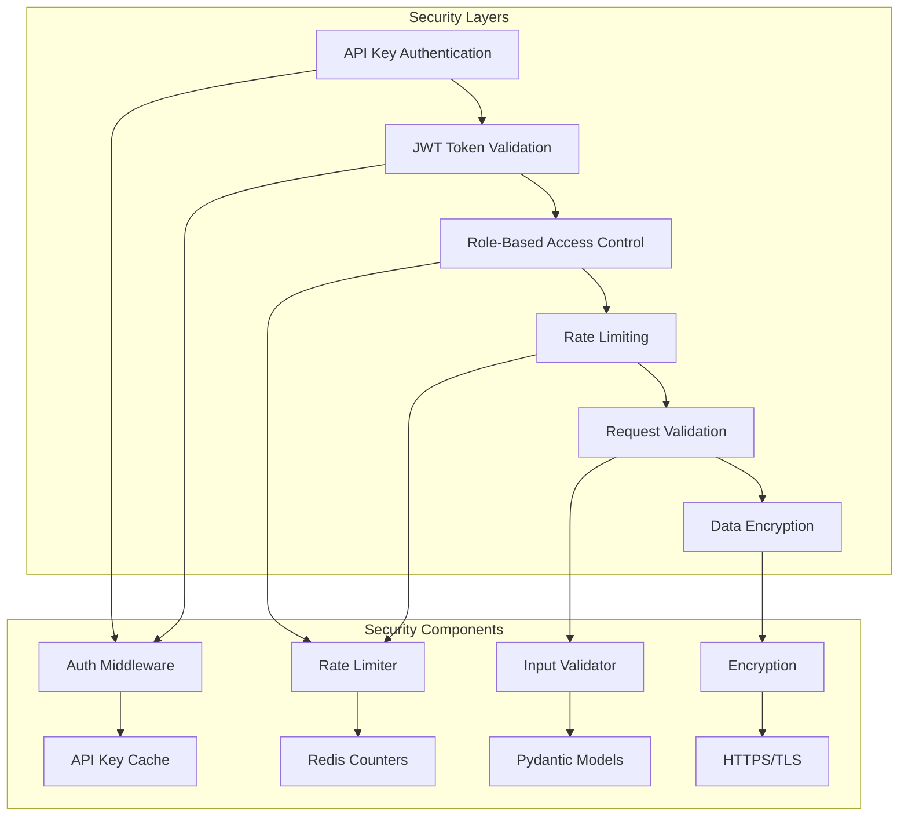

# Ai4V-C Microservices Architecture Diagram

## Visual ASCII Architecture Diagram

```
┌─────────────────────────────────────────────────────────────────────────────────────────────────┐
│                                    AI4V-C MICROSERVICES PLATFORM                                │
└─────────────────────────────────────────────────────────────────────────────────────────────────┘

┌─────────────────────────────────────────────────────────────────────────────────────────────────┐
│                                    EXTERNAL LAYER                                               │
│  ┌─────────────┐    ┌─────────────────────────────────────────────────────────────────────┐    │
│  │     👤      │    │                    📱 Client Applications                            │    │
│  │   Users     │────│              (Web, Mobile, API Clients)                             │    │
│  └─────────────┘    └─────────────────────────────────────────────────────────────────────┘    │
└─────────────────────────────────────────────────────────────────────────────────────────────────┘
                                        │
                                        ▼
┌─────────────────────────────────────────────────────────────────────────────────────────────────┐
│                                    FRONTEND LAYER                                              │
│  ┌─────────────────────────────────────────────────────────────────────────────────────────┐    │
│  │                    🌐 Simple UI Frontend (Next.js 13 + TypeScript)                     │    │
│  │                              Port: 3000                                                │    │
│  │  ┌─────────────┐ ┌─────────────┐ ┌─────────────┐ ┌─────────────┐ ┌─────────────┐      │    │
│  │  │   🎤 ASR    │ │   🔊 TTS    │ │   🌐 NMT    │ │  📊 Real-time│ │  🔧 Settings│      │    │
│  │  │  Interface  │ │  Interface  │ │  Interface  │ │  Streaming  │ │   Panel     │      │    │
│  │  └─────────────┘ └─────────────┘ └─────────────┘ └─────────────┘ └─────────────┘      │    │
│  └─────────────────────────────────────────────────────────────────────────────────────────┘    │
└─────────────────────────────────────────────────────────────────────────────────────────────────┘
                                        │
                                        ▼
┌─────────────────────────────────────────────────────────────────────────────────────────────────┐
│                                  API GATEWAY LAYER                                             │
│  ┌─────────────────────────────────────────────────────────────────────────────────────────┐    │
│  │                    🚪 API Gateway Service (FastAPI + httpx)                            │    │
│  │                              Port: 8080                                                │    │
│  │  ┌─────────────┐ ┌─────────────┐ ┌─────────────┐ ┌─────────────┐ ┌─────────────┐      │    │
│  │  │ 🔐 Auth     │ │ ⚡ Rate     │ │ 🛣️  Request │ │ ⚖️  Load    │ │ 🔄 Service  │      │    │
│  │  │ Middleware  │ │ Limiting    │ │ Routing     │ │ Balancing   │ │ Discovery   │      │    │
│  │  └─────────────┘ └─────────────┘ └─────────────┘ └─────────────┘ └─────────────┘      │    │
│  └─────────────────────────────────────────────────────────────────────────────────────────┘    │
└─────────────────────────────────────────────────────────────────────────────────────────────────┘
                                        │
                    ┌───────────────────┼───────────────────┐
                    ▼                   ▼                   ▼
┌─────────────────────────────────────────────────────────────────────────────────────────────────┐
│                                  CORE SERVICES LAYER                                          │
│  ┌─────────────┐ ┌─────────────┐ ┌─────────────┐ ┌─────────────┐ ┌─────────────┐ ┌─────────────┐│
│  │ 🔐 Auth     │ │ ⚙️  Config  │ │ 📊 Metrics  │ │ 📡 Telemetry│ │ 🚨 Alerting │ │ 📈 Dashboard││
│  │ Service     │ │ Service     │ │ Service     │ │ Service     │ │ Service     │ │ Service     ││
│  │ Port: 8081  │ │ Port: 8082  │ │ Port: 8083  │ │ Port: 8084  │ │ Port: 8085  │ │ Port: 8090  ││
│  └─────────────┘ └─────────────┘ └─────────────┘ └─────────────┘ └─────────────┘ └─────────────┘│
└─────────────────────────────────────────────────────────────────────────────────────────────────┘
                                        │
                    ┌───────────────────┼───────────────────┐
                    ▼                   ▼                   ▼
┌─────────────────────────────────────────────────────────────────────────────────────────────────┐
│                                 AI/ML SERVICES LAYER                                          │
│  ┌─────────────┐ ┌─────────────┐ ┌─────────────┐ ┌─────────────────────────────────────────┐  │
│  │ 🎤 ASR      │ │ 🔊 TTS      │ │ 🌐 NMT      │ │         🤖 Triton Inference Server      │  │
│  │ Service     │ │ Service     │ │ Service     │ │        (GPU-Accelerated Models)         │  │
│  │ Port: 8087  │ │ Port: 8088  │ │ Port: 8089  │ │     - ASR Models (22+ Languages)       │  │
│  │             │ │             │ │             │ │     - TTS Models (Multiple Voices)      │  │
│  │ • Audio     │ │ • Voice     │ │ • Language  │ │     - NMT Models (Bidirectional)       │  │
│  │   Processing│ │   Management│ │   Detection │ │     - Real-time Inference               │  │
│  │ • Streaming │ │ • Audio Gen │ │ • Translation│ │     - Batch Processing                 │  │
│  │ • VAD       │ │ • SSML      │ │ • Quality   │ │     - Dynamic Batching                  │  │
│  │ • ITN       │ │ • Streaming │ │   Metrics   │ │                                        │  │
│  └─────────────┘ └─────────────┘ └─────────────┘ └─────────────────────────────────────────┘  │
└─────────────────────────────────────────────────────────────────────────────────────────────────┘
                                        │
                    ┌───────────────────┼───────────────────┐
                    ▼                   ▼                   ▼
┌─────────────────────────────────────────────────────────────────────────────────────────────────┐
│                              MIDDLEWARE & CACHING LAYER                                        │
│  ┌─────────────┐ ┌─────────────┐ ┌─────────────┐ ┌─────────────────────────────────────────┐  │
│  │ 💾 Redis    │ │ 📨 Kafka    │ │ 🐘 Zookeeper│ │              Caching Strategy            │  │
│  │ Cache       │ │ Message     │ │ Coordination│ │                                        │  │
│  │ Port: 6381  │ │ Broker      │ │ Port: 2181  │ │  • API Keys (300s TTL)                 │  │
│  │             │ │ Port: 9093  │ │             │ │  • Rate Limiting Counters              │  │
│  │ • API Key   │ │             │ │ • Kafka     │ │  • Session Storage                      │  │
│  │   Cache     │ │ • Event     │ │   Coordination│ │  • Service Registry                    │  │
│  │ • Rate      │ │   Streaming │ │ • Service   │ │  • Model Metadata Cache                 │  │
│  │   Limiting  │ │ • Message   │ │   Discovery │ │  • Real-time Data                       │  │
│  │ • Session   │ │   Queuing   │ │ • Load      │ │                                        │  │
│  │   Storage   │ │ • Service   │ │   Balancing │ │                                        │  │
│  │ • Service   │ │   Comm      │ │ • Failover  │ │                                        │  │
│  │   Registry  │ │ • Real-time │ │   Management│ │                                        │  │
│  └─────────────┘ └─────────────┘ └─────────────┘ └─────────────────────────────────────────┘  │
└─────────────────────────────────────────────────────────────────────────────────────────────────┘
                                        │
                    ┌───────────────────┼───────────────────┐
                    ▼                   ▼                   ▼
┌─────────────────────────────────────────────────────────────────────────────────────────────────┐
│                                  DATA STORAGE LAYER                                           │
│  ┌─────────────┐ ┌─────────────┐ ┌─────────────┐ ┌─────────────────────────────────────────┐  │
│  │ 🗄️ PostgreSQL│ │ 📈 InfluxDB │ │ 🔍 Elasticsearch│ │            Data Organization           │  │
│  │ Primary DB  │ │ Time Series │ │ Search &    │ │                                        │  │
│  │ Port: 5434  │ │ Port: 8089  │ │ Analytics   │ │  • Users & Authentication              │  │
│  │             │ │             │ │ Port: 9203  │ │  • API Keys & Sessions                 │  │
│  │ • Users     │ │ • Metrics   │ │             │ │  • Request/Response Logs               │  │
│  │ • API Keys  │ │ • Performance│ │ • Logs      │ │  • ASR/TTS/NMT Results                │  │
│  │ • Sessions  │ │ • Monitoring│ │ • Search    │ │  • Time Series Metrics                 │  │
│  │ • Requests  │ │ • Analytics │ │ • Analytics │ │  • Full-text Search                    │  │
│  │ • Results   │ │ • Dashboards│ │ • Telemetry │ │  • Real-time Analytics                 │  │
│  │ • Audit     │ │ • Alerts    │ │ • Events    │ │  • Performance Monitoring              │  │
│  │   Logs      │ │ • Reports   │ │ • Monitoring│ │                                        │  │
│  └─────────────┘ └─────────────┘ └─────────────┘ └─────────────────────────────────────────┘  │
└─────────────────────────────────────────────────────────────────────────────────────────────────┘

┌─────────────────────────────────────────────────────────────────────────────────────────────────┐
│                                 EXTERNAL INTEGRATIONS                                         │
│  ┌─────────────┐ ┌─────────────┐ ┌─────────────┐ ┌─────────────────────────────────────────┐  │
│  │ 📊 Grafana  │ │ 🔍 Prometheus│ │ 🚨 AlertManager│ │            Monitoring Stack            │  │
│  │ Dashboards  │ │ Metrics     │ │ Alerts      │ │                                        │  │
│  │             │ │ Collection  │ │ Management  │ │  • Real-time Dashboards                │  │
│  │ • Visual    │ │             │ │             │ │  • Performance Metrics                 │  │
│  │   Analytics │ │ • Service   │ │ • Threshold  │ │  • Service Health Monitoring          │  │
│  │ • KPI       │ │   Discovery │ │   Alerts    │ │  • Resource Utilization                │  │
│  │   Tracking  │ │ • Health    │ │ • Escalation│ │  • Custom Dashboards                   │  │
│  │ • Custom    │ │   Checks    │ │ • Notifications│ │  • Historical Data Analysis           │  │
│  │   Dashboards│ │ • Resource  │ │ • Integration│ │                                        │  │
│  │ • Reports   │ │   Monitoring│ │   with PagerDuty│ │                                        │  │
│  └─────────────┘ └─────────────┘ └─────────────┘ └─────────────────────────────────────────┘  │
└─────────────────────────────────────────────────────────────────────────────────────────────────┘

┌─────────────────────────────────────────────────────────────────────────────────────────────────┐
│                                    NETWORK ARCHITECTURE                                       │
│  ┌─────────────────────────────────────────────────────────────────────────────────────────┐    │
│  │                    🌐 Microservices Network (172.25.0.0/16)                           │    │
│  │                                                                                         │    │
│  │  ┌─────────────┐    ┌─────────────┐    ┌─────────────┐    ┌─────────────┐              │    │
│  │  │   Frontend  │◄──►│   Gateway   │◄──►│   Services  │◄──►│   Storage   │              │    │
│  │  │   (3000)    │    │   (8080)    │    │ (8081-8090) │    │ (5434,6381) │              │    │
│  │  └─────────────┘    └─────────────┘    └─────────────┘    └─────────────┘              │    │
│  │         │                   │                   │                   │                  │    │
│  │         │                   │                   │                   │                  │    │
│  │         ▼                   ▼                   ▼                   ▼                  │    │
│  │  ┌─────────────┐    ┌─────────────┐    ┌─────────────┐    ┌─────────────┐              │    │
│  │  │   WebSocket │    │   Load      │    │   Service   │    │   Data      │              │    │
│  │  │   Streaming │    │   Balancer  │    │   Registry  │    │   Pipeline  │              │    │
│  │  └─────────────┘    └─────────────┘    └─────────────┘    └─────────────┘              │    │
│  └─────────────────────────────────────────────────────────────────────────────────────────┘    │
└─────────────────────────────────────────────────────────────────────────────────────────────────┘
```

## Visual Mermaid Architecture Diagram (Reference Style)



## Reference-Style Microservices Architecture



## Simplified Pictorial Architecture



## Complete System Architecture



## Detailed Service Communication Flow



## Data Flow Architecture



## Technology Stack Summary

### Frontend Layer
- **Next.js 13** with TypeScript
- **Chakra UI** for components
- **TanStack React Query** for state management
- **Axios** for API communication
- **WebSocket** for real-time streaming

### API Gateway Layer
- **FastAPI** with async/await
- **httpx** for service communication
- **Redis** for caching and rate limiting
- **Service discovery** and load balancing

### Core Services
- **FastAPI** microservices
- **PostgreSQL** for data persistence
- **Redis** for caching and sessions
- **Kafka** for event streaming

### AI/ML Services
- **FastAPI** with Triton integration
- **Triton Inference Server** for model serving
- **librosa/soundfile** for audio processing
- **WebSocket** for real-time streaming

### Data Storage
- **PostgreSQL** (Primary database)
- **Redis** (Caching and sessions)
- **InfluxDB** (Time series metrics)
- **Elasticsearch** (Logs and search)

### Infrastructure
- **Docker Compose** for orchestration
- **Kafka + Zookeeper** for messaging
- **Health checks** for all services
- **Network isolation** with custom bridge

## Port Allocation

| Service | Port | Purpose |
|---------|------|---------|
| Simple UI | 3000 | Frontend interface |
| API Gateway | 8080 | Central entry point |
| Auth Service | 8081 | Authentication |
| Config Service | 8082 | Configuration management |
| Metrics Service | 8083 | Metrics collection |
| Telemetry Service | 8084 | Telemetry data |
| Alerting Service | 8085 | Alert management |
| Dashboard Service | 8090/8501 | Monitoring dashboard |
| ASR Service | 8087 | Speech-to-Text |
| TTS Service | 8088 | Text-to-Speech |
| NMT Service | 8089 | Neural Translation |
| PostgreSQL | 5434 | Primary database |
| Redis | 6381 | Caching layer |
| InfluxDB | 8089 | Time series DB |
| Elasticsearch | 9203 | Search engine |
| Kafka | 9093 | Message broker |
| Zookeeper | 2181 | Kafka coordination |

## Security Architecture



This architecture provides a comprehensive, scalable, and maintainable microservices platform for AI/ML services with proper separation of concerns, caching strategies, and monitoring capabilities.
