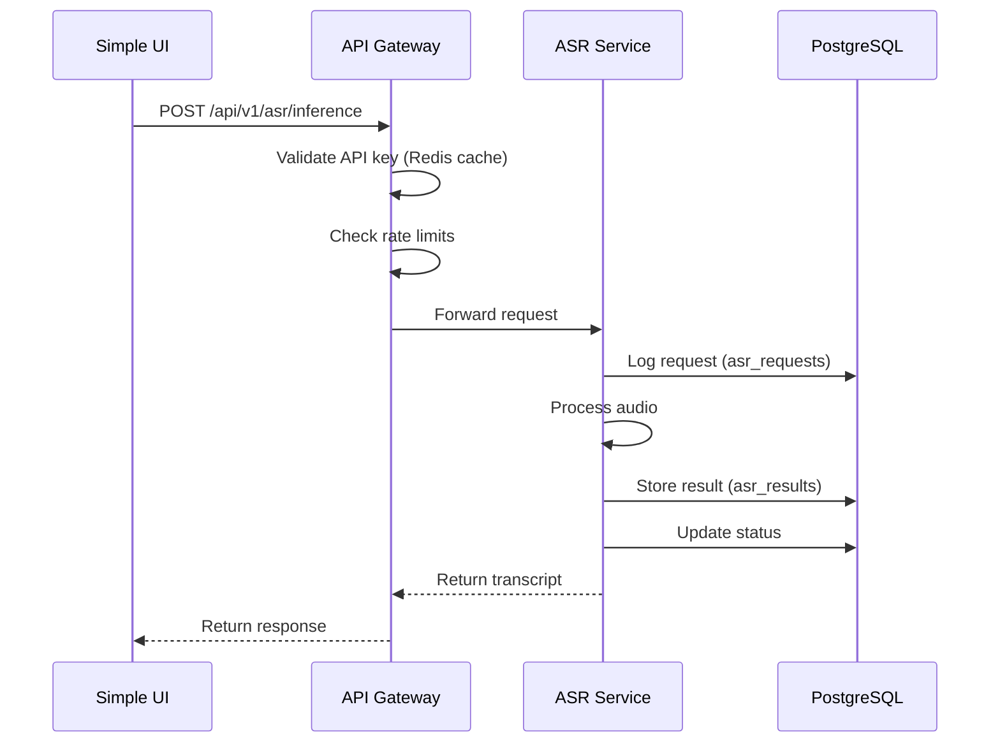
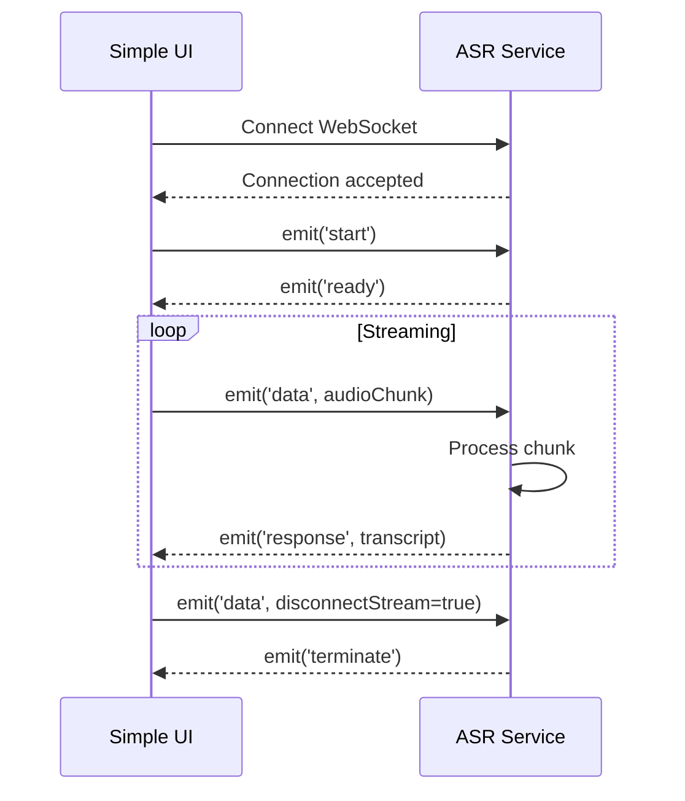

# Architecture Documentation

## System Overview

The Dhruva AI/ML Microservices Platform is a distributed system built on microservices architecture, implementing the 6-layer Frontend-Backend Communication Flow pattern. The platform includes feature flag management with Unleash and OpenFeature for progressive delivery and experimentation.

## Architecture Layers

### Layer 1: User Interface Layer
- **Component**: Simple UI Frontend (Next.js 13)
- **Responsibility**: User interaction, input validation, result visualization
- **Technology**: React 18, TypeScript, Chakra UI

### Layer 2: API Configuration Layer
- **Component**: API Client (Axios)
- **Responsibility**: Request formatting, authentication header injection, response parsing
- **Technology**: Axios with interceptors, TanStack React Query

### Layer 3: HTTP Transport Layer
- **Component**: API Gateway Service
- **Responsibility**: Request routing, load balancing, rate limiting, service discovery
- **Technology**: FastAPI, httpx, Redis

### Layer 4: Backend API Layer
- **Components**: ASR, TTS, NMT Services (FastAPI routers)
- **Responsibility**: Request validation, authentication, response formatting
- **Technology**: FastAPI, Pydantic

### Layer 5: Service Layer
- **Components**: Business logic services (ASRService, TTSService, NMTService)
- **Responsibility**: Core inference logic, audio/text processing, Triton integration
- **Technology**: Python, NumPy, Triton Client

### Layer 6: Repository Layer
- **Components**: Database repositories (ASRRepository, TTSRepository, NMTRepository)
- **Responsibility**: Data persistence, query execution, transaction management
- **Technology**: SQLAlchemy (async), asyncpg

### Layer 7: Database Layer
- **Component**: PostgreSQL
- **Responsibility**: Data storage, referential integrity, indexing
- **Technology**: PostgreSQL 15

## Communication Patterns

### Synchronous Communication (REST API)

### Asynchronous Communication (WebSocket)

## Data Flow

### ASR Service Data Flow
1. Audio input (base64 or URL) → Audio processing (mono conversion, resampling, VAD) → Triton inference → Post-processing (ITN, punctuation) → Transcript output

### TTS Service Data Flow
1. Text input → Text processing (normalization, chunking) → Triton inference → Audio generation → Format conversion → Audio output (base64)

### NMT Service Data Flow
1. Text input → Text normalization → Script code handling → Triton inference (batch) → Translation output

## Database Schema

### Authentication Schema (auth_db)
- **users**: User accounts
- **roles**: User roles (ADMIN, USER, etc.)
- **permissions**: Fine-grained permissions
- **api_keys**: API key management
- **sessions**: Session tracking

### AI Services Schema (auth_db)
- **asr_requests**: ASR request logging
- **asr_results**: ASR transcription results
- **tts_requests**: TTS request logging
- **tts_results**: TTS audio generation results
- **nmt_requests**: NMT request logging
- **nmt_results**: NMT translation results

### Feature Flags Schema (config_db)
- **feature_flags**: Flag definitions cached from Unleash
- **feature_flag_evaluations**: Audit trail of all flag evaluations

Unleash maintains its schema in the shared PostgreSQL instance (unleash database) as the source of truth for flag configurations, strategies, and variants. The config_db tables serve as a local cache and audit trail.

## Security Architecture

### Authentication Flow
1. Client sends API key in Authorization header
2. API Gateway/Service checks Redis cache for API key
3. If cache miss, query PostgreSQL api_keys table
4. Validate key is active and not expired
5. Cache valid key in Redis (TTL: 300s)
6. Update last_used_at timestamp
7. Populate request.state with user context
8. Proceed to business logic

### Rate Limiting Strategy
- **Algorithm**: Sliding window with Redis counters
- **Granularity**: Per API key (not per IP)
- **Limits**: 60/minute, 1000/hour, 10000/day
- **Storage**: Redis with automatic expiry
- **Response**: 429 with Retry-After header

## Scalability Considerations

### Horizontal Scaling
- All services are stateless (except session data in Redis)
- Can scale independently: `docker-compose up -d --scale asr-service=3`
- API Gateway load balances across instances
- Database connection pooling prevents connection exhaustion

### Vertical Scaling
- Increase Docker resource limits in docker-compose.yml
- Increase database connection pool sizes
- Increase worker processes for CPU-intensive tasks

### Caching Strategy
- **API Keys**: Cached in Redis (300s TTL)
- **Model Metadata**: Cached in memory (static data)
- **Rate Limits**: Redis counters with automatic expiry

## Technology Choices

### Why FastAPI?
- Async/await support for high concurrency
- Automatic OpenAPI/Swagger documentation
- Pydantic for data validation
- High performance (comparable to Node.js, Go)

### Why PostgreSQL?
- ACID compliance for transactional data
- Rich data types (JSONB for flexible metadata)
- Excellent performance for relational queries
- Mature ecosystem and tooling

### Why Redis?
- In-memory performance for caching
- Atomic operations for rate limiting
- Pub/sub for real-time features (future)
- Simple key-value storage

### Why Triton Inference Server?
- Optimized for ML model serving
- Supports multiple frameworks (PyTorch, TensorFlow, ONNX)
- Dynamic batching for throughput
- GPU acceleration support

### Why Unleash + OpenFeature?
- Unleash: Enterprise-grade feature flag management with UI
- OpenFeature: Vendor-neutral SDK prevents lock-in
- Separation of concerns: Unleash for management, OpenFeature for evaluation
- Gradual rollouts, targeting, and A/B testing capabilities

## Design Patterns

### Repository Pattern
- Abstracts database operations
- Enables easy testing with mocks
- Centralizes query logic
- Supports multiple database backends

### Dependency Injection
- FastAPI Depends() for loose coupling
- Easier testing and mocking
- Clear dependency graph

### Middleware Pattern
- Cross-cutting concerns (auth, logging, rate limiting)
- Reusable across services
- Ordered execution pipeline

### Provider Pattern (OpenFeature)
- Abstracts feature flag backend (Unleash, LaunchDarkly, etc.)
- Enables testing with mock providers
- Consistent evaluation API across services
- Supports multiple providers via domains
