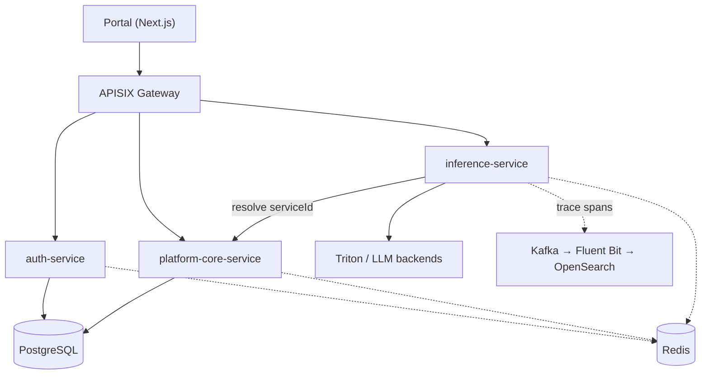
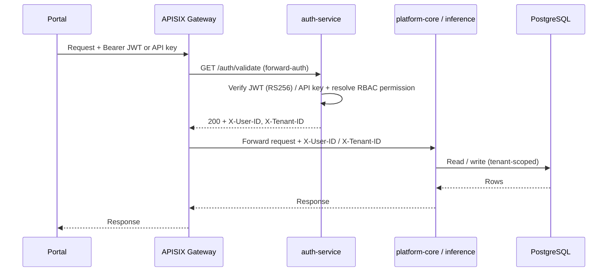

# Overall Architecture

`ai4i-core` is a multi-tenant AI inference platform. A web **Portal** talks to a set of
**FastAPI microservices** through an **APISIX** gateway; the services persist business data in
**PostgreSQL** and use **Redis** for caching and rate-limit/session state. Observability
data (trace spans, logs, metrics) flows out on a separate lane through **Kafka**,
**Fluent Bit**, **OpenSearch**, **Prometheus**, and **Grafana**.

> ### Where Kafka actually sits
> The mental model is *Portal → Microservice → Kafka → Database*. In the real code,
> **Kafka is on the telemetry path, not the business-data path.** Business writes go
> straight to PostgreSQL. Kafka carries **OpenTelemetry trace spans** emitted by the
> `inference-service` to topic `kafka-topic-otel-trace`
> (`services/inference-service/trace/setup.py:17`), which Fluent Bit forwards to the
> OpenSearch `traces-*` index. The diagrams below keep these two lanes visually separate
> so the distinction is explicit.

## System diagram

> Request path: **Portal → APISIX → service → PostgreSQL** (Redis for cache/state). The
> telemetry lane (dotted) is separate: inference-service spans flow **Kafka → Fluent Bit →
> OpenSearch**. Metrics (Prometheus/Grafana) and alerts (Alertmanager) are listed in the
> [infrastructure inventory](#infrastructure-inventory) rather than drawn here.

## Request path (sequence)

Every external request is authenticated/authorized at the gateway by calling the
auth-service `/auth/validate` endpoint, which returns identity headers the downstream
service trusts.

Permission enforcement is centralized: auth-service loads `api_permissions.json`
(`METHOD:PATH → permission_id`) and the gateway calls `/auth/validate` on every request.
Downstream services do **not** re-check permissions in-process
(`services/auth-service/app/routes/__init__.py`).

> The gateway is **APISIX** and is **external to this repository** (not a
> container in `docker-compose-local.yml`). `/auth/validate` is invoked as
> a forward-auth subrequest (`GET`), and auth-service returns `X-User-ID` /
> `X-Tenant-ID` headers that the gateway injects into the upstream request
> (`services/auth-service/app/routes/validation.py`).

## Infrastructure inventory

Defined in [`docker-compose-local.yml`](../../docker-compose-local.yml). Network:
`microservices-network` (bridge, `172.30.0.0/16`).

| Component | Container | Host port | Role |
|-----------|-----------|-----------|------|
| PostgreSQL 15 | `ai4v-postgres` | 5432 | Primary relational store (SCRAM-SHA-256) |
| Redis 7 | `ai4v-redis` | 6379 | Cache, rate-limit state, OAuth state, resolution cache |
| Zookeeper | `ai4v-zookeeper` | — (internal 2181) | Kafka coordination |
| Kafka | `ai4v-kafka` | 9093 (`9093:9092`) | OTEL span transport (telemetry lane); services connect via the broker host listener configured in `KAFKA_SERVER` |
| Prometheus | `ai4v-prometheus` | 9090 | Metrics scrape + time-series store |
| Grafana | `ai4v-grafana` | 3001 | Dashboards |
| Alertmanager | `ai4v-alertmanager` | 9095 | Alert routing / notifications |
| Node Exporter | `ai4v-node-exporter` | 9100 | Host metrics |
| OpenSearch | `ai4v-opensearch` | 9204 | Trace (`traces-*`) + log storage |
| OpenSearch Dashboards | `ai4v-opensearch-dashboards` | 5602 | Trace/log visualization |
| Fluent Bit | `ai4v-fluent-bit` | — | Log/span shipper → OpenSearch |
| migration-runner | `ai4v-migration-runner` | — | On-demand Alembic migrations |
| Portal (simple-ui) | `ai4v-simple-ui` | 3000 | Next.js web UI |

Application services (`auth-service`, `platform-core-service`) are also defined in compose
for convenience; `inference-service` runs natively and is reached via
`inference-service:host-gateway`.

## Databases

| Database | Owner service | Stores |
|----------|---------------|--------|
| `ai4iplatform_auth` | auth-service | users, credentials, tenants, tenant_plans, roles, permissions, API keys, refresh & verification tokens |
| `ai4iplatform_core` | platform-core-service | models, services, alert definitions/history |

**Redis** holds: JWT/API-key validation cache & revocation, per-email reset rate limits,
OAuth state & exchange codes (auth-service); model/service resolution cache (platform-core);
service-resolution cache (inference-service).

**OpenSearch** holds: `traces-*` (OTEL spans from inference-service) and container logs.
platform-core-service queries `traces-*` via its `/telemetry/traces/search` endpoint.

## A note on observability scope

Only **inference-service** wires up OpenTelemetry tracing and the Kafka span exporter
(`services/inference-service/app_factory.py` → `trace/setup.py`). The auth-service and
platform-core-service are explicitly **logging-only** — see the module docstrings in
`services/auth-service/app/main.py` and `services/platform-core-service/app/main.py`
("No tracing or observability — logging only"). All three still emit structured logs
(via `ai4i_core.logging`) that Fluent Bit ships to OpenSearch. Only
**inference-service** exposes a Prometheus scrape endpoint (`/enterprise/metrics`);
platform-core and auth-service do not.

Distributed traces are stored in and queried from the **OpenSearch `traces-*` index**:
`inference-service/trace/setup.py` installs a `LoggerSpanExporter` →
logs + Kafka (`kafka-topic-otel-trace`) → Fluent Bit → OpenSearch `traces-*`. Trace reads
go through `platform-core` `/telemetry/traces/search` and the frontend
`observabilityService.ts`, both of which query OpenSearch.

## Dependency license audit

All infrastructure and runtime dependencies are open source. No proprietary dependencies.

| Dependency | Package / Image | License |
|---|---|---|
| **Triton Inference Server client** | `tritonclient[http]>=2.40.0` (`libs/ai4i_core/pyproject.toml`) | BSD-3-Clause |
| **Ollama** | HTTP backend only — no pip package; called via REST | MIT |
| **PostgreSQL** | `postgres:15-alpine` + `asyncpg`, `psycopg2-binary` | PostgreSQL License (OSI-approved) |
| **Redis** | `redis:7-alpine` + `redis>=5.0.0` | BSD-3-Clause |
| **Kafka** | `confluentinc/cp-kafka:7.4.0` + `kafka-python` | Apache 2.0 (Kafka broker); Confluent Community License for cp-kafka extras — swap to `bitnami/kafka` if full Apache 2.0 is required |
| **OpenSearch** | `opensearchproject/opensearch:2.11.0` + `opensearch-py` | Apache 2.0 |
| **OpenTelemetry** | `opentelemetry-*` packages | Apache 2.0 |
| **FastAPI / Uvicorn** | `fastapi`, `uvicorn[standard]` | MIT |
| **Prometheus / Grafana** | `prom/prometheus`, `grafana/grafana`, `prom/alertmanager` | Apache 2.0 |
| **Fluent Bit** | `fluent/fluent-bit` | Apache 2.0 |
| **Nginx** | `nginx:alpine` | BSD-2-Clause |

> **Note on `confluentinc/cp-kafka`:** The Kafka broker itself is Apache 2.0. Confluent's
> cp-kafka image bundles additional Confluent Platform components under the Confluent
> Community License. If a fully Apache 2.0 stack is required, replace the image with
> `bitnami/kafka` or `apache/kafka` — both are drop-in compatible with the existing
> `KAFKA_SERVER` configuration.

## Regulatory Compliance & Privacy

This is a **self-hosted, open-source** platform — the operator (the organisation deploying it) is the data controller and is responsible for regulatory compliance in their jurisdiction. The architecture provides the following built-in controls:

| Control | Implementation |
|---------|----------------|
| Password security | Argon2id hashing with per-user salt (auth-service `app/core/security.py`) |
| Token signing | RS256 JWTs with ≥ 10-key rotation and JWKS endpoint (auth-service) |
| Data isolation | Per-tenant schema isolation; `TENANT_ADMIN` role scoped to its own tenant |
| PII handling | Configurable domain-specific redaction policies — `REDACT`, `MASK`, `REDACT_TAG` — for healthcare, financial, logistics, education contexts |
| Secrets management | All credentials injected via environment variables; no secrets in source |
| Transport security | TLS at the APISIX gateway; internal services communicate on an isolated bridge network |
| Audit trail | Structured JSON logs (all services) + OpenTelemetry trace spans (inference-service) shipped to OpenSearch |

### Applicable regulations

Operators deploying this platform in India should assess compliance with:

- **Digital Personal Data Protection Act, 2023 (DPDPA)** — data minimisation, purpose limitation, and grievance redressal. The PII redaction capability and per-tenant isolation support these obligations; a full Data Protection Impact Assessment (DPIA) remains the operator's responsibility.
- **IT Act, 2000 / SPDI Rules, 2011** — requirements for sensitive personal data (passwords, financial data). Argon2id hashing and TLS-in-transit address storage and transmission safeguards.
- **GDPR** (if EU data subjects are involved) — data-subject rights (erasure, portability) must be implemented at the application layer by the operator; the per-tenant isolation model provides the necessary data-scope boundary.

For detailed security implementation see [docs/architecture/01-auth-service.md — Data Privacy & Security](./01-auth-service.md#data-privacy--security).
