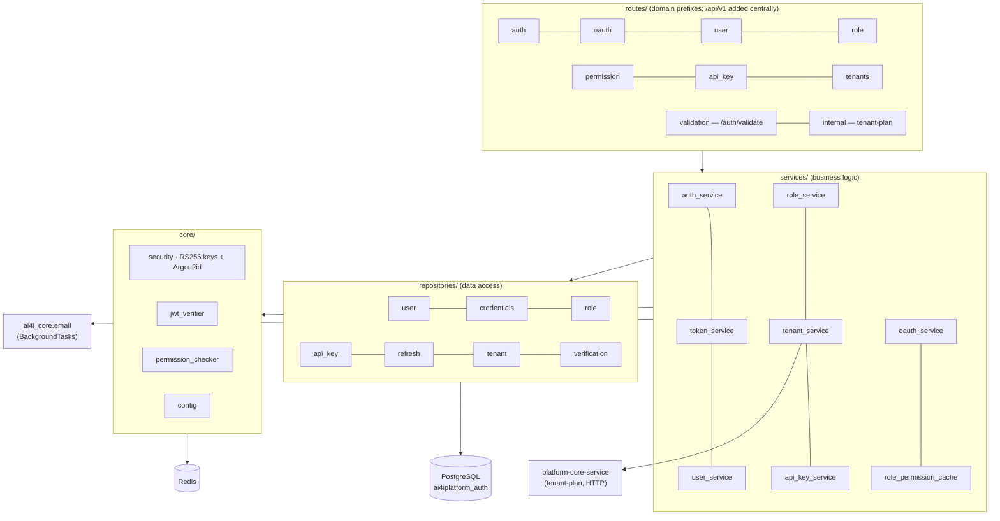

# auth-service

**Port:** `8081` · **Stack:** FastAPI / Python 3.11 / SQLAlchemy (async) · **DB:** PostgreSQL
`ai4iplatform_auth` · **Cache:** Redis

The auth-service is the platform's identity authority. It is the **only** service that
issues and verifies JWTs, and it backs the gateway's per-request authorization via the
`/auth/validate` endpoint. It is intentionally logging-only — no tracing
(`services/auth-service/app/main.py`).

## Capabilities

- **Registration & email verification** — self-signup issues a verification token (48 h);
  `/verify-email` activates the account.
- **Login / logout** — email + password → JWT pair (**RS256**; access ≈ 60 min, refresh
  ≈ 7 days). `/refresh` mints a new access token; `/logout` revokes the refresh token.
- **Password lifecycle** — forgot-password (single-use reset token, 30 min,
  anti-enumeration, rate-limited 3/hour per email), reset-password, authenticated
  change-password, with email notifications.
- **API keys** — create (32-char key shown once), list, update (name, permissions,
  expiry, active flag); revocation tracked in Redis.
- **Guest login** — a pre-seeded guest account with a configurable inference-service scope.
- **OAuth2 (Google)** — provider list, authorize redirect, callback → short-lived
  exchange code → SPA exchanges for a JWT pair. State validation + redirect-URI allowlist
  guard against CSRF / open-redirect.
- **RBAC** — 5 roles (`ADMIN`, `USER`, `GUEST`, `MODERATOR`, `TENANT_ADMIN`); permissions
  are (resource, action) pairs joined to roles many-to-many; a 60-second in-memory
  role→permissions cache (`services/auth-service/app/services/role_permission_cache.py`)
  is the lookup source during its refresh window.
- **Multi-tenancy** — tenant CRUD and lifecycle (`PENDING → ACTIVE → SUSPENDED →
  DEACTIVATED`), per-tenant plans (JSONB quota / rate-limit / allowed-services config),
  tenant-user provisioning. `TENANT_ADMIN` is scoped to its own tenant; `ADMIN`/`MODERATOR`
  are not.
- **Gateway validation** — `/auth/validate` accepts JWT, API key, or anonymous callers,
  resolves the required permission from `api_permissions.json`, and returns `X-User-ID` /
  `X-Tenant-ID` for downstream services.
- **Security** — Argon2id password hashing with a per-user salt
  (`app/core/security.py`); RS256 key management with rotation (≥10 keys, active index
  configurable); JWKS support.

## Component layout

## API endpoints

The `/api/v1` prefix is applied centrally by the shared versioning router; the tables
below show the domain-level paths. Source: `services/auth-service/app/routes/`.

### Auth — `/auth`
| Method | Path | Purpose |
|--------|------|---------|
| POST | `/auth/register` | Self-registration (triggers verification email) |
| POST | `/auth/verify-email` | Consume verification token |
| POST | `/auth/resend-verification` | Re-issue verification link |
| POST | `/auth/login` | Email + password → JWT pair |
| POST | `/auth/guest/login` | Guest account login |
| POST | `/auth/refresh` | Refresh token → new access token |
| POST | `/auth/logout` | Revoke refresh token |
| POST | `/auth/forgot-password` | Request reset link (rate-limited) |
| POST | `/auth/reset-password` | Consume reset token, set new password |
| POST | `/auth/change-password` | Authenticated password change |

### Users — `/auth`
| Method | Path | Purpose |
|--------|------|---------|
| GET / PUT | `/auth/me` | Get / update own profile |
| GET | `/auth/users` | List users (ADMIN / MODERATOR / TENANT_ADMIN) |
| GET | `/auth/users/{user_id}` | User details (tenant-scoped) |

### Roles & permissions — `/auth`
| Method | Path | Purpose |
|--------|------|---------|
| GET | `/auth/roles/list` | List roles |
| POST | `/auth/roles/assign` · `/auth/roles/remove` | Assign / remove a user's role |
| GET | `/auth/roles/user/{user_id}` | A user's roles |
| POST/GET | `/auth/roles/assign/guest/services` · `/auth/roles/list/guest/services` | Manage GUEST inference scope |
| GET | `/auth/permissions` | List permissions (admin) |
| GET | `/auth/inference/permissions` | Inference-scoped permissions |

### API keys — `/auth/api-keys`
| Method | Path | Purpose |
|--------|------|---------|
| POST | `/auth/api-keys` | Create key (raw key returned once) |
| GET | `/auth/api-keys` | List own keys |
| GET | `/auth/api-keys/all` | List all keys (admin) |
| PATCH | `/auth/api-keys/{api_key}` | Update name / permissions / expiry / active |
| DELETE | `/auth/api-keys/{api_key}` | Revoke / delete key |

### Tenants — `/auth/tenants`
| Method | Path | Purpose |
|--------|------|---------|
| POST / GET | `/auth/tenants` | Create / list tenants |
| GET / PATCH | `/auth/tenants/{tenant_id}` | Get / update tenant |
| PATCH | `/auth/tenants/{tenant_id}/status` | Lifecycle transition |
| GET | `/auth/tenants/{tenant_id}/plan` | Tenant plan |
| GET / POST | `/auth/tenants/{tenant_id}/users` | List / invite tenant users |
| PATCH | `/auth/tenants/{tenant_id}/users/{user_id}` | Update tenant user |
| PATCH | `/auth/tenants/{tenant_id}/users/{user_id}/status` | Change tenant-user status |
| DELETE | `/auth/tenants/{tenant_id}/users/{user_id}` | Remove tenant user |

### OAuth2, validation, internal, health
| Method | Path | Purpose |
|--------|------|---------|
| GET | `/auth/oauth2/providers` | List configured providers |
| GET | `/auth/oauth2/{provider}/authorize` · `/callback` | Consent redirect / callback |
| POST | `/auth/oauth2/exchange` | Exchange code → JWT pair |
| GET | `/auth/validate` | **Gateway** forward-auth: token/API-key validation → identity headers |
| GET | `/internal/tenant-plan/tenant-id/{tenant_id}` | Tenant plan lookup (service-to-service) |
| GET | `/api/v1/auth/health`, `/ready` | Liveness / readiness |

## Data model

Source: `services/auth-service/app/models/`.

| Table | Key columns | Purpose |
|-------|-------------|---------|
| `users` | id (UUID), email, username, tenant_id (FK), is_active, is_delete, creation_type, last_login | User accounts |
| `user_credentials` | user_id (FK, unique), password_hash, password_salt | Argon2id credentials (1:1) |
| `tenants` | id, name, organisation, email, status | Tenant orgs |
| `tenant_plans` | id (UUID), tenant_id (FK), plan_id, tier, quota_config (JSONB), rate_limit_config (JSONB), allowed_services (JSONB) | Billing/quota config |
| `refresh` | user_id (FK, unique), refresh_token (unique) | Refresh-token session (1:1) |
| `api_key` | id, user_id (FK), api_key (unique), key_name, permissions (JSON), expires_at, is_active | API-key auth |
| `roles` | id, name (enum, unique) | Role definitions |
| `permissions` | id, name (unique), resource, action | Permission definitions |
| `user_role` | (user_id, role_id) | User↔role (M:N) |
| `role_permission` | (role_id, permission_id) | Role↔permission (M:N) |
| `token_verification` | id, token (unique), is_active, expires_at | Email activation / reset tokens |

## Integration

- **APISIX gateway** calls `/auth/validate` (forward-auth, `GET`) on every
  request (see [overview sequence](./00-overview.md#request-path-sequence)).
- **platform-core-service** is called over **direct request/response HTTP** (httpx async
  client) for tenant-plan assignment (`PLATFORM_CORE_URL`); the tenant service drives this.
- **Email** is sent via Starlette `BackgroundTasks` + `ai4i_core.email` (SMTP / SES /
  SendGrid; console fallback in dev). **No Kafka.**

## Key environment variables

| Group | Variables |
|-------|-----------|
| Database | `AUTH_DB_USER/PASSWORD/HOST/PORT`, `AUTH_SERVICE_DB_NAME` (`ai4iplatform_auth`) or `DATABASE_URL`; `DB_POOL_SIZE`, `DB_MAX_OVERFLOW` |
| Redis | `REDIS_HOST/PORT/PASSWORD/DB`, `REDIS_TIMEOUT` |
| JWT / keys | `RS256_KEY_DIRECTORY`, `RS256_MIN_KEY_COUNT`, `RS256_ACTIVE_KEY_INDEX`, `JWT_ISSUER`, `JWT_AUDIENCE` |
| Token expiry | `ACCESS_TOKEN_EXPIRE_MINUTES`, `REFRESH_TOKEN_EXPIRE_DAYS`, `API_KEY_EXPIRE_DAYS`, `SETUP_TOKEN_EXPIRE_HOURS`, `RESET_TOKEN_EXPIRE_MINUTES` |
| Password (Argon2id) | `ARGON2_TIME_COST`, `ARGON2_MEMORY_COST`, `ARGON2_PARALLELISM`, `PASSWORD_HASH_MAX_WORKERS` |
| OAuth2 | `GOOGLE_CLIENT_ID/SECRET`, `OAUTH_REDIRECT_BASE_URL`, `OAUTH_ALLOWED_REDIRECT_URIS`, `OAUTH_STATE_TTL_SECONDS`, `OAUTH_EXCHANGE_CODE_TTL_SECONDS` |
| Email / SMTP | `EMAIL_PROVIDER`, `EMAIL_FROM`, `SMTP_HOST/PORT/USERNAME/PASSWORD`, `SMTP_USE_TLS`, `SETUP_LINK_BASE_URL`, `VERIFY_LINK_BASE_URL`, `RESET_LINK_BASE_URL`, `RESET_REQUEST_LIMIT_PER_HOUR` |
| Guest / platform | `GUEST_EMAIL`, `GUEST_PASSWORD`, `PLATFORM_CORE_URL` |

> Config source of truth: `services/auth-service/app/core/config.py`.

## Data Privacy & Security

### Password security

Passwords are hashed with **Argon2id** and a per-user salt (`app/core/security.py:PasswordManager`). Argon2id is the memory-hard winner of the Password Hashing Competition; the cost parameters (`ARGON2_TIME_COST`, `ARGON2_MEMORY_COST`, `ARGON2_PARALLELISM`) are configurable via environment variables. Raw passwords are never stored or logged.

### JWT & key management

Access tokens are signed with **RS256** (asymmetric). The service manages a pool of ≥ 10 RS256 key pairs (`RS256_MIN_KEY_COUNT`); the active signing key is selected by index (`RS256_ACTIVE_KEY_INDEX`). Retired keys are retained for verification to support rolling rotation without invalidating in-flight tokens. A **JWKS** endpoint exposes the public key set for downstream consumers. In production, the RS256 key directory must be pre-populated; auto-generation is disabled outside development.

### Tenant & data isolation

All user and credential data is stored in the `ai4iplatform_auth` PostgreSQL database, schema-isolated from the platform-core database. Tenant plans carry per-tenant quota, rate-limit, and allowed-service configuration in JSONB columns (`tenant_plans`). The `TENANT_ADMIN` role is scoped strictly to its own tenant. Cross-tenant reads of tenant details and tenant users are available to `ADMIN` only.

### PII redaction

The platform ships a domain-specific PII redaction policy library covering identifiers (Aadhaar UID, PAN, passport, voter ID, IFSC, credit card, phone, email) and geo-location suffixes. Pre-built policies are available for healthcare, financial, logistics, and education domains across multiple languages (English, Hindi, Tamil, Marathi). Redaction actions — `REDACT`, `REDACT_TAG`, `MASK` — are configurable per policy and are inactive by default until explicitly activated.

### Secrets handling

All credentials (database passwords, SMTP, OAuth client secrets, RS256 key paths) are injected via environment variables and never committed to source.

### Transport security

TLS termination is handled at the **APISIX gateway** layer. Services communicate internally over the `microservices-network` bridge network (`172.30.0.0/16`) without additional TLS between application services and infrastructure.
