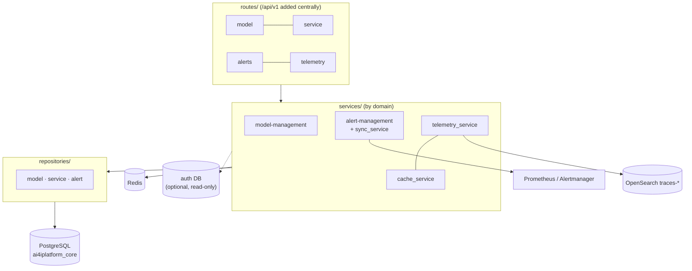

# platform-core-service

**Port:** `8095` (host `8102`) · **Stack:** FastAPI / Python 3.11 / SQLAlchemy (async) ·
**DB:** PostgreSQL `ai4iplatform_core` (+ optional read of the auth DB) · **Cache:** Redis

The platform-core-service is the platform's control plane. It owns the **model/service
registry** and **alert management**, and exposes a **telemetry query** surface over
OpenSearch. It is **logging-only** and does **not** expose a Prometheus `/metrics`
endpoint (`services/platform-core-service/app/main.py`). Its Prometheus-related code
manages alert rule files and triggers Prometheus config reloads — it is a Prometheus
manager, not a scrape target.

## Capabilities by domain

### Model & service registry
- Register and **version** models (`mm_models`); status `ACTIVE` / `DEPRECATED`; a
  configurable cap on active versions per model.
- Publish model versions as **services** (`mm_services`) with backend metadata and an
  inference-server type (Triton default).
- **Endpoint validation**: before publishing, the service can run a test call against the
  backend (Triton) — lenient (`<500`) or strict (`<400`) mode.
- `try-it` service listing for public trials.

### Alert management
- **Alert definitions** (PromQL), **notification receivers** (email/webhook), and
  **routing rules** with timing config.
- A background loop (when `ALERT_SYNC_ENABLED`) syncs definitions/rules into Prometheus
  and Alertmanager YAML; Alertmanager posts firing alerts back to the
  `/alerts/history/webhook` endpoint for **alert history**.

### Telemetry query
- `GET /telemetry/traces/search` queries the OpenSearch `traces-*` index (filter by
  task_type, status, tenant, date range; admin- vs tenant-scoped).

## Component layout

## API endpoints

The `/api/v1` prefix is applied centrally. Domain prefixes below are from
`services/platform-core-service/app/routes/`.

### Models — `/models`
| Method | Path | Purpose |
|--------|------|---------|
| GET | `/models` | List (filter: task_type, status, name, created_by) |
| GET | `/models/{model_id}` | Details (optionally by version) |
| POST | `/models` | Create model |
| PATCH | `/models` | Update metadata / set version status — `model_id` + fields (e.g. `versionStatus` ACTIVE/DEPRECATED) in the body |
| DELETE | `/models/{model_id}` | Delete version |

### Services — `/services`
| Method | Path | Purpose |
|--------|------|---------|
| GET | `/services` | List (filter: task_type, published) |
| GET | `/services/try-it-service-list` | Public trial list |
| GET | `/services/{service_id}` | Details |
| POST | `/services` | Create service |
| PATCH | `/services` | Update / publish — `service_id` + fields (e.g. `isPublished`) in the body; published services are immutable |
| DELETE | `/services/{service_id}` | Delete (unpublished) |

### Alerts — `/alerts/*`
| Method | Path | Purpose |
|--------|------|---------|
| CRUD | `/alerts/definitions` (+ `/{id}`) | Alert definitions |
| CRUD | `/alerts/receivers` (+ `/{id}`) | Notification receivers |
| CRUD | `/alerts/routing-rules` (+ `/{id}`, `/{id}/timing`) | Routing rules |
| GET | `/alerts/history` | Firing-alert history |
| POST | `/alerts/history/webhook` | Alertmanager → platform-core webhook |

### Telemetry & health
| Method | Path | Purpose |
|--------|------|---------|
| GET | `/telemetry/traces/search` | Search OpenSearch traces |
| GET | `/api/v1/platform-core/health` | Health |

## Data model

Source: `services/platform-core-service/app/models/`.

| Domain | Tables |
|--------|--------|
| Model management | `mm_models`, `mm_services` |
| Alert management | `alert_definitions`, `alert_annotations`, `alert_history`, `notification_receivers`, `routing_rules` |

## Integration

- **inference-service** reads `/models/{id}` and `/services/{id}` to resolve a `serviceId`
  to a model version + backend endpoint.
- **auth-service** — token validation happens at the gateway; platform-core trusts the
  gateway-injected `X-Tenant-Id` / admin headers. An optional **read-only** connection to
  the auth DB can be enabled (`AUTH_DB_NAME`), otherwise that engine is a no-op.
- **Prometheus / Alertmanager** — alert sync (outbound) + history webhook (inbound).
- **OpenSearch** — read path for trace search.

## Key environment variables

| Group | Variables |
|-------|-----------|
| Primary DB | `DATABASE_URL` or `POSTGRES_USER/PASSWORD/HOST/PORT` + `CORE_DB_NAME` (`ai4iplatform_core`); `DB_POOL_SIZE`, `DB_MAX_OVERFLOW` |
| Optional auth DB | `AUTH_DB_NAME` (empty → skipped), `AUTH_DB_USER/PASSWORD/HOST/PORT` (fall back to primary) |
| Redis | `REDIS_HOST/PORT/PASSWORD/DB`, `REDIS_TIMEOUT`, `MODEL_CACHE_TTL_SECONDS`, `SERVICE_CACHE_TTL_SECONDS` |
| Model rules | `MAX_ACTIVE_VERSIONS_PER_MODEL`, `RUN_INFERENCE_TEST`, `ENDPOINT_VALIDATION_TIMEOUT_SECONDS`, `ENDPOINT_VALIDATION_MODE`, `ENDPOINT_VALIDATION_SKIP_TLS_VERIFY`, `ENDPOINT_VALIDATION_ALLOW_PRIVATE_HOSTS` |
| External services | `AUTH_SERVICE_URL` |
| Alert sync | `ALERT_SYNC_ENABLED`, `SYNC_INTERVAL`, `PROMETHEUS_URL`, `ALERTMANAGER_URL`, `PROMETHEUS_APPLICATION_ALERTS_PATH`, `PROMETHEUS_INFRASTRUCTURE_ALERTS_PATH`, `ALERTMANAGER_CONFIG_PATH`, `ALERT_HISTORY_WEBHOOK_URL`, `SMTP_*` |
| OpenSearch | `OPENSEARCH_URL`, `OPENSEARCH_USERNAME`, `OPENSEARCH_PASSWORD`, `OPENSEARCH_INDEX` (`traces-*`) |

> Config source of truth: `services/platform-core-service/app/core/config.py`.
