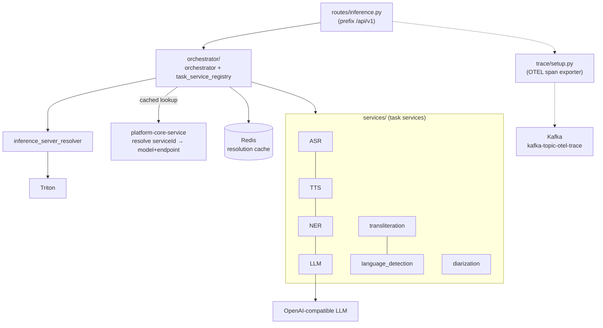
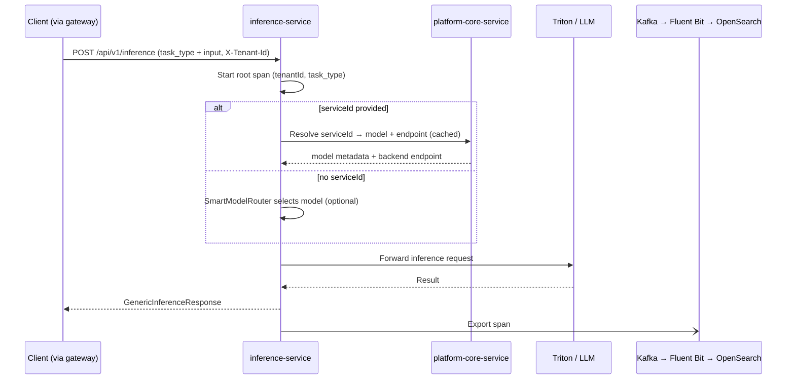

# inference-service

**Port:** `8090` (runs natively on the host; default config `PORT=8080` is overridden by
env) · **Stack:** FastAPI / Python 3.11 · **State:** stateless (in-memory + Redis cache;
no business DB in the active path)

The inference-service is the platform's **data plane**. It exposes one unified inference
API plus per-task convenience routes, resolves which model/backend to use (via
platform-core), forwards to **Triton** or an **OpenAI-compatible LLM**, and emits
OpenTelemetry spans. It is the **only** service that wires up tracing + the Kafka span
exporter (`services/inference-service/app_factory.py`, `trace/setup.py`).

## Capabilities

- **Unified polymorphic inference** — a single JSON envelope (`task_type` + one of
  `input` / `audio` / `image` arrays + `config`). The `/inference` handler accepts a raw
  dict (`payload: Dict[str, Any]`), with an optional top-level `serviceId` used for model
  selection. `GenericInferenceRequest` / `GenericInferenceResponse`
  (`services/inference-service/models/common.py`) describe the envelope and response shape.
- **Task coverage** — NMT, NER, transliteration, language detection, ASR, TTS,
  audio-language detection, speaker diarization, language diarization, OCR, and LLM chat.
- **Orchestration** — `orchestrator/orchestrator.py` + `task_service_registry.py` route a
  request to the matching task service; `inference/inference_server_resolver.py` resolves
  the Triton endpoint.
- **Backend integration** — Triton Inference Server (default) and OpenAI-compatible LLM
  upstreams (vLLM / llama.cpp / Ollama) via an OpenAI proxy; per-model endpoint overrides
  through `LLM_MODEL_ENDPOINTS`.
- **SmartModelRouter (optional)** — when no `serviceId` is supplied, route to the best
  model via `SMR_SERVICE_URL`.
- **Caching** — dual-layer (in-memory + Redis) cache of service-resolution results
  (`CACHE_TTL_SECONDS`).
- **Tracing** — per-request root span carrying `tenantId` + `task_type`; spans exported to
  the Python logger and to Kafka topic `kafka-topic-otel-trace` (→ Fluent Bit →
  OpenSearch `traces-*`, the trace store).
- **Multi-tenancy** — trusts the gateway-injected `X-Tenant-Id` and embeds it in spans
  for per-tenant trace attribution.

## Component layout



## Inference flow (sequence)



## API endpoints

All under the `/api/v1` prefix (`API_PREFIX`). Source:
`services/inference-service/routes/inference.py`.

| Method | Path | Task |
|--------|------|------|
| POST | `/inference` | Polymorphic — `task_type` in the payload |
| POST | `/nmt/inference` | Neural machine translation |
| POST | `/ner/inference` | Named-entity recognition |
| POST | `/transliteration/inference` | Script transliteration |
| POST | `/language-detection/inference` | Text language detection |
| POST | `/asr/inference` | Speech-to-text |
| POST | `/tts/inference` | Text-to-speech |
| POST | `/audio-lang-detection/inference` | Audio language detection |
| POST | `/speaker-diarization/inference` | Speaker segmentation |
| POST | `/language-diarization/inference` | Multilingual segmentation |
| POST | `/ocr/inference` | Optical character recognition |
| POST | `/chat`, `/chat/completions` | OpenAI-compatible LLM proxy |
| GET | `/inference/tasks` | List available inference tasks |
| GET | `/inference/health` | Health check |

## Request / response shape

The `/inference` endpoint accepts a raw JSON object (the handler signature is
`payload: Dict[str, Any]`). `GenericInferenceRequest` (`models/common.py`) documents the
envelope shape — exactly one of `input` / `audio` / `image` is populated based on
`task_type`. `serviceId` is an optional **top-level** key read from the payload by the
orchestrator (`orchestrator/orchestrator.py`) for model resolution — it is **not** a typed
field on `GenericInferenceRequest`. `GenericInferenceResponse` is the response model:

```jsonc
{
  "serviceId": "string",            // optional; if omitted, SMR may route
  "task_type": "NMT",               // NMT | ASR | TTS | NER | OCR | ...
  "input":  [ { "source": "Hello" } ],   // text tasks
  "audio":  [ { "audioContent": "<b64>", "audioFormat": "wav" } ],  // audio tasks
  "image":  [ { "imageContent": "<b64>", "imageFormat": "png" } ],  // image tasks
  "config": { "language": { "sourceLanguage": "en", "targetLanguage": "hi" } },
  "control_config": { "timeout_ms": 5000, "priority": "high", "cache_result": true }
}
```

`GenericInferenceResponse`:

```jsonc
{
  "output": [ { /* task-specific */ } ],
  "config": { /* optional metadata */ },
  "smr_response": { /* optional routing info */ },
  "model": {
    "modelProvider": "IndicTrans",   // mm_models.submitter.name
    "modelVersion": "1.0",           // mm_models.version
    "modelId": "ade00312...",        // mm_models.model_id
    "language": [ { "sourceLanguage": "en", "targetLanguage": "hi" } ]  // mm_models.languages
  }
}
```

`model` is resolved from `service_info` (populated by `InferenceServerResolver` from mm_models)
and attached centrally in `BaseTaskService.process()`, so it appears on every response from the
10 Triton-backed task services. It lets API/portal clients echo `modelProvider`/`modelVersion`
into the Feedback API without a second lookup. LLM (`/chat/completions`, `/chat` — a raw
OpenAI-compatible passthrough) and Pipeline (not yet implemented) don't go through this envelope,
so they never carry this block.

## Integration

- **Gateway** authenticates upstream; inference-service trusts `X-Tenant-Id` and does no
  in-process auth.
- **platform-core-service** (`MODEL_MANAGEMENT_SERVICE_URL`) resolves `serviceId` →
  model + backend endpoint; results are cached.
- **Triton / LLM** are the actual inference backends.
- **Kafka** receives OTEL spans (`kafka-topic-otel-trace`) → Fluent Bit → OpenSearch
  `traces-*`, which platform-core later queries. If the Kafka producer can't initialize,
  spans degrade gracefully to logs only (`trace/setup.py:39`).

## Key environment variables

| Group | Variables |
|-------|-----------|
| Service | `SERVICE_NAME`, `HOST`, `PORT`, `WORKERS`, `API_PREFIX` (`/api/v1`), `LOG_LEVEL`, `DEBUG` |
| platform-core | `MODEL_MANAGEMENT_SERVICE_URL`, `MODEL_MANAGEMENT_SERVICE_TIMEOUT` |
| SmartModelRouter | `SMR_SERVICE_URL`, `SMR_SERVICE_TIMEOUT` |
| LLM proxy | `LLM_DEFAULT_ENDPOINT`, `LLM_MODEL_ENDPOINTS` (JSON map), `LLM_INFERENCE_TIMEOUT` |
| Backend | `DEFAULT_TRITON_TIMEOUT` |
| Cache / DB | `REDIS_URL`, `REDIS_PASSWORD`, `CACHE_TTL_SECONDS`; `DATABASE_URL`, `POSTGRES_*` (optional) |
| Telemetry | `ENABLE_TELEMETRY`, `KAFKA_ENABLED`, `KAFKA_SERVER`, `KAFKA_TOPIC_OTEL_TRACE` |
| Kafka (trace export) | `KAFKA_TOPIC_OTEL_TRACE`, `KAFKA_SERVER` — read directly in `trace/setup.py`, not in `config.py` |

> Config source of truth: `services/inference-service/config.py` (except the Kafka trace
> vars, which `trace/setup.py` reads via `os.getenv`).

## Content Types Handled

The inference-service processes three primary content modalities, routed by `task_type` in the unified `/inference` request envelope:

| Modality | Task types | Input field | Format |
|----------|-----------|-------------|--------|
| **Text** | `NMT`, `NER`, `TRANSLITERATION`, `LANGUAGE_DETECTION`, `PII` | `input[].source` | Plain text string; multi-item arrays supported |
| **Audio** | `ASR`, `TTS`, `AUDIO_LANGUAGE_DETECTION`, `SPEAKER_DIARIZATION`, `LANGUAGE_DIARIZATION` | `audio[].audioContent` | Base64-encoded; `audioFormat` (wav, mp3, …) declared per item |
| **Image / Document** | `OCR` | `image[].imageContent` | Base64-encoded; `imageFormat` (png, jpg, …) declared per item |
| **LLM chat** | — | OpenAI-compatible message array | JSON via `/chat/completions` endpoint |

Content is **not persisted** by the inference-service — payloads are forwarded to the backend (Triton or LLM proxy) and the response is returned immediately to the caller. The only data written is **OpenTelemetry spans** (tenant ID + task type, no payload content) exported to the Kafka trace topic (`kafka-topic-otel-trace`).

Language coverage spans Indic and international scripts. NMT, ASR, TTS, transliteration, and NER back-ends serve multiple Indic scripts (Devanagari, Tamil, Telugu, and others); exact language pairs depend on the models registered in platform-core.
