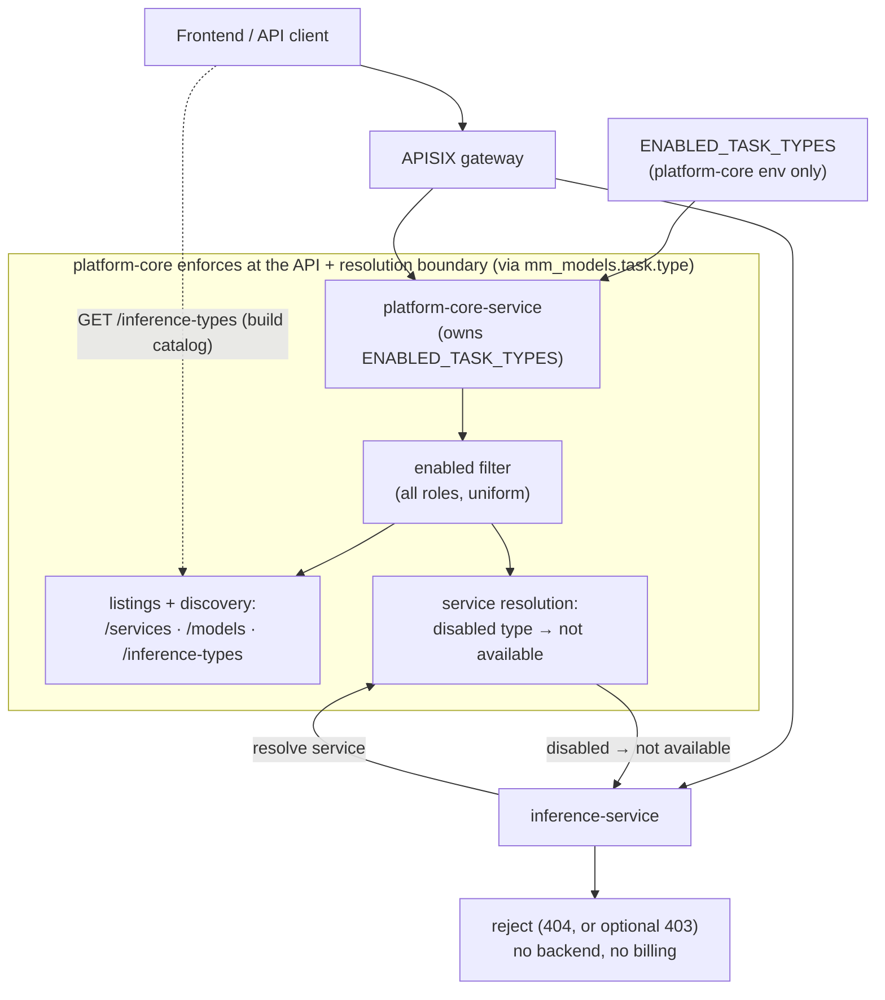

# Design: Config-Driven Enabled Task Types

| | |
|---|---|
| **Status** | Draft for review |
| **Author** | Vipul Dholariya |
| **Branch** | `config_driven_task_type` |
| **Scope** | `platform-core-service` (owner: services/models, `/inference-types`, usage, metering, alerts), `inference-service`, `auth-service`, `frontend/simple-ui`. Full surface map in §8.4 |
| **Premise** | LLM is a registry-backed service (model-as-service-id), resolved via MMS like every other type — see §7 |
| **Reviewers** | _(eng + product)_ |

---

## 1. Summary

Introduce a per-deployment allowlist, `ENABLED_TASK_TYPES`, that declares which inference task
types a deployment serves. Enabled types are **serviceable** (the backend runs them) and
**visible** (the frontend and listing APIs surface them); everything else is hidden from every
catalog and unreachable for inference.

**Single owner.** `ENABLED_TASK_TYPES` lives in **platform-core** only — the registry/governance
layer. platform-core enforces both effects from that one place: it filters disabled types out of
its listing/discovery APIs, and it refuses to resolve a disabled-type service. Because
`inference-service` resolves **every** service (Triton *and* LLM) through platform-core, a disabled
type is simply not resolvable, so inference rejects it — with **no config of its own**. The frontend
reads platform-core's discovery endpoint. One value, one owner, no per-service duplication.

## 2. Background & motivation

The platform today serves a fixed set of task types (NMT, ASR, TTS, NER, OCR, transliteration,
diarization, language detection, and an OpenAI-compatible LLM chat surface). Every deployment
exposes all of them, regardless of what the operator actually runs.

Real deployments are narrower. A sovereign/DPG adopter may stand up an **LLM-only** platform, or
a **speech-only** one, and wants the product to reflect exactly that — no dead UI entries for
capabilities they haven't provisioned, no inference endpoints accepting traffic for models that
aren't deployed, and no listing API advertising services that can't be used. Serving unprovisioned
task types is both a **UX problem** (confusing catalog) and an **operational/security problem**
(inference endpoints reachable for backends that don't exist).

There is no mechanism for this today: the serviceable set is a hardcoded list in the orchestrator,
and the frontend catalog is hardcoded in the UI.

## 3. Goals / Non-goals

### Goals
- A single per-deployment config selects the served task types, owned in one place.
- Disabled types are non-serviceable (unreachable for inference) **and** invisible (absent from UI + APIs).
- One source of truth for "what's enabled" that the frontend consumes dynamically.
- Fail-fast on misconfiguration.
- **Consolidate the task-type vocabulary** onto the yaml (`get_inference_types()`) as the single
  canonical list, so the divergent hardcoded lists (§5) stop drifting and the enabled filter has
  one thing to apply to.

### Non-goals
- Per-tenant / per-API-key gating — that is guest-services + tier entitlement, already present (§10).
- Runtime hot-reload — config is read at process start; changing it requires a restart.
- Deleting registry rows for disabled types — disabled ≠ deleted; re-enabling is lossless.
- Duplicating the config into every service — the whole point is one owner (§7).

## 4. Requirements

**Functional**
- F1 — `ENABLED_TASK_TYPES` is a comma-separated allowlist, global per deployment, owned by platform-core.
- F2 — inference for a disabled type is rejected at resolution, before any billing side effect.
- F3 — listing, discovery, **and usage/metering** APIs (`/services`, `/models`, `/inference-types`,
  usage-spend endpoints) return only enabled types for **all** roles (admins included) — a disabled
  type is not part of the deployment.
- F4 — publishing a service for a disabled type is rejected; already-published ones are hidden.
- F5 — the frontend shows only enabled task types (nav, catalog, routes).

**Non-functional**
- N1 — negligible latency: an in-memory membership check on a set parsed once at startup; the
  service-resolution inference-service uses is already TTL-cached, so no new per-request cost.
- N2 — single source of truth: the value exists in exactly one service; no per-service copies, no
  drift, no new cross-service fetch (inference-service reuses the resolution call it already makes).
- N3 — misconfiguration (unknown value) fails fast at platform-core startup.
- N4 — rejections are observable (logs + metric).

## 5. Key constraint — divergent task-type vocabularies, consolidated onto the yaml

**Today several independent, hardcoded task-type lists exist across the codebase, in different
casings, with differing membership** (full list in §8.4). This design **consolidates them
onto the yaml** — `get_inference_types()` becomes the one canonical vocabulary, and each list either
derives from it or carries a drift-guard test asserting it matches the yaml names. The enabled filter
(§7) then has a single vocabulary to apply to.

| Source | Where | Form | Notes |
|---|---|---|---|
| A. inference-service allowlists | `orchestrator/orchestrator.py:25` (`ALLOWED_TASK_TYPES`); `routes/inference.py:705` (`/inference/tasks`) | `UPPER` | routing allowlist; extra legacy entries |
| B. platform-core enum `TaskTypeEnum` | `platform-core-service/app/schemas/enums/model_management.py` | `lower-hyphen` | request-schema validation enum |
| C. **Canonical list** `inference_types.yaml` | `ai4i_core.ppu.get_inference_types()` (bundled yaml) | `lower-hyphen` | shared by both backends; name + unit + pricing; the vocabulary this design uses |
| — metering / alerts / display | `SERVICE_BREAKDOWN_CONFIG`, `INFERENCE_TASKS`, `config_renderer.SERVICE_TYPE_MAP` | mixed | see §8.4 |
| — frontend `ServiceId` | `frontend/simple-ui/src/config/serviceMetadata.ts` | `lower` | includes UI-only entries |

**Decision (locked):** `inference_types.yaml` (via `ai4i_core.ppu.get_inference_types()`) is the
**single canonical vocabulary**; every other list (§8.4) derives from it or is drift-guarded against
it. `ENABLED_TASK_TYPES` values are the yaml `name` form (lower-hyphen: `llm`, `asr`, `nmt`, …).
platform-core validates against it (§7) and matches it against
`mm_models.task["type"]` (already lower-hyphen); the frontend normalizes `ServiceId`
(`.lower().replace("_","-")` + a tiny alias like `audio-language-detection → audio-lang-detection`,
per `SERVICE_ID_ALIASES` `useGuestServices.ts:6-23`) when reading `/inference-types`.
**inference-service never holds the enabled set**, so its UPPER `TaskType` vocabulary is irrelevant
here. The yaml is authoritative — only its `name` entries are valid `ENABLED_TASK_TYPES` values.

> ⚠️ `mm_services` has **no `task_type` column.** Task type lives on the model:
> `mm_models.task["type"]` (JSONB). The enabled filter operates through the Service→Model join
> (`service_repository.py:67,97`: `Model.task["type"].astext == task_type`).

## 6. Design overview

**One owner (platform-core), enforcing both effects; the other components inherit.**



- **platform-core is the single enforcement point** — one uniform filter at the API + resolution
  boundary, applied to **all roles** (a disabled type is not part of the deployment). It does **not**
  touch the raw repository, so internal/system reads (billing, migrations) still see everything.
- **inference-service inherits serviceability** — it resolves every service through platform-core, so
  a disabled type has no resolvable backend. It holds no `ENABLED_TASK_TYPES` (§8.2).
- **Frontend inherits visibility** — it builds its catalog from `/inference-types` (§8.3).

## 7. Config mechanism & dependency

`ENABLED_TASK_TYPES` is a comma-separated env string read **only by platform-core**, parsed into a
set at startup:

```python
# platform-core-service/app/core/config.py — the ONLY service that reads this
from ai4i_core.ppu import get_inference_types

_KNOWN = {t["name"] for t in get_inference_types()}       # names from inference_types.yaml

class Settings(BaseSettings):
    ENABLED_TASK_TYPES: str = Field(..., description="Comma-separated enabled task types")

    @field_validator("ENABLED_TASK_TYPES")
    @classmethod
    def _validate(cls, v: str) -> str:                    # single validate method, fail-fast (N3)
        unknown = {s.strip() for s in v.split(",") if s.strip()} - _KNOWN
        if unknown:
            raise ValueError(f"ENABLED_TASK_TYPES has unknown task types: {sorted(unknown)}")
        return v
```

- **One place.** A literal line in `services/platform-core-service/env.template` (like the existing
  `ALLOW_DEPRECATED_MODEL_CHANGES` / `RUN_INFERENCE_TEST` toggles); `setup-env.sh` copies it verbatim
  to `platform-core-service/.env` (it only substitutes `<PLACEHOLDER>` tokens, line 124). Since
  platform-core is the sole consumer, **no** root `env.template` entry and **no** `setup-env.sh`
  substitution line are needed. No inference-service env, no frontend config.
- **Required field** ⇒ missing config fails platform-core boot (N3). Parsed once, cached (N1).

**Full canonical vs enabled — two distinct reads:**
- `get_inference_types()` (shared lib) → the **full** yaml list. Used for *vocabulary* (deriving the
  lists in §8.4) and by *system/coarse* consumers that must see all types — the billing consumer,
  `quota_guard`, inference-service's known-type check, auth's `quota-{name}` fields, migrations.
- `get_enabled_inference_types()` = `get_inference_types()` ∩ `ENABLED_TASK_TYPES`, **computed in
  platform-core** (the only reader of the env). Used at the *display / API / resolution boundaries*
  (§8.1, §8.4) that decide what's visible and serviceable.

This split is what keeps **single-owner** intact through the reconciliation: other services derive
their *vocabulary* from the shared yaml, but only platform-core ever reads `ENABLED_TASK_TYPES` and
computes the enabled subset. Deriving a list from the yaml is **not** the same as reading the env.

### LLM resolves through platform-core

The single-owner model works because inference-service resolves **every** service through
platform-core — Triton and LLM alike:

- `llm_service.py` resolves LLM by `payload["model"]` (the model name *is* the service id) →
  `InferenceServerResolver.resolve_service(service_id)` → MMS, the same lookup Triton uses
  (`llm_service.py:96-103`).
- `/chat/completions` therefore has **no** special case — it is gated by the same resolution path as
  every other type.

## 8. Detailed design

### 8.1 platform-core — the single enforcement point

The enabled filter is applied **uniformly for all roles** on the **API-serving code paths** — the
service/route methods behind `/services`, `/models`, `/inference-types`, the usage endpoints, and
single-service resolution (reusing the existing `Model.task["type"]` join). It is **not** applied to
the low-level reads that system jobs use (the billing consumer, migrations), so stored data stays
intact and only external API responses are gated.

- **Serviceability (the boundary).** `GET /services/{service_id:path}` → `view_service` →
  `get_service_detail` (`routes/service.py:167`) is the exact endpoint `inference-service`'s
  `InferenceServerResolver` calls to resolve every service (`inference_server_resolver.py:77`). A
  service whose `mm_models.task["type"]` is disabled resolves as **not available**. inference-service
  already treats a non-resolvable/not-published service as unusable (`is_published=False` →
  `LookupError` → 404 at `llm_service.py:44`, `orchestrator.py:196`), so a disabled type flows through
  that same path — **no inference-service change required**. (Optional: return a distinct
  `TASK_TYPE_DISABLED` so it surfaces as `403` rather than `404`.)
- **Listings (visibility).** `GET /services` (`routes/service.py:123`) and `GET /models`
  (`routes/model.py:42-92`) exclude disabled types via the `Model.task["type"]` join
  (`service_repository.py:67,97`) for every caller, including Admin/Moderator. `200` with a filtered
  result — not an error.
- **Publish rejection.** `POST/PATCH /services` (`service_service.py` create/update) rejects a service
  whose task type is disabled → `403 TASK_TYPE_DISABLED`.
- **Usage & metering (display).** The usage/spend dashboard breaks down per task type
  (`ppu_usage_service.py` derives it from `ppu_quota_usage.inference_name`) and offers a task-type
  selector (`modelTaskType`). Filter the response's per-type breakdown **and** the selector options to
  the enabled set, so disabled types don't appear in usage histograms or dropdowns. Stored
  `ppu_quota_usage` rows are **not** deleted — only the display is filtered — so re-enabling a type
  restores its history and totals.
- **Discovery — `GET /inference-types`.** The route exists (`routes/inference_types.py`) and today
  returns the **full** `get_inference_types()` list unfiltered. Change it to **intersect with the
  enabled set** so it returns only enabled `{ name, unit }`. Both "what exists" and "what's enabled" —
  the frontend's single source (§8.3).

(`_is_platform_admin` in `routes/service.py` still governs its original concern — stripping sensitive
fields for non-admin callers — which is independent of enablement.)

### 8.2 inference-service — inherits, holds no config

- **No `ENABLED_TASK_TYPES` env, no code change required for the gate.** Every inference (Triton and
  LLM) resolves its target service via `resolve_service` → platform-core's service-detail resolution.
  A disabled type resolves as not-available, which the resolver already surfaces as a
  not-usable error (`is_published=False` → `LookupError` → 404 at `llm_service.py:44`,
  `orchestrator.py:196`) — so inference is rejected **before** the task service runs, with no
  ai-inference span and no PPU debit.
- **Optional polish:** to return `403 TASK_TYPE_DISABLED` instead of a generic 404, platform-core
  returns a distinct signal and inference-service maps it — a small, isolated change to the resolver's
  error handling.
- `ALLOWED_TASK_TYPES` (`orchestrator.py:25`, checked in `_validate_task_type` at `:102`) stays a
  coarse "is this a known task type at all" check; enablement is enforced by resolution, not here.

### 8.3 Frontend — inherits via `/inference-types`

The catalog is hardcoded today (`serviceMetadata.ts`; `index.tsx:164-177`; `Sidebar.tsx:283-392`), but
the enable/disable-by-id mechanism already exists for guests and is **mirrored**:

- Add `useEnabledServices` (mirror of `useGuestServices.ts`) calling `GET /inference-types`, returning
  an enabled-id `Set<ServiceId>` (normalize `name → ServiceId` via the alias map).
- Filter `index.tsx:178-182` `services[]` and `Sidebar.tsx` `baseNavItems` by it, **AND-ed** with the
  guest filter; add route guards so a deep-link to a disabled page redirects/not-founds.
- `serviceMetadata.ts` stays the id↔title/icon map. One backend list drives the UI.
- **Usage dashboard** (`usage-dashboard.tsx`, `usageSpendService.ts`): its task-type dropdown and
  per-type spend histogram are driven by the same enabled set, so disabled types don't appear there
  either. (The backend already filters the usage response, §8.1 — the dropdown options come from the
  filtered `/inference-types`.)

### 8.4 Full surface coverage

Task types surface in far more places than the core gate. Every one is driven by the enabled set;
grouped by *how*:

**Inherit automatically once `/inference-types` is filtered** — via the frontend `useInferenceTypes`
hook (`hooks/useInferenceTypes.ts`): service create/registry selector, tier add-quota selector,
usage-spend dropdown, model-management selector. **Requirement:** drop the hook's hardcoded
`MODEL_TASK_TYPE_LIST` fallback (`config/constants.ts:1392`) so an API hiccup can't reveal disabled
types.

**Gated by the resolution boundary (§8.1–8.2):** all inference — Triton per-task, unified
`/inference`, LLM `/chat/completions` + audio. auth-service `/auth/validate` (`get_inference_types()`
lookup) may also reject disabled at the gateway as defense-in-depth.

**Need explicit enabled-filtering (do NOT go through `/inference-types`):**

| Surface | Where | Action |
|---|---|---|
| Metering dashboards (`/overview`, `/tenant-consumption`, `/service-consumption`) | `metering_promql_builder.py` `SERVICE_BREAKDOWN_CONFIG`; `services/metering_service.py` | filter `active_services` to enabled |
| Usage/spend per-type display | `ppu_usage_service.py` (`spendByModelTaskType`) | filter display to enabled |
| Tier/quota add selector (forward config) | `pay_per_use` tier_service; `TierManagement.tsx` | offer enabled only (inherits via hook) |
| Alert task scoping (forward config) | `promql_builder.py` `INFERENCE_TASKS`; `alert_definition.py` | derive from yaml; offer/validate **enabled** only |
| Frontend home cards / sidebar nav | `pages/index.tsx` (`services`), `Sidebar.tsx` (`baseNavItems`) | filter by enabled set (via hook) |
| Frontend logs task-type filter | `pages/logs.tsx:42` (imports `MODEL_TASK_TYPE_LIST` directly) | switch to the hook |
| Frontend static maps | `serviceMetadata.ts`, `servicePageConfig.ts`, `meteringConstants.ts`, `apiEndpoints.ts` | keep as id→display maps; the *active* set comes from the hook |

**Derive from the FULL yaml, NOT enabled-filtered** (so no other service reads `ENABLED_TASK_TYPES`,
keeping single-owner):
- **inference-service** `ALLOWED_TASK_TYPES` / `/inference/tasks` — a coarse known-type check; derive
  from `get_inference_types()`. Enablement is enforced by resolution (§8.1), not here.
- **auth-service** `quota-{name}` fields — harmless per-type tracking keys; derive from
  `get_inference_types()`. (A quota field for a disabled type is unused, not user-visible; filtering
  it would force auth to read the env, breaking single-owner.)
- Display/abbreviation maps (`config_renderer` `SERVICE_TYPE_MAP`) — key off yaml names, drift-guarded.

**Never filtered (historical/system):** kafka billing consumer, `ppu_quota_usage` writes,
`quota_guard`, migrations, raw DB reads.

**Vocabulary reconciliation (in scope — the chosen approach).** The divergent lists — `TaskTypeEnum`,
`SERVICE_BREAKDOWN_CONFIG`, `INFERENCE_TASKS`, `config_renderer` map, `ALLOWED_TASK_TYPES` — converge
on the yaml (`get_inference_types()`) as the single source: each is either **derived** from it, or
kept static with a **drift-guard test** asserting it equals the yaml names (for structures that carry
extra metadata — `TaskTypeEnum` for pydantic validation, `SERVICE_BREAKDOWN_CONFIG`'s metric mapping,
`config_renderer`'s abbreviations — key the metadata off yaml names and assert full coverage). Once
consolidated, the enabled filter (`get_enabled_inference_types()`, §7) applies to **one** vocabulary
rather than being duplicated per list. This convergence is the main scope driver for the feature.

## 9. API contract summary

| Surface | Before | After |
|---|---|---|
| `GET /inference-types` (platform-core) | all yaml types (unfiltered) | filtered → enabled subset `{name,unit}` |
| `GET /services[?task_type=]`, `GET /models` | all published | published **and** type-enabled |
| MMS service resolution (inference's call) | resolves any published service | disabled type → not available |
| `POST /{task}/inference`, `/inference`, `/chat/completions` | served | rejected (resolution fails for a disabled type) — 404 today, or 403 `TASK_TYPE_DISABLED` with the optional signal |
| `POST/PATCH /services` | any valid type | `403 TASK_TYPE_DISABLED` for a disabled type |
| Usage/metering APIs (per-task-type spend, `modelTaskType` selector) | all task types with data | filtered to enabled types |
| System jobs (billing consumer, migrations) | direct `mm_services`/`ppu_quota_usage` access | **unchanged** — not filtered; stored data intact |

Enablement applies uniformly to all roles across every external API (listings, discovery, usage);
only system jobs reading the DB directly are exempt. Optional new error code `TASK_TYPE_DISABLED` →
**403** (else the existing 404 applies).

## 10. Interactions with existing gates

- **Guest services** (`/auth/roles/list/guest/services`) and **tier entitlement** (`X-Tier-ID` vs
  `service.tier_ids`) are per-tenant/role gates. `ENABLED_TASK_TYPES` is a coarser **deployment-wide**
  gate applied first:
  - visibility = deployment-enabled ∩ guest-allowed
  - serviceability = deployment-enabled ∩ published ∩ tier-entitled
- **PPU/quota & metering:** the billing consumer bills only what runs, so a disabled type accrues no
  new usage; its **stored** `ppu_quota_usage` rows are retained but the usage/spend **display** is
  filtered to enabled types (§8.1), so disabled types drop out of dashboards, dropdowns, and
  histograms. Re-enabling restores their history. Forward-looking tier/quota configuration selectors
  offer enabled types only.

## 11. Security considerations

- **Serviceability enforced server-side in platform-core** by not resolving a disabled type — it has
  **no resolvable endpoint** for inference, so inference-service physically cannot reach a backend for
  it. Enforcement and resolution are the same authority.
- **Uniform across roles:** enablement is a deployment-wide policy, so no role — admin included —
  can list, resolve, or run a disabled type through the API. There is no privileged path around it.
- **Internal reads are separate:** the filter sits at the API boundary, not the raw repository, so
  system jobs (billing reconciliation, migrations) still read all rows — enablement never corrupts
  historical data.
- **Attack-surface reduction:** an LLM-only deployment exposes no resolvable ASR/OCR/etc. backend.
- **No side effects on reject:** rejection happens at resolution, before inference/billing.
- **Eventual consistency (accepted):** inference-service TTL-caches resolution (`CACHE_TTL_SECONDS`),
  so a just-disabled type can still resolve from cache until the entry expires. Acceptable for a static
  deploy-time policy; if immediate cutover is ever required, add cache invalidation (out of scope).

## 12. Observability

- **Startup log (platform-core):** the resolved enabled set.
- **Rejection log (WARN):** `task_type` + tenant/correlation id when resolution denies a disabled type
  (platform-core) and when inference-service returns the 403.
- **Metric:** `task_type_rejected_total{task_type}` on the resolution denial, to catch stale clients
  or misconfiguration.

## 13. Alternatives considered

| Decision | Chosen | Alternatives & why not |
|---|---|---|
| **Config ownership** | Single owner: platform-core; others inherit | (a) *Per-backend env* (each service reads its own `ENABLED_TASK_TYPES`) — duplicates the value into every service; only justified if a service can't inherit. inference-service *can* inherit (it resolves via platform-core), so duplication is unnecessary. (b) *DB-backed setting* — invites runtime mutation (non-goal) + a migration. |
| **Serviceability mechanism** | Refuse to resolve a disabled type (platform-core) | (a) *Independent gate in inference-service reading its own env* — needs the config in inference-service, the very duplication we're avoiding; (b) *Gateway (APISIX)* — external, doesn't cover the unified `/inference` body dispatch. Resolution refusal reuses the call inference-service already makes and is a strictly stronger boundary (no endpoint exists). |
| **Discovery** | Filter the existing `GET /inference-types` | (a) New `/config/enabled-task-types` — duplicates a near-identical endpoint that already exists; (b) Unleash flags — per-flag boolean eval, not a typed task list. |
| **Canonical vocabulary** | `inference_types.yaml` via `ai4i_core.ppu`; all other lists consolidated onto it (§8.4, Phase 0) | It's the one list both backends already import and that `/inference-types` serves, so validation and discovery agree. Alternative — leave the divergent lists in place and duplicate the enabled filter at each one — rejected as drift-prone. |
| **Reject vs allow-but-hide on publish** | Reject **and** hide | Allow-but-hide lets operators register unusable services that silently do nothing. |

Single-owner relies on inference-service resolving *all* types — including LLM — via platform-core
(§7). If any inference path bypassed MMS resolution, that path would need its own check and the
per-backend-env alternative would apply to it.

## 14. Edge cases

- **Vocabulary drift:** only platform-core (matches `mm_models.task["type"]`) and the frontend
  (normalizes `ServiceId`) touch the vocabulary; both unit-tested.
- **Config-change skew:** inference-service caches MMS resolution (TTL); after a config change, a
  disabled type may still resolve from cache until the TTL expires / restart. Accepted for a static
  deploy-time policy; the same skew already exists for any service change (§11).
- **Leftover service of a disabled type:** hidden from every API caller (admins included) and
  unresolvable for inference; the DB row is retained, and internal reads still see it. Re-enabling is
  a config change (flip `ENABLED_TASK_TYPES` + redeploy), not a service-API action — an admin does not
  manage a disabled type through the services API.
- **Pre-existing published service of a disabled type:** as above — hidden + unresolvable; row kept;
  re-enabling restores it with no data change.
- **Unknown / mis-cased env value:** platform-core startup error (N3) — `ENABLED_TASK_TYPES` values
  must be the yaml lower-hyphen names; anything else fails the `field_validator` at boot.

## 15. Testing strategy

- **Unit (platform-core):** the `ENABLED_TASK_TYPES` `field_validator` accepts known yaml names and
  raises on an unknown one (startup fail); the service-lookup filter excludes disabled types.
- **Integration (`ENABLED_TASK_TYPES=llm`):** `/inference-types` → `[llm]`; `/services` returns no
  non-LLM services **for any role (including admin)**; `POST /nmt/inference` → rejected;
  `POST /chat/completions` → 200; `POST /services` for an NMT model → 403; the usage/spend dashboard
  and its task-type dropdown show only LLM; UI renders LLM only.
- **System-job check:** the billing consumer and migrations reading `mm_services` /
  `ppu_quota_usage` directly still see a disabled type's rows (filter is API-boundary only); a
  disabled type's stored usage is retained and reappears if re-enabled.
- **Integration (`llm,nmt`):** exactly those two enabled across all surfaces.
- **Regression:** with all types enabled, behavior is identical to today.

## 16. Rollout & backward compatibility

- **Sequencing (per §18):** vocabulary consolidation (Phase 0), platform-core enforcement (Phase 1),
  metering & alerts (Phase 2), frontend (Phase 3), then the optional 403 signal (Phase 4). Each is
  independently reviewable; the core gate is entirely in platform-core.
- **Backward compatibility:** existing deployments add `ENABLED_TASK_TYPES` to
  `platform-core-service`'s env (no default). Full list preserves today's behavior; DPG/public docs
  show `ENABLED_TASK_TYPES=llm` as the minimal example.

## 17. Resolved decisions

1. Canonical vocabulary — `inference_types.yaml` via `ai4i_core.ppu.get_inference_types()`. ✅
2. Disabled-type inference — rejected at resolution (404 via the existing not-found path; optional
   `403 TASK_TYPE_DISABLED` signal). Enforcement is **uniform across all roles**. ✅
3. Publish-time — **reject and hide** (from all API callers). ✅
4. Discovery — **filter `GET /inference-types`** (exists; today unfiltered) to the enabled set. ✅
5. Ownership — **single owner, platform-core**; inference-service inherits via MMS resolution;
   frontend via `/inference-types`. No per-service config. ✅
6. Usage/metering — display (dashboards, dropdowns, histograms) filtered to enabled types; stored
   usage rows retained, system jobs unfiltered. ✅
7. Vocabulary — **consolidate all task-type lists onto the yaml** (`get_inference_types()`); the enabled
   filter (`get_enabled_inference_types()`) applies to that one source. Coverage matrix in §8.4. ✅

## 18. Implementation plan

**Phase 0 — vocabulary consolidation (foundation, no behavior change).** Make the lists (§8.4)
derive from `get_inference_types()`, or add a **drift-guard test** per static structure
(`TaskTypeEnum`, `SERVICE_BREAKDOWN_CONFIG` metrics, `INFERENCE_TASKS`, `config_renderer` map,
`ALLOWED_TASK_TYPES`) asserting it equals the yaml names. Add `get_enabled_inference_types()`
(= yaml ∩ `ENABLED_TASK_TYPES`) in platform-core. This is a pure refactor — behavior identical, but
now there is one vocabulary and one place the enabled filter attaches.

**Phase 1 — platform-core owns + enforces (the core gate).** `ENABLED_TASK_TYPES` in `core/config.py`
with a `field_validator` against the yaml + a literal line in `platform-core-service/env.template`;
apply `get_enabled_inference_types()` at the API + resolution boundary of `/services`,
`/services/{id}`, `/models`, the **usage/spend endpoints**, and **filter `GET /inference-types`** —
uniform for all roles; not in the raw repository, so system jobs are untouched; reject publish of a
disabled type; tests. After this the core gate is functional (disabled types unresolvable → inference
404s).

**Phase 2 — metering & alerts.** Filter metering dashboards (`SERVICE_BREAKDOWN_CONFIG` /
`active_services`) and alert task-scoping (`INFERENCE_TASKS`, `alert_definition.py`) to the enabled
set. (Vocabulary already reconciled in Phase 0 — these now filter one source.)

**Phase 3 — frontend.** Make `useInferenceTypes` (`/inference-types`) the single source and **drop the
`MODEL_TASK_TYPE_LIST` fallback**; filter home cards (`index.tsx`) + sidebar (`Sidebar.tsx`) + route
guards; switch the **logs** filter (`logs.tsx`) off the direct `MODEL_TASK_TYPE_LIST` onto the hook.
Static maps (`serviceMetadata.ts`, etc.) stay id→display only. Verify `ENABLED_TASK_TYPES=llm` shows
LLM only across home, nav, inference pages, usage, logs, tiers, service/model forms.

**Phase 4 (optional) — distinct 403 signal.** platform-core returns `TASK_TYPE_DISABLED`,
inference-service maps it to `403` instead of the default 404.

*Not enabled-filtered (Phase 0 reconciliation only, stay on the full yaml — §8.4):* inference-service
`ALLOWED_TASK_TYPES` / `/inference/tasks`, auth `quota-{name}` fields. These derive from the yaml but
are **not** gated by `ENABLED_TASK_TYPES`, so no other service reads the env — single-owner holds.

## 19. References

> Line numbers are indicative — this branch is under active development and they drift; the
> **symbol names** are the stable anchors. Re-confirm exact lines at implementation.

- Task-type sources: `orchestrator/orchestrator.py` (`ALLOWED_TASK_TYPES`, `_validate_task_type`),
  `routes/inference.py` (`/inference/tasks`), `schemas/enums/model_management.py` (`TaskTypeEnum`);
  **canonical list** `ai4i_core.ppu.get_inference_types()`
  (`libs/ai4i_core/ai4i_core/ppu/inference_types.yaml`).
- Listing / resolution / filter: `routes/service.py`, `routes/model.py`,
  `repositories/model_management/service_repository.py`; inference-service `InferenceServerResolver`
  (MMS resolution).
- Usage / metering: `services/pay_per_use/ppu_usage_service.py` (per-task-type breakdown from
  `ppu_quota_usage.inference_name`), `routes/usage.py`, `routes/metering.py`,
  `utils/metering_promql_builder.py` (`SERVICE_BREAKDOWN_CONFIG`); frontend `components/metering/UsageAndSpendTab.tsx`,
  `hooks/useUsageAndSpendData.ts`.
- Alerts: `utils/promql_builder.py` (`INFERENCE_TASKS`), `schemas/alert_management/alert_definition.py`,
  `utils/config_renderer.py` (`SERVICE_TYPE_MAP`).
- Frontend task-type sources: `hooks/useInferenceTypes.ts` (dynamic, ← `/inference-types`),
  `config/constants.ts` (`MODEL_TASK_TYPE_LIST` fallback), `config/serviceMetadata.ts`,
  `config/meteringConstants.ts`, `pages/logs.tsx` (direct list use).
- Backend task-type lists to reconcile onto the yaml: `TaskTypeEnum`,
  `SERVICE_BREAKDOWN_CONFIG`, `INFERENCE_TASKS`, `config_renderer.SERVICE_TYPE_MAP`, `ALLOWED_TASK_TYPES`.
- LLM path (registry-backed): `services/inference-service/services/llm_service.py` (resolves
  `payload["model"]` → `resolve_service` → MMS).
- Resolution endpoint (serviceability chokepoint): platform-core `routes/service.py`
  (`view_service` / `get_service_detail`, `GET /services/{service_id}`); inference-service
  `inference/inference_server_resolver.py` (`GET /api/v1/services/{id}`).
- Frontend allowlist precedent: `hooks/useGuestServices.ts` (`SERVICE_ID_ALIASES`),
  `config/serviceMetadata.ts`, `components/common/Sidebar.tsx`, `pages/index.tsx`.
- Env generation: `scripts/setup-env.sh` (literal lines pass through the `<PLACEHOLDER>` sed verbatim).
