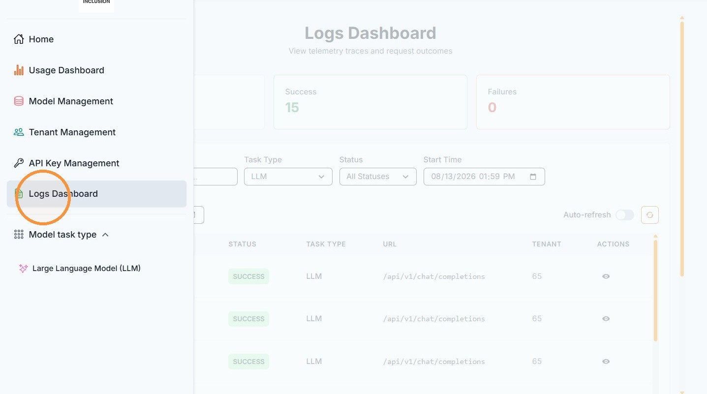
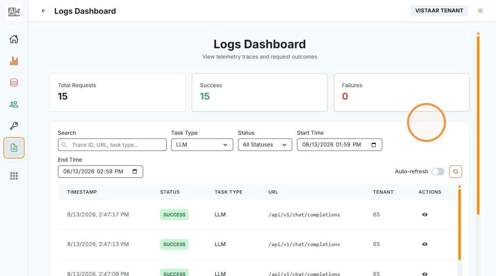
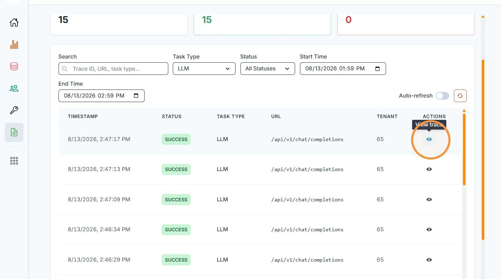
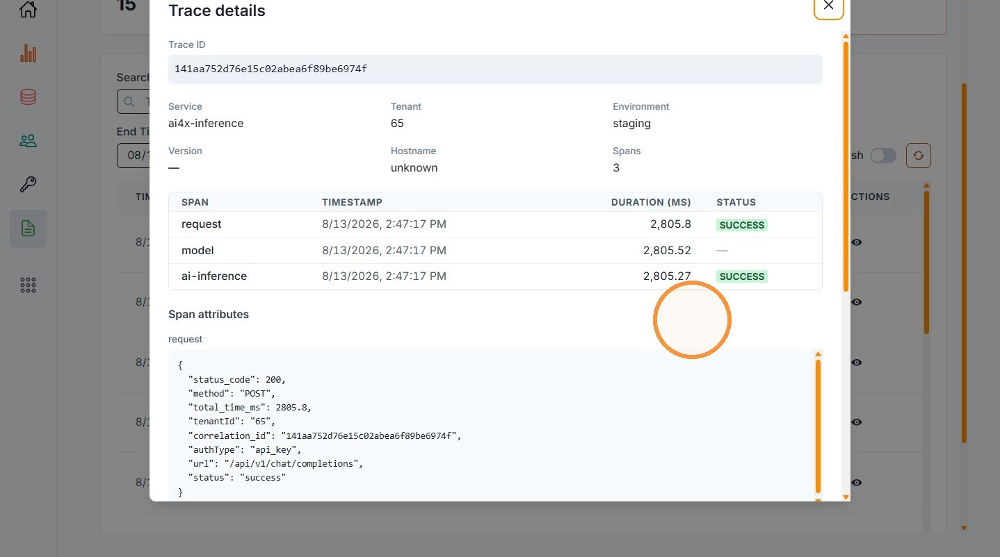

# 5. Logs Dashboard

| | |
| --- | --- |
| Objective | Review request logs and trace details for your institution's request activity. |
| Role | Institution Admin |
| Prerequisites | At least one request has been made using your institution's API keys. |

**Step 1** Click "Logs Dashboard" from the left navigation.

**Step 2** View your institution's request logs, filterable by task type, status, and time range.

**Step 3** Click the view icon next to a log entry to see its trace details.

**Step 4** Review the trace details, including timing for each stage of the request.

| | |
| --- | --- |
| Outcome | You can review your institution's request activity in detail — useful when debugging an application issue. |
| Next | Proceed to [Manage Your Profile](manage-profile.md). |
