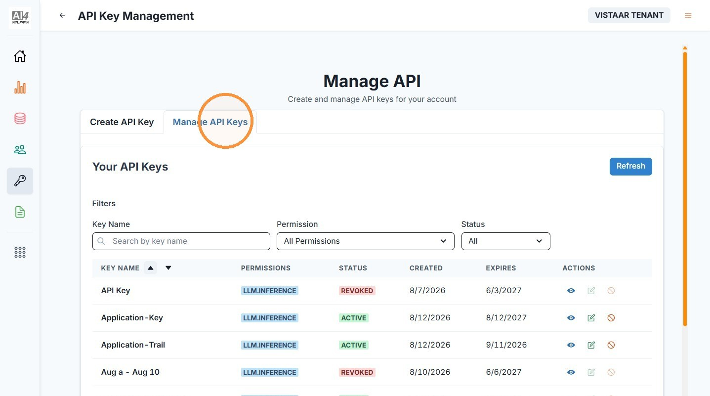
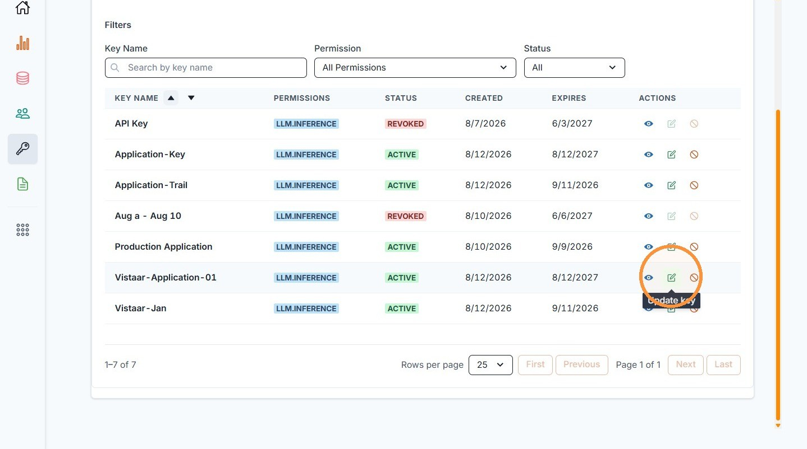
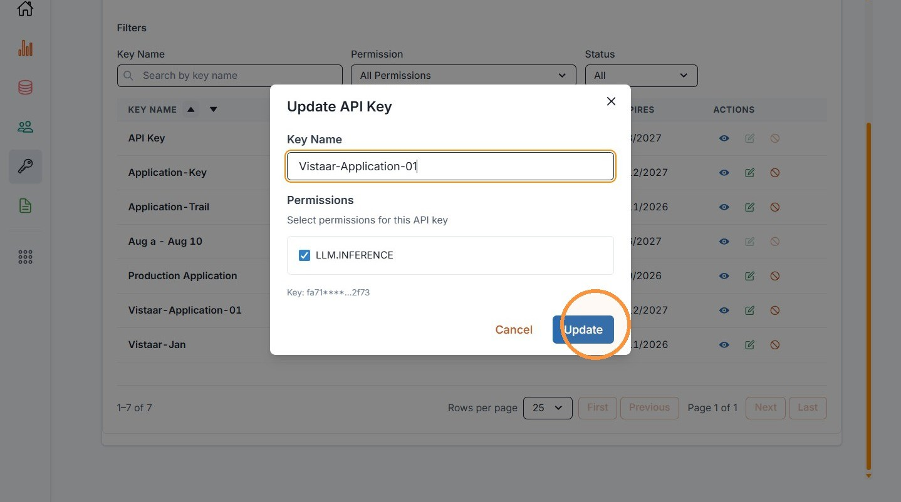
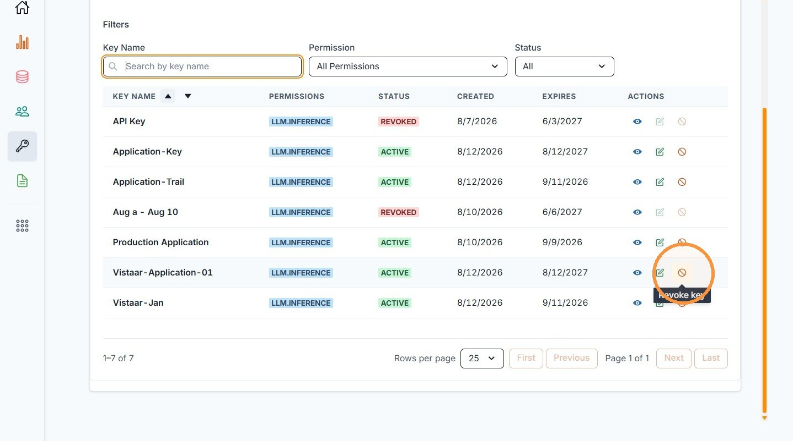
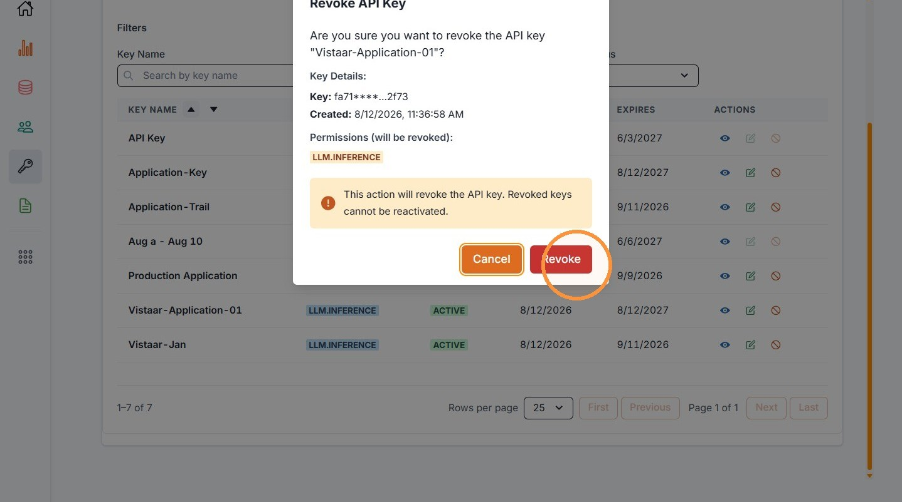

# 1. Manage API Keys

| | |
| --- | --- |
| Objective | Update or revoke an existing API key. |
| Role | Institution Admin |
| Prerequisites | You have at least one existing API key. |

**Step 1** Click "API Key Management," then click "Manage API Keys" to view your institution's application keys.

**Step 2** To rename a key or change its permissions, click the edit icon.

**Step 3** Update the key name or permissions, then click "Update." A key's expiry cannot be changed here.

**Step 4** To revoke a key, click the revoke icon.

**Step 5** Confirm the revocation.


**IMPORTANT**

Revoking a key is permanent — revoked keys cannot be reactivated. If the application still needs access, you'll need to create a new key and update the application with it.


| | |
| --- | --- |
| Outcome | The key is updated, or revoked and immediately stops authenticating requests. |
| Next | Proceed to [Manage Institution Users](manage-users.md). |
