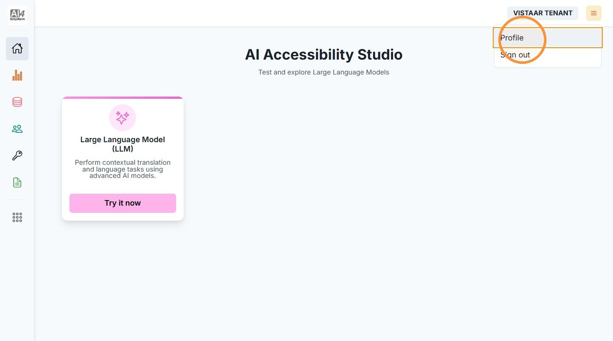
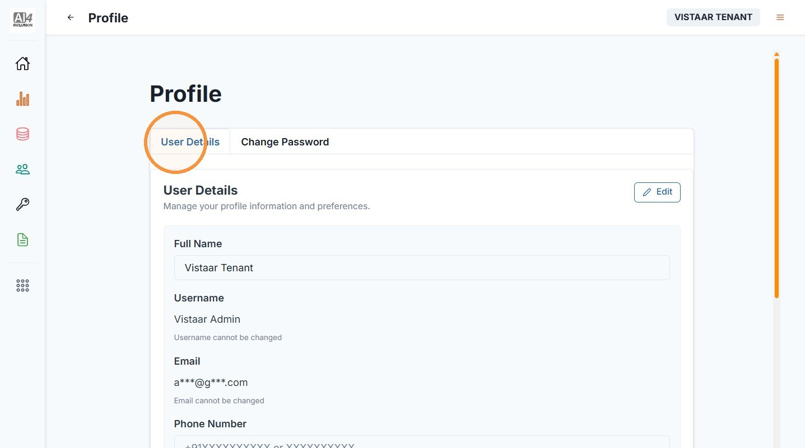
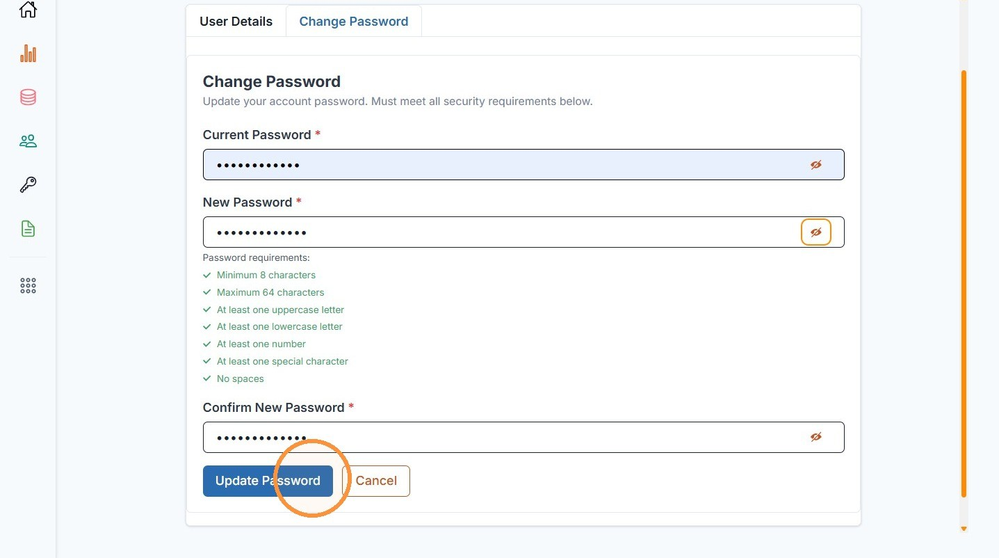
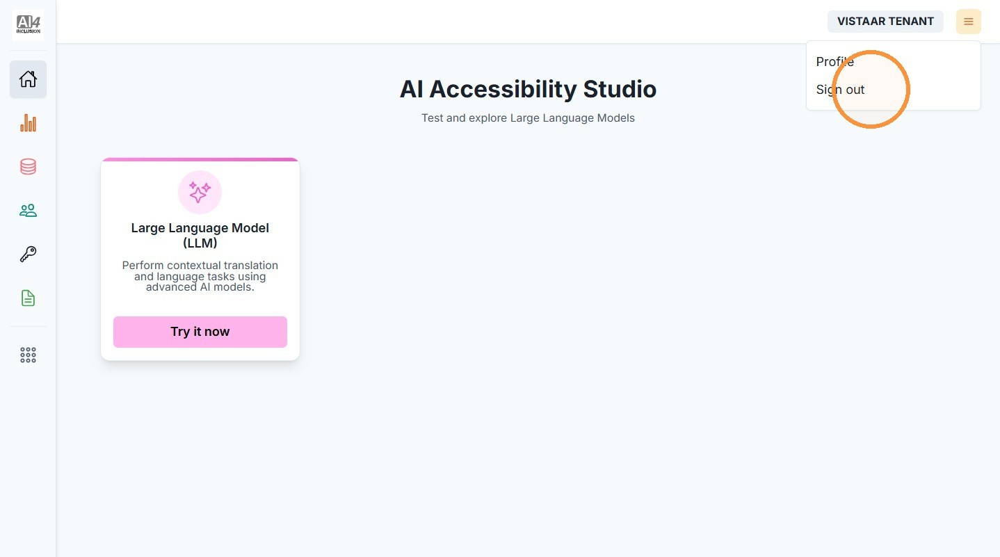
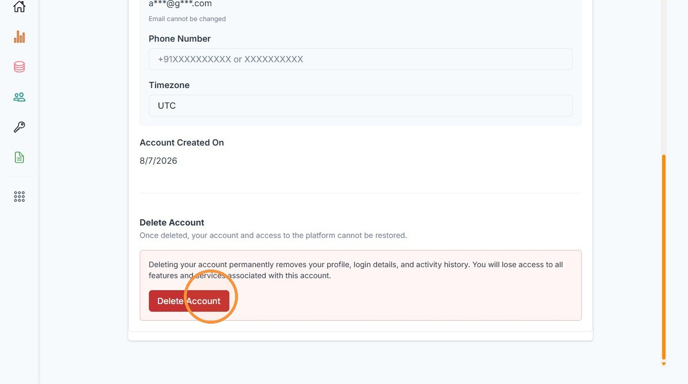
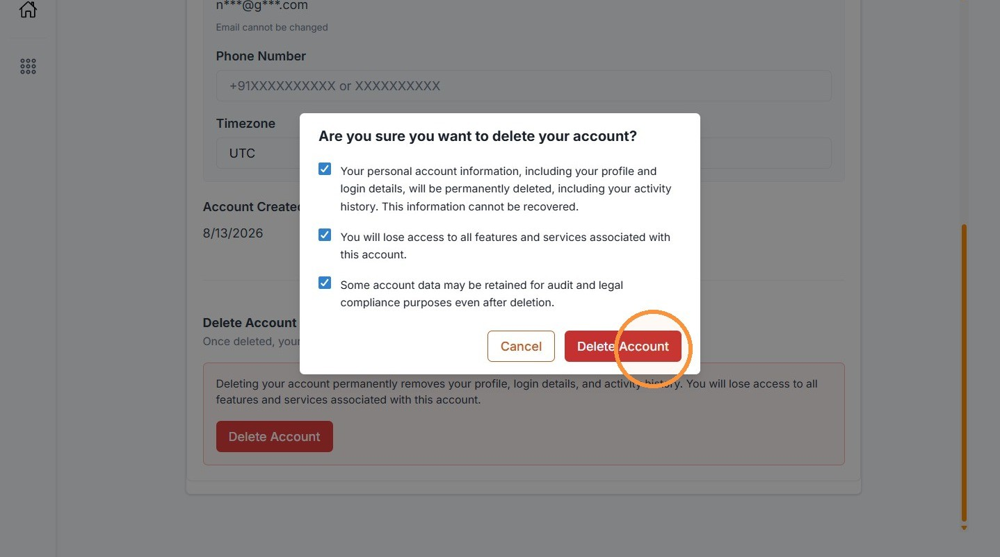

# 6. Manage Your Profile

| | |
| --- | --- |
| Objective | Update your profile, change your password, sign out, or delete your own account. |
| Role | Institution Admin |
| Prerequisites | None. |

**Step 1** Click the menu icon in the top right, then click "Profile."

**Step 2** View or edit your user details.

**Step 3** To change your password, click the "Change Password" tab, enter your current and new password, then click "Update Password."


**NOTE**

Your new password must meet every requirement shown — each one turns green as it's satisfied.


**Step 4** To sign out, click the menu icon and click "Sign out." You're returned to the sign-in page.

**Step 5** To delete your account, scroll the user details page to "Delete Account" and click "Delete Account."

**Step 6** Confirm the deletion.


**IMPORTANT**

You can only delete your own account if your institution has another active Institution Admin. If you're the sole Institution Admin, this action is blocked — ask your Adopter Admin to add another Institution Admin first.


| | |
| --- | --- |
| Outcome | Your profile or password is updated, or your account is deleted, depending on the action you took. |
