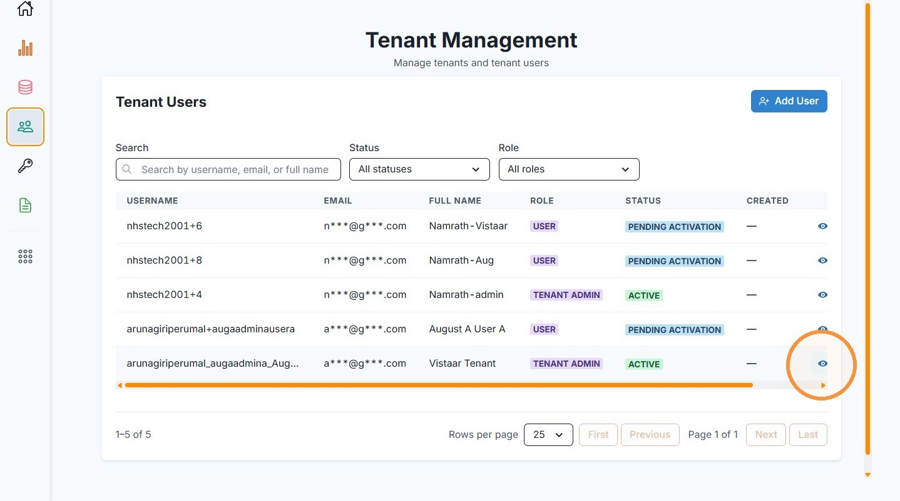
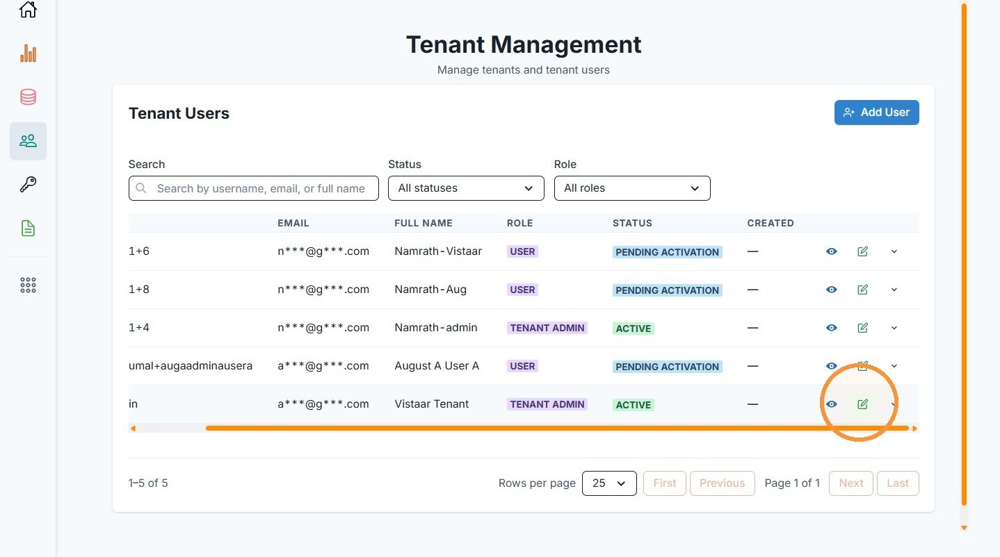
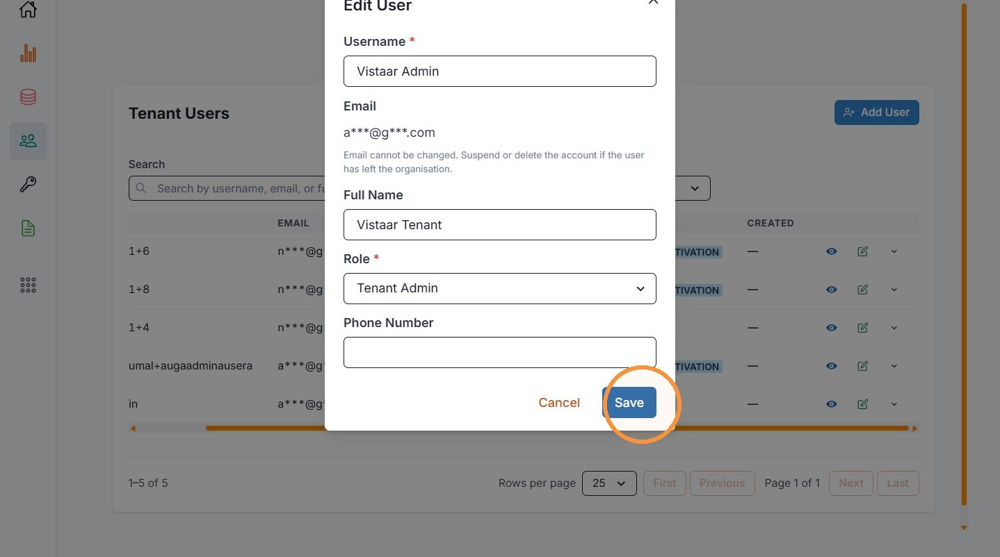
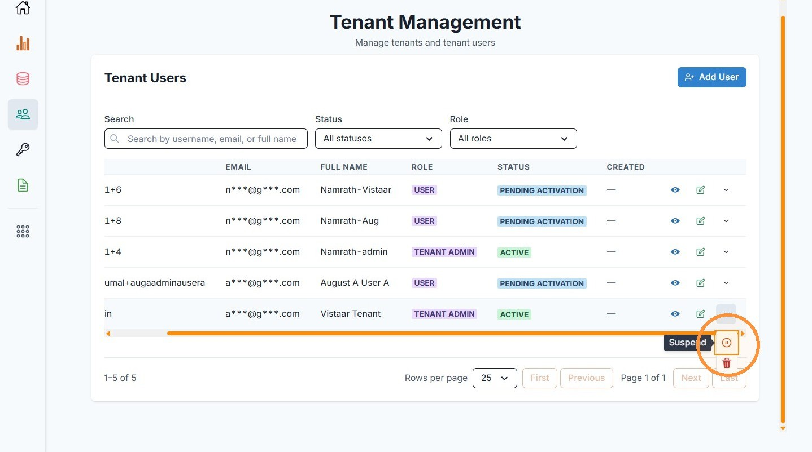
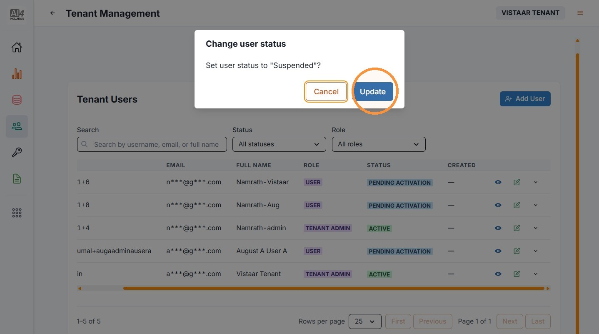
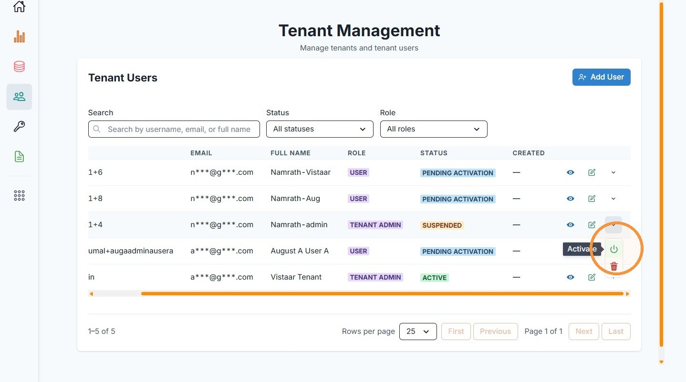
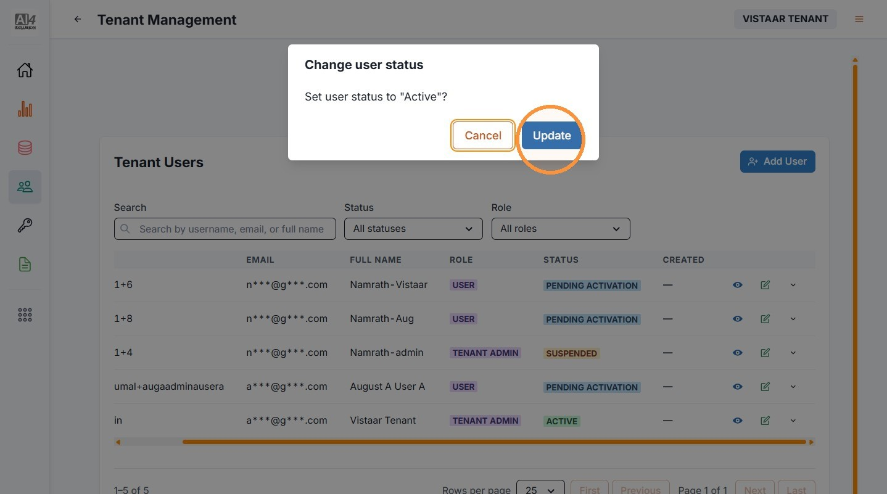
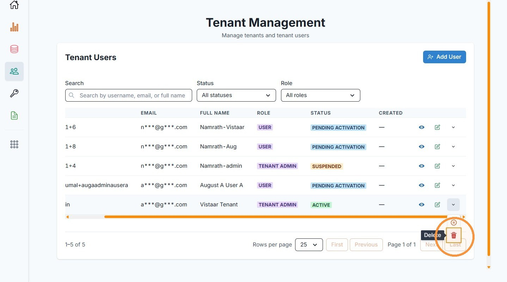
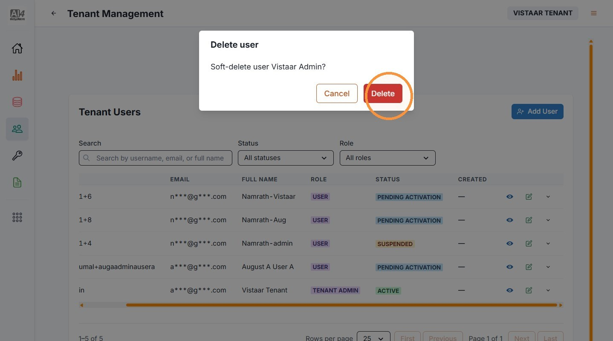

# 2. Manage Institution Users

| | |
| --- | --- |
| Objective | Change a user's role, suspend or activate an existing institution user, or delete one. |
| Role | Institution Admin |
| Prerequisites | You have at least one existing institution user. |

**Step 1** Click "Tenant Management" to view your institution's users.

**Step 2** To change a user's role, click the edit icon for that user.

**Step 3** Update their Role, then click "Save."

**Step 4** To suspend a user, open the row's actions menu and click "Suspend."

**Step 5** Confirm the status change.

**Step 6** To activate a suspended user, open the row's actions menu and click "Activate."

**Step 7** Confirm the status change.

**Step 8** To delete a user, open the row's actions menu and click "Delete."

**Step 9** Confirm the deletion.


**NOTE**

Suspending a user blocks their access immediately. You can restore it at any time using the Activate action.



**IMPORTANT**

Deleting a user is permanent and irreversible. They lose access immediately, and the portal does not offer a way to restore a deleted user afterward.



**IMPORTANT**

An institution must always have at least one active Institution Admin. You cannot suspend or delete a user if doing so would leave your institution without one.


| | |
| --- | --- |
| Outcome | The user's role is updated, or the user is suspended or deleted, depending on the action you took. |
| Next | Proceed to [Try It Now](try-it-now.md). |
