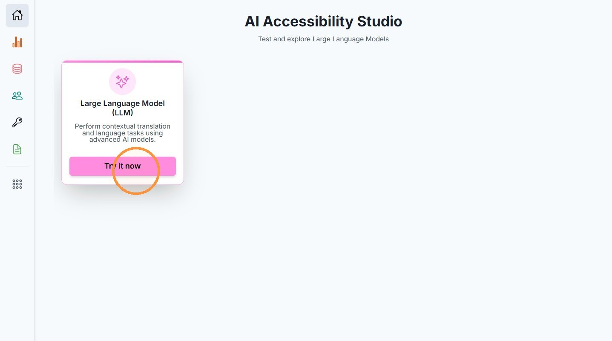
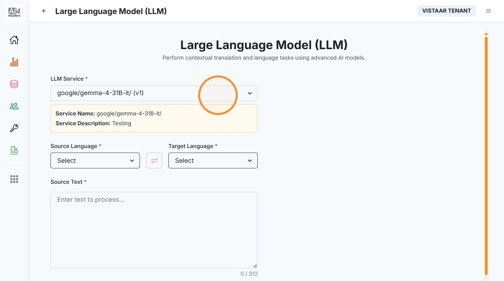
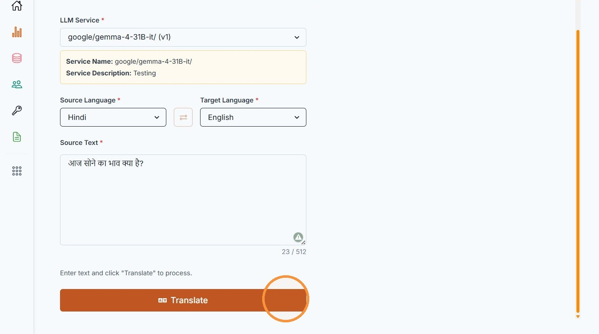

# 3. Try It Now

| | |
| --- | --- |
| Objective | Explore and test an available LLM directly from the portal. |
| Role | Institution Admin or Institution User |
| Prerequisites | None. |

**Step 1** From Home, click "Try it now" on the Large Language Model (LLM) card to open AI Accessibility Studio.

**Step 2** Select the LLM service you want to test, then choose the source and target languages.

**Step 3** Enter the text to process and click "Translate."

| | |
| --- | --- |
| Outcome | You can explore and test an available LLM directly in the portal. |
| Next | Proceed to [View Available Models](view-models.md). |
