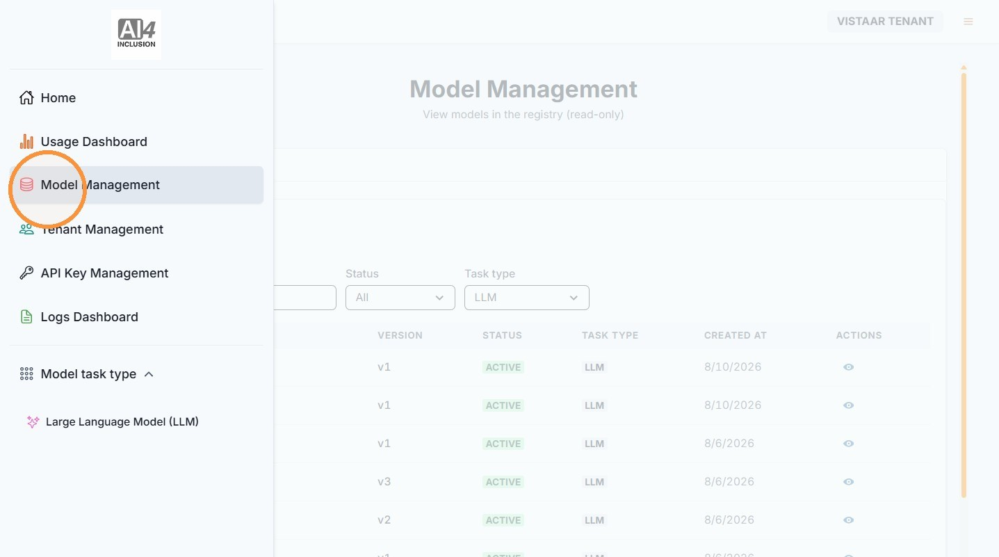
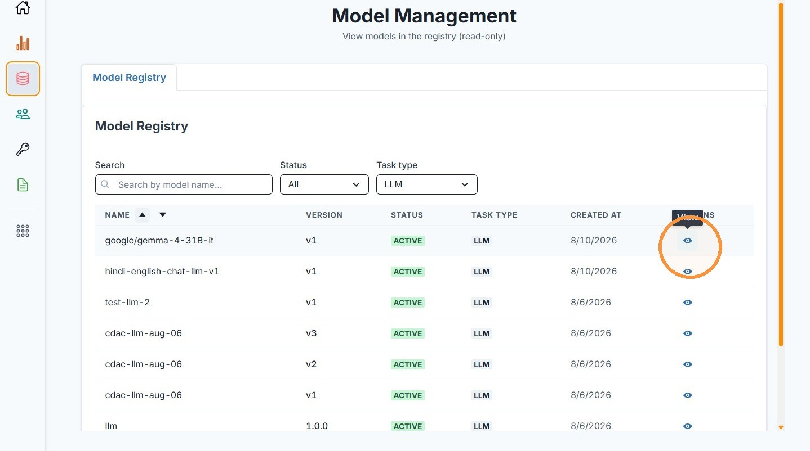

# 4. View Available Models

| | |
| --- | --- |
| Objective | See which models your Adopter has made available on the platform. |
| Role | Institution Admin |
| Prerequisites | None. |

**Step 1** Click "Model Management" from the left navigation.

**Step 2** View the Model Registry.

| | |
| --- | --- |
| Outcome | You can see every model currently registered on the platform. |
| Next | Proceed to [Logs Dashboard](logs.md). |
