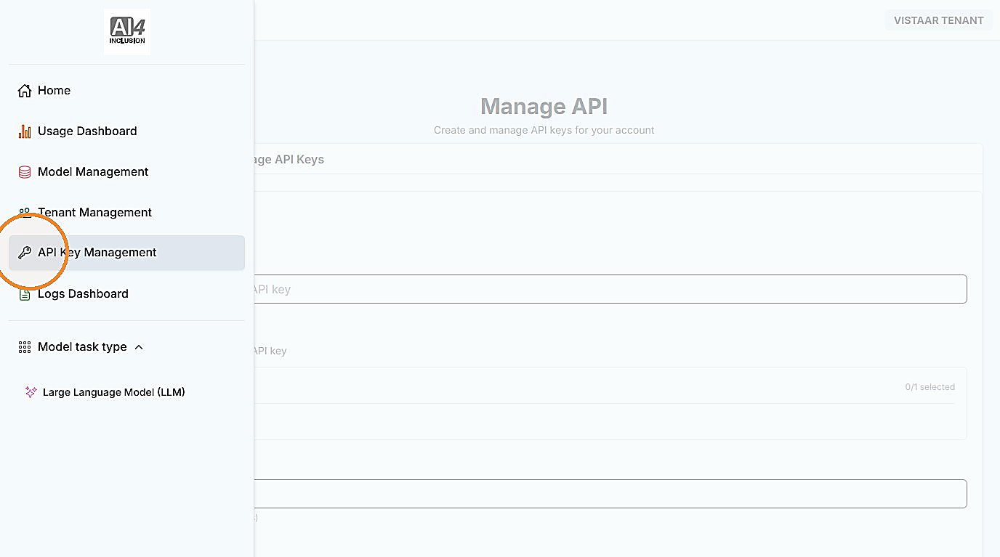
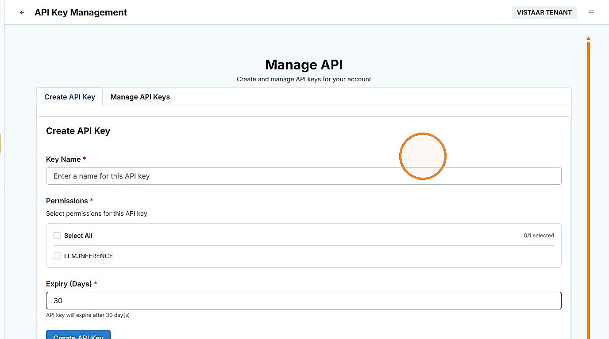
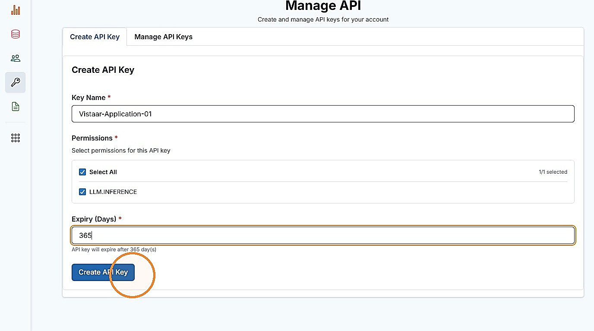
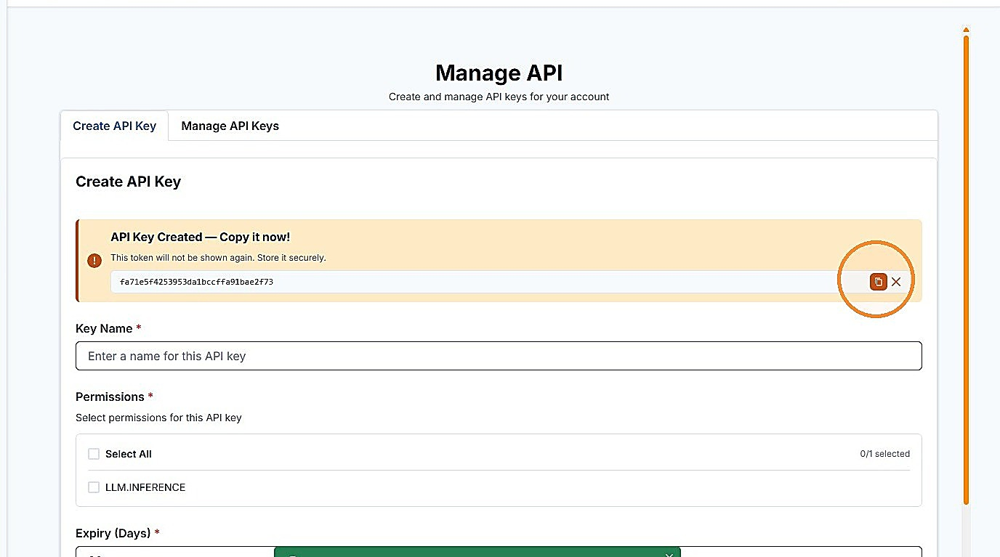

# 3. Create an API Key (Application Access)

| | |
| --- | --- |
| Objective | Create an API key so an application can access LLMs. |
| Role | Institution Admin |
| Prerequisites | Your institution has been assigned a tier and budget, and you know the application's name, the permissions it needs, and when the key should expire. |

**Step 1** Click "API Key Management" to create a key for your application.

**Step 2** The "Create API Key" tab opens by default.

**Step 3** Enter the required information — Key Name, Permissions, and Expiry — and click "Create API Key."


**NOTE**

Name each key the same as the application it's for — for example, "FieldSurveyApp" — so it stays easy to identify later, especially once your institution has more than one application.


**Step 4** Once the API key is created, copy it and store it securely — it is shown only once.


**IMPORTANT**

The full API key is displayed only at the moment of creation and cannot be retrieved again afterwards. Copy it and store it securely before leaving this screen. If it is lost, you will need to create a new key.


| | |
| --- | --- |
| Outcome | The application has an API key, ready to access LLMs, valid until its expiry. |
| Next | Proceed to [Onboard Institution Users](onboard-users.md). |
