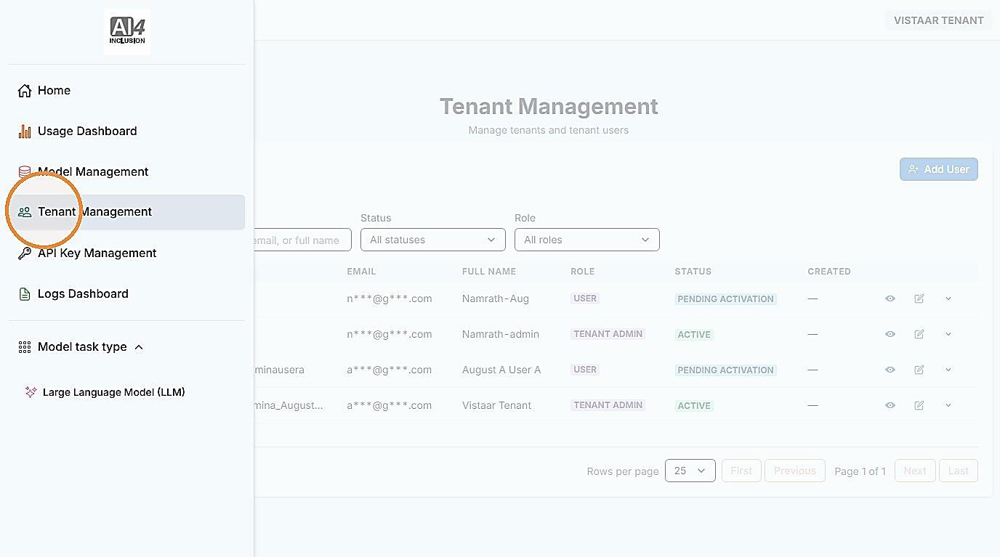
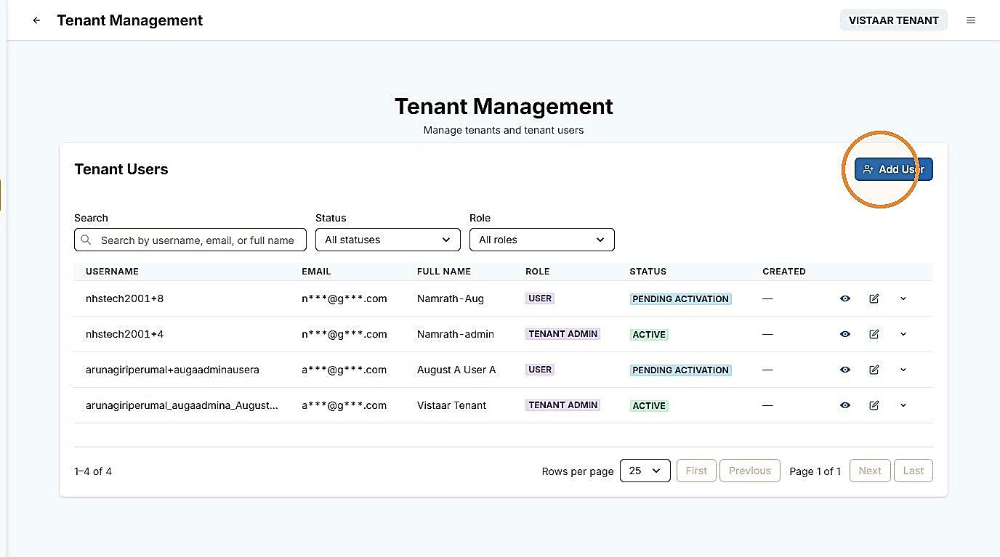
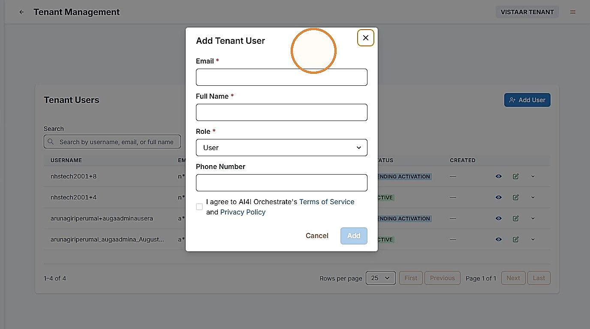
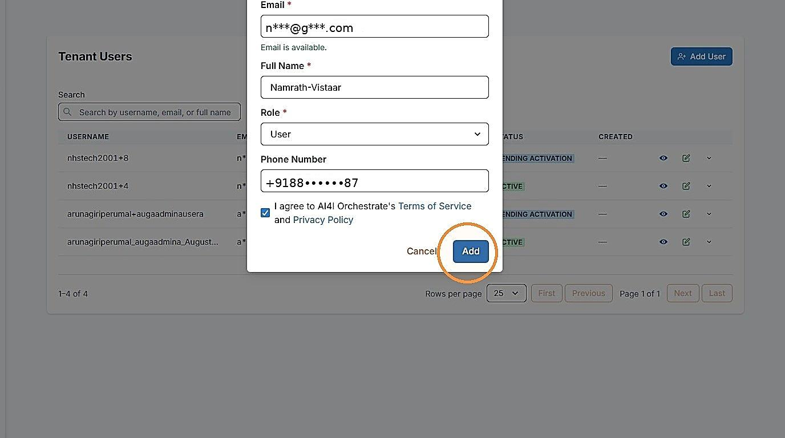
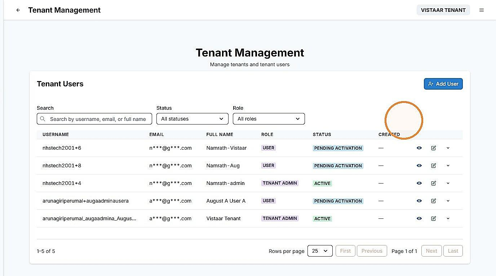

# 2. Onboard an Application

| | |
| --- | --- |
| Objective | Register an application that will consume services on behalf of your institution. |
| Role | Tenant Admin |
| Prerequisites | Your account is active and you are signed in; you have the contact details of the person the application will be registered under. |

**Step 1** Click "Tenant Management" to onboard your applications.

<!-- TODO: add screenshot to assets/onboard-application-01-tenant-management.png -->

**Step 2** Click "Add User" to register a new application.

<!-- TODO: add screenshot to assets/onboard-application-02-existing-users.png -->

<!-- TODO: add screenshot to assets/onboard-application-03-registration-form.png -->

**Step 3** Enter all required fields — Email, Full Name, Role, and Phone Number — agree to the policies by checking the consent box, and click "Add."

<!-- TODO: add screenshot to assets/onboard-application-04-fill-details.png -->

**Step 4** The new entry appears with a status of "Pending activation." Once the application's contact verifies the email and sets a password, the status changes to active.

<!-- TODO: add screenshot to assets/onboard-application-05-pending-activation.png -->


**NOTE**

Once the application is added, an invite is sent to the application's contact. They will need to verify the email and set their password, in the same way you set yours when your own account was first verified.



**NOTE**

If the application's contact doesn't receive this invite within a few minutes, ask them to check their spam folder, then contact your Adopter Admin — they can activate the account through an alternate method.


| | |
| --- | --- |
| Outcome | The application is registered under your institution, initially pending activation, and becomes active once its contact verifies their email and sets a password. |
| Next | Proceed to [Create an API Key](create-api-key.md). |
