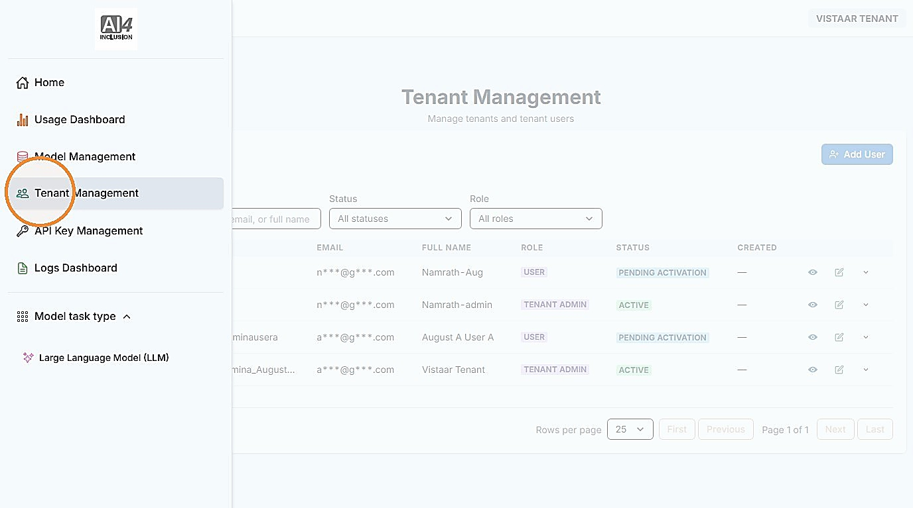
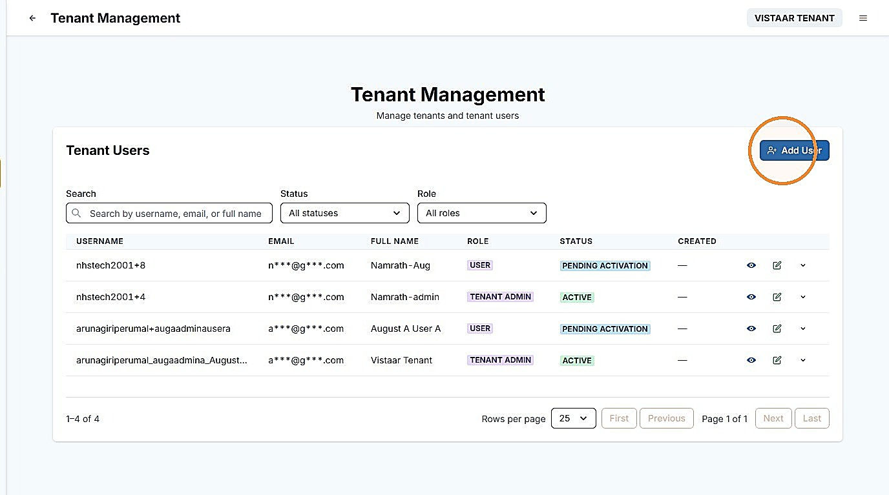
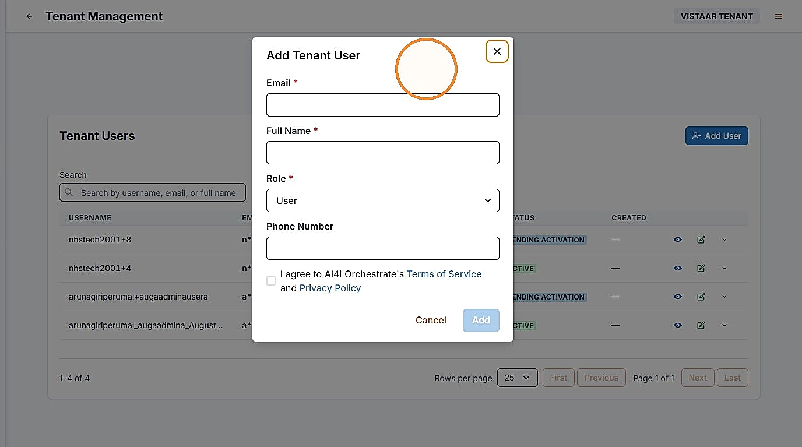
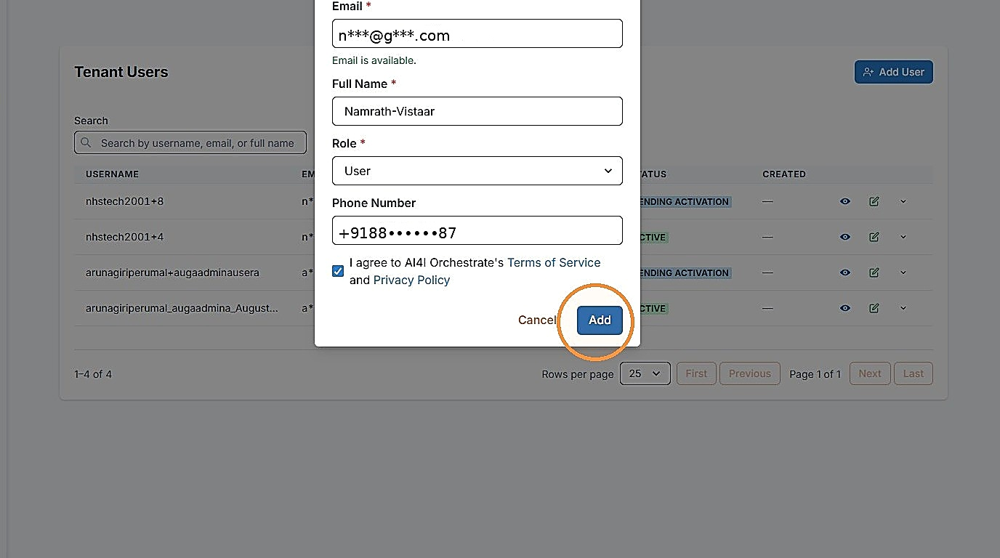
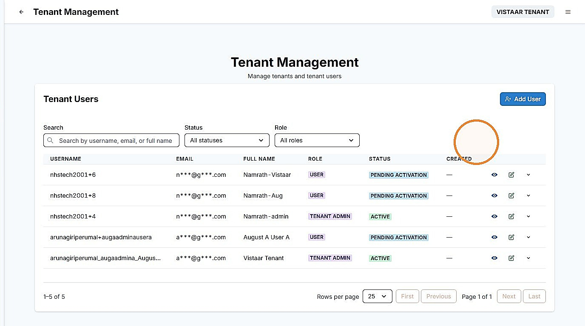

# 4. Onboard Institution Users

| | |
| --- | --- |
| Objective | Add an Institution User to your institution, so they can sign in to AI Switch. |
| Role | Institution Admin |
| Prerequisites | You have the new user's name and email; phone number is optional. |

**Step 1** Click "Tenant Management" to onboard your institution's users.

**Step 2** Click "Add User" to onboard a new user.

**Step 3** Enter the required fields — Email, Full Name, and Role — and Phone Number if available, then agree to the policies by checking the consent box, and click "Add."


**NOTE**

Choose "User" for an Institution User, who can sign in and explore available LLMs, or "Tenant Admin" if they should have the same administrative access as you.


**Step 4** The new entry appears with a status of "Pending activation." Contact your Adopter Admin to activate the account.


**NOTE**

New institution users are activated by your Adopter Admin, who shares their sign-in credentials with you once the account is activated.


| | |
| --- | --- |
| Outcome | The user is added to your institution, initially pending activation, and becomes active once your Adopter Admin activates the account. |
| Next | Proceed to [Part III](../operate-and-govern/metering-dashboard.md) to track your institution's budget and usage. |
