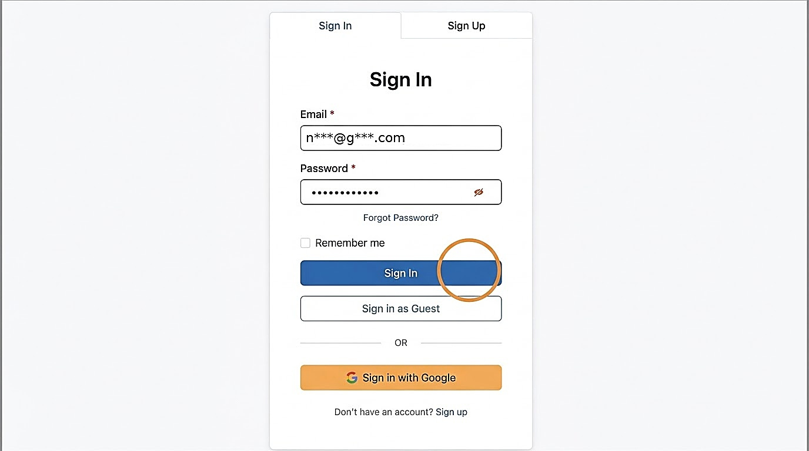
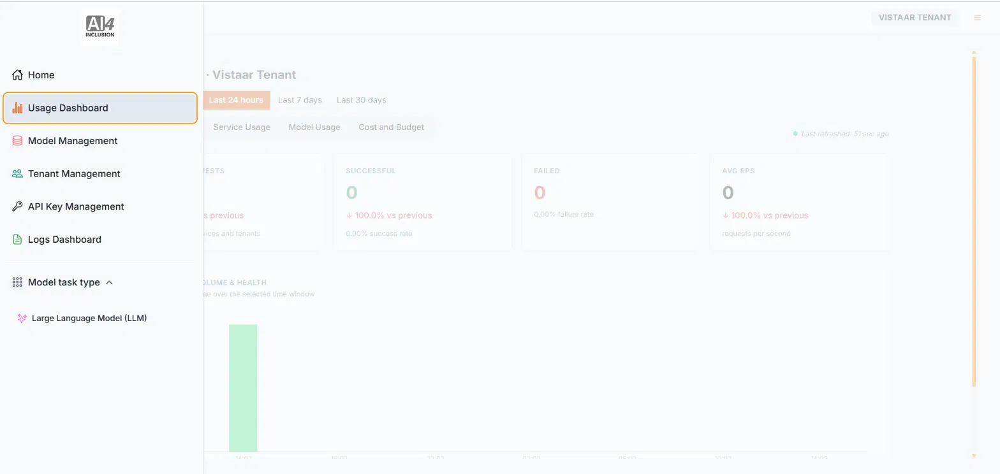

# 2. Signing In

| | |
| --- | --- |
| Objective | Sign in to AI Switch using the credentials your Adopter Admin has shared with you. |
| Role | Institution Admin |
| Prerequisites | Your institution account has been activated, and your Adopter Admin has shared your sign-in credentials. |

**Step 1** Sign in to AI Switch.

**Step 2** By default, you land on the Usage Dashboard.

| | |
| --- | --- |
| Outcome | You're signed in and viewing the Usage Dashboard, your institution's landing page. |
| Next | Proceed to [Create an API Key](create-api-key.md). |
