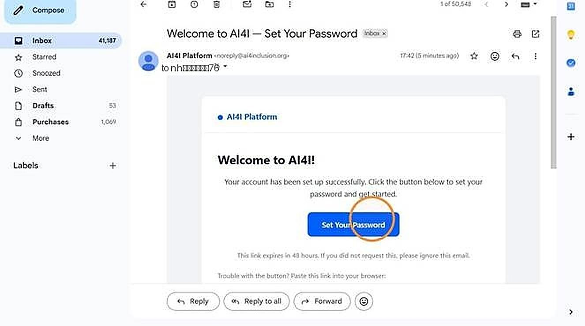
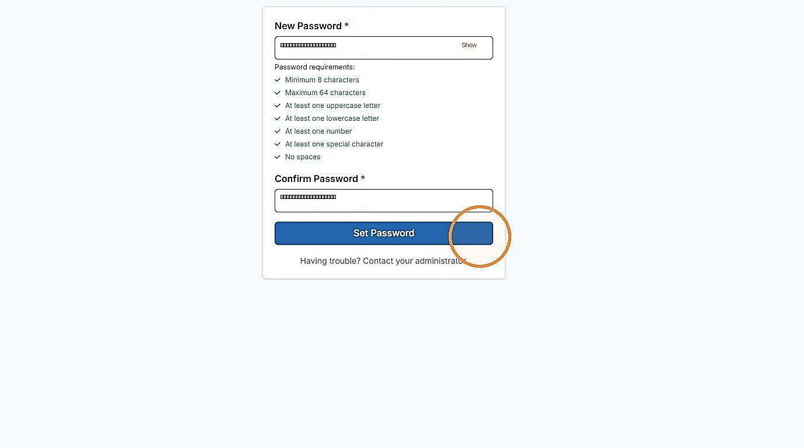
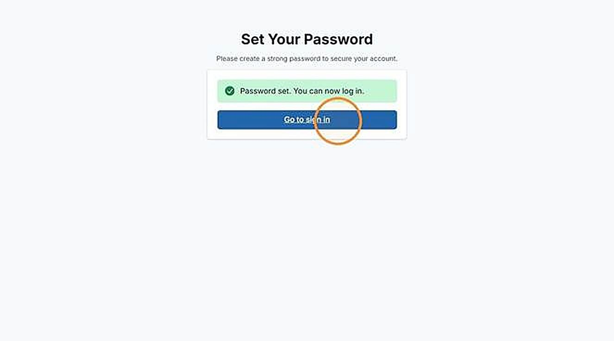
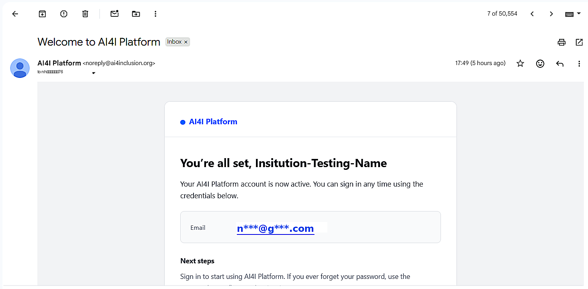
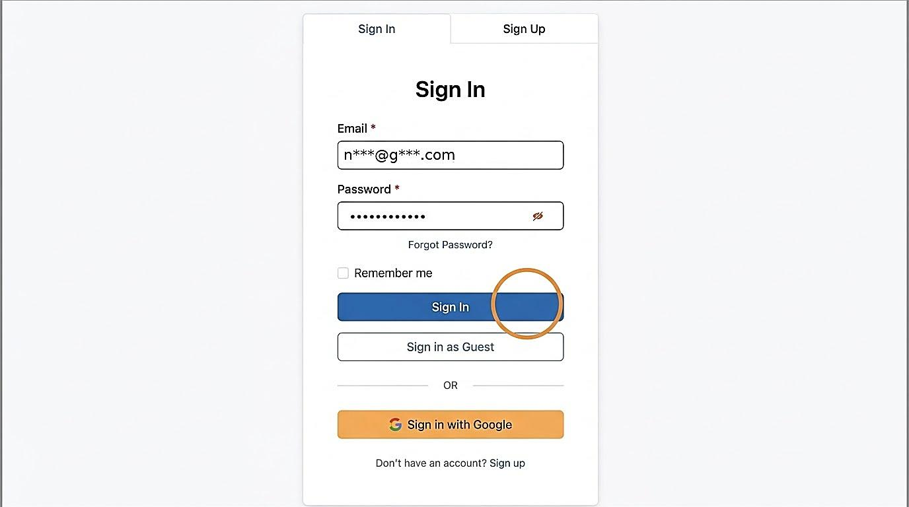

# 1. Verify Your Account & Set Your Password

| | |
| --- | --- |
| Objective | Activate your Tenant Admin account from the onboarding email, set your password, and sign in. |
| Role | Tenant Admin |
| Prerequisites | The Adopter Admin has onboarded your institution, and an activation email has been sent to your address. |

**Step 1** Once the Adopter Admin onboards you, an email is sent to verify your account and set your password. Open the email and click "Set your password."

<!-- TODO: add screenshot to assets/verify-account-01-activation-email.png -->


**NOTE**

If this email doesn't arrive within a few minutes, check your spam folder, then contact your Adopter Admin — they can activate your account through an alternate method.


**Step 2** Enter your password and confirm it, then click "Set Password." All requirements must be met before the button is enabled.

<!-- TODO: add screenshot to assets/verify-account-02-set-password.png -->

**Step 3** Once your password is set successfully, click "Go to sign in."

<!-- TODO: add screenshot to assets/verify-account-03-password-set-success.png -->

**Step 4** A welcome email with your account details is sent to your address.

<!-- TODO: add screenshot to assets/verify-account-04-welcome-email.png -->

**Step 5** Sign in with your credentials.

<!-- TODO: add screenshot to assets/verify-account-05-sign-in.png -->

| | |
| --- | --- |
| Outcome | Your account is active, and you are signed in to the portal, ready to onboard your institution's applications. |
| Next | Proceed to [Onboard an Application](onboard-application.md). |
