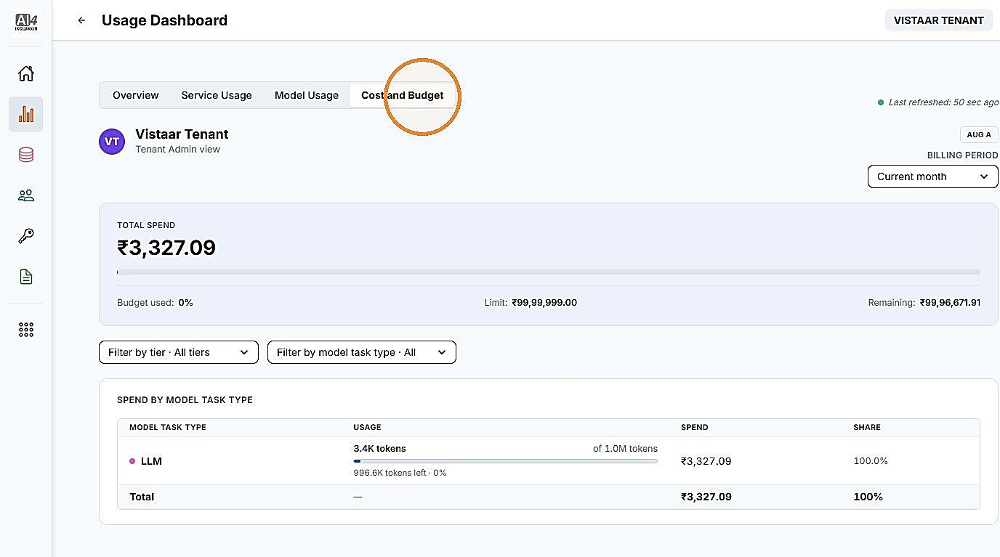

# 1. Reports & Insights — Metering Dashboard

| | |
| --- | --- |
| Objective | View your institution's usage and spend against its assigned tier and budget, broken down by service and by model. |
| Role | Tenant Admin |
| Prerequisites | At least one application in your institution is consuming a service using an API key. |

**Step 1** Click "Usage Dashboard" from the left navigation.

<!-- TODO: add screenshot to assets/metering-dashboard-01-usage-dashboard.png -->

**Step 2** Click "Overview" for a summary of your institution's usage — total requests, success and failure counts, and request volume over time.

<!-- TODO: add screenshot to assets/metering-dashboard-02-overview-tab.png -->

**Step 3** Click "Model Usage" to view usage broken down by model.

<!-- TODO: add screenshot to assets/metering-dashboard-03-model-usage-tab.png -->

**Step 4** Click "Cost and Budget" to view your institution's spend against its assigned tier and budget.

<!-- TODO: add screenshot to assets/metering-dashboard-04-cost-and-budget.png -->

| | |
| --- | --- |
| Outcome | You can see your institution's usage and spend in the Usage Dashboard — Overview for a summary, Service Usage and Model Usage for breakdowns by service and by model, and Cost and Budget for spend against your assigned tier and budget. |


**NOTE**

If you need a different tier or a larger budget, contact your Adopter Admin — tiers and budgets are assigned at the platform level and cannot be changed by a Tenant Admin.

