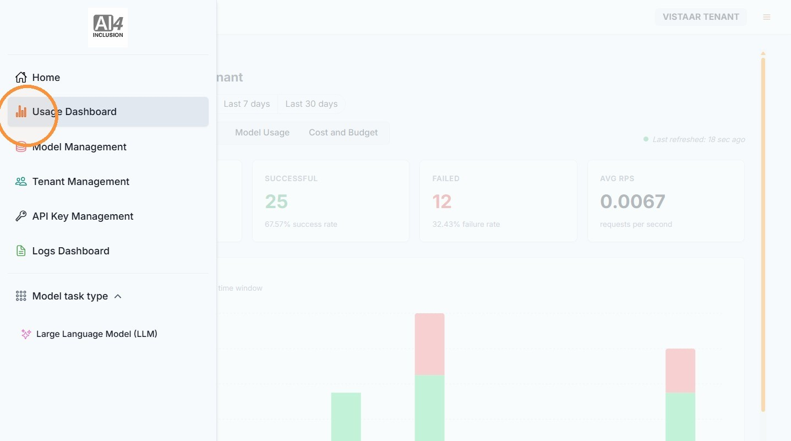
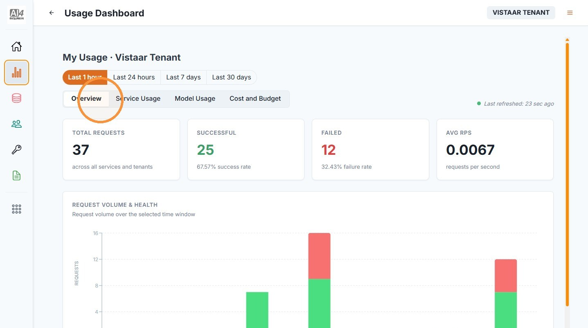
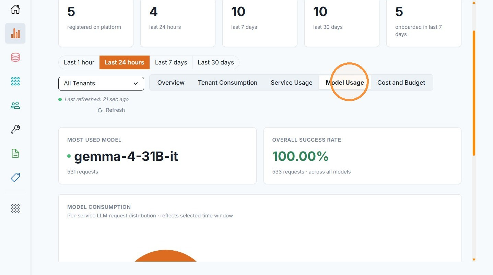
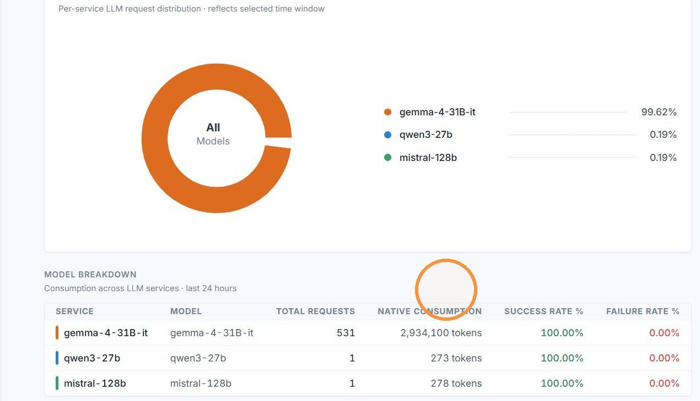
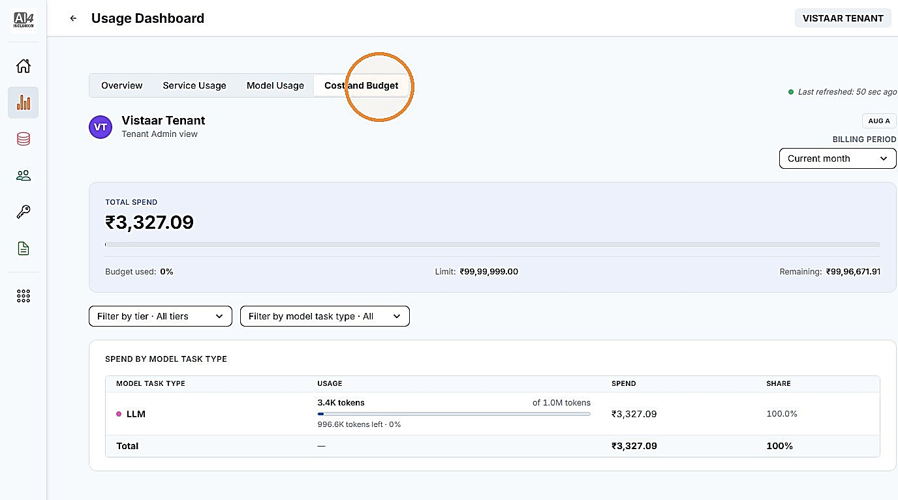

# 1. Metering Dashboard

| | |
| --- | --- |
| Objective | Track your institution's budget and usage against its assigned tier. |
| Role | Institution Admin |
| Prerequisites | Your institution has at least one application in use. |

**Step 1** Click "Usage Dashboard" from the left navigation.

**Step 2** Click "Overview" for a summary of your institution's usage — total requests, success and failure counts, and request volume over time.

**Step 3** Click "Model Usage" to view usage broken down by model.

**Step 4** Scroll down in the Model Usage tab to view the breakdown — first by model, then by individual service, showing total requests, consumption, and success and failure rates for each.


**NOTE**

A Service is a specific model version made available through an endpoint — a single model can run as more than one Service. This view groups your Services by the model they run on, so you can see which Services fall under which model.


**Step 5** Click "Cost and Budget" to view your institution's spend against its assigned tier and budget.

| | |
| --- | --- |
| Outcome | You can see your institution's budget and usage — Overview for a summary, Service Usage and Model Usage for breakdowns, and Cost and Budget for spend against your assigned tier and budget. |
| Next | Proceed to Part IV for day-to-day account and access management. |


**NOTE**

If you need a different tier or a larger budget, contact your Adopter Admin — this is managed at the platform level.

