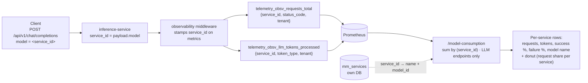
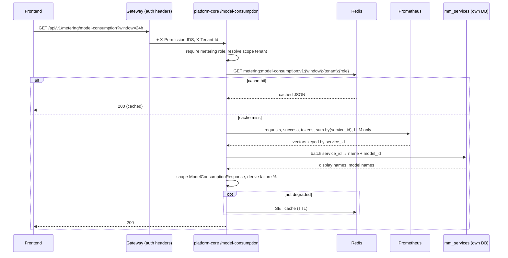

# Model Consumption API: High-Level Design

**Scope:** Backend only, LLM only. New metering endpoint behind a new "Model Consumption" tab, reporting LLM usage broken down by the service a tenant called. Service: `platform-core-service`.

---

## 1. Terminology

Read this first. The tab is called "Model Consumption", but the unit it counts is a **service**, not a model. The words below are used with these exact meanings throughout the document.

| Term | Meaning | Source |
|---|---|---|
| `service_id` | Human readable id of a deployed service, e.g. `MH-gemma-32b`, `gemma-h100`. Not a UUID. This is the string the client sends in the OpenAI `model` field, and the grouping key for this endpoint. | `mm_services.service_id` (varchar, unique) |
| `name` | Human readable display name of that service. | `mm_services.name` (separate column) |
| `model_name` | The actual model behind the service, e.g. `gemma-3-27b-it`. Informational only, never grouped on. | `mm_services.model_id` |

**Cardinality, and why it matters:**

- One service maps to **exactly one** model. `mm_services.model_id` is a single FK to `mm_models`.
- One model maps to **many** services. The same Gemma can back `BV-gemma-32b` (BharatVistaar), `MH-gemma-32b` (Mahavistaar), `gemma-h100` and `gemma-a100` (different GPU tiers).

So grouping by model name would merge BharatVistaar and Mahavistaar traffic into one row and destroy tenant attribution. Grouping by `service_id` keeps it. Every "row" in this document is one deployed service.

---

## 2. Objective and Non-Goals

**Objective:** give operators a per-service view of LLM usage. Today the metering tabs group by task, so all LLM traffic collapses into a single "LLM" row and there is no way to see how it splits across the services tenants actually call.

- Report per-service LLM usage for a time window (1h / 24h / 7d / 30d): total requests, tokens processed, success rate, failure rate.
- Show the mapped model name on each row, so operators can see which model a service runs.

**Non-goals:**

- No roll-up or total by model name. Two services running the same model stay two rows.
- No second level drill-down (pick a model, see its services). Deferred.
- Service Consumption is unchanged. It stays service level and is still needed for Bhashini, which spans multiple task types. Whether the UI shows or hides that tab is a frontend decision with no backend impact.

---

## 3. Design Change: High-Level Workflow

**Why this is needed:** the service dimension is already recorded on every LLM metric but never surfaced grouped. The client sends the service id in the OpenAI `model` field; the platform stamps it onto every Prometheus metric as `service_id`. Grouping the existing metrics by `service_id` splits the single "LLM" bucket into one row per service, with no new tracking.

**Source is Prometheus, not billing.** The billing path (`PPUQuotaUsage`) is keyed by task type, aggregated monthly, and measures cost, so it cannot serve a per-service, 1h to 30d consumption view. This endpoint stays entirely on Prometheus.



---

## 4. API Design

### Endpoint
```
GET /api/v1/metering/model-consumption
```

### Query parameters
| Param | Type | Default | Notes |
|---|---|---|---|
| `window` | `1h \| 24h \| 7d \| 30d` | `24h` | FastAPI `Literal`; 422 for anything else. `all` is internal only. |
| `tenant_id` | int ≥ 1, optional | none | Platform-admin-only narrowing. Ignored (overridden by header) for tenant admins. |

### Response schema

New models in `schemas/metering.py`. Same *shape* as `ServiceConsumptionResponse` but a separate type, not a reuse of `ServiceRow`, which keeps this decoupled from `/service-consumption` and from the billing/spend schemas.

```
ServiceModelRow:
  service_id: str           # raw value the client sent in the OpenAI `model` field; the grouping key
  name: str                 # mm_services.name, falls back to service_id when unresolved
  model_name: str | null    # mm_services.model_id, the actual model behind the service
  requests: int
  native_units: float       # total tokens
  native_unit_suffix: str   # "tokens"
  success_pct: float
  failure_rate_pct: float

ModelConsumptionSummary:
  most_used: { service_id, name, requests } | null              # by request volume
  highest_failure_rate: { service_id, name, failure_rate_pct } | null

ModelConsumptionResponse:
  scope: Scope
  summary: ModelConsumptionSummary | null
  breakdown: list[ServiceModelRow]
  degraded: bool
  generated_at: str
```

`/service-consumption` returns neither a service id nor a model name today, and no frontend code reads those fields, so this endpoint is free to define its own property names. The names above follow the same convention as the existing services tab.

### Data reads

- Prometheus for all counts (via the existing `PrometheusClient`).
- `mm_services` (platform-core's own DB, via the existing `ServiceRepository`) for `service_id → (name, model_id)`, batched for the ids in the result set. No schema change and no migration; this is a new *read* dependency for the metering path, cached with the response.

**`model_name` comes from `mm_services`, never from a Prometheus label.** The `model` label on `telemetry_obsv_llm_tokens_processed` is not a reliable display source: the buffered path sets it to the name vLLM echoes back in the response body (`google/gemma-4-E4B-it`), while the streaming path sets it to the registry name resolved before the call. The same service can therefore emit two different model strings, and neither exists on a failed request. The DB lookup is deterministic, is present for failures too, and is the same batch call that already resolves `name`.

### Caching

Redis, same TTL (`metering_cache_ttl_seconds`) as the other tabs.
```
Cache key: metering:model-consumption:v1:{window}:{scope_tenant or 'all'}:{role}
```
Role and tenant are in the key, so a scoped response cannot leak across tenants or roles. Written only when `degraded` is false.

---

## 5. PromQL Design

All queries wrap the metric in the existing `sum_over_window()` hybrid (`(metric unless metric offset w) or (increase(metric[w]) > 0)`) so counts are reset-aware and consistent with the other tabs. LLM endpoints are matched on the path label (`exported_endpoint`, env-driven): `/api/v1/chat` and `/api/v1/chat/completions`.

```promql
# Requests per service (LLM endpoints only): drives requests + the donut
sum by (service_id) (
  <sum_over_window> telemetry_obsv_requests_total{
    exported_endpoint=~"/api/v1/(chat|chat/completions)",
    tenant!="unknown"          # + ,tenant="<id>" when scoped
  }
)

# Successful requests per service: same selector + status_code=~"2.."

# Tokens per service
sum by (service_id) (
  <sum_over_window> telemetry_obsv_llm_tokens_processed_sum{
    token_type="total",
    tenant!="unknown"          # + ,tenant="<id>" when scoped
  }
)
```

**Group by `service_id` only.** Do not add `model` to the `by` clause. Doing so would split one service across several rows and, because the model label is absent on failed requests, would skew the success and failure percentages.

Failure % is derived as `100 - success_pct` per service, guarded so a zero-traffic service reports 0 % failure (not 100 %), exactly as `/service-consumption` does. The donut uses the per-service request counts (request share), matching the UI.

---

## 6. UI

New "Model Consumption" tab, added next to Service Consumption rather than replacing it.

- One row per service. The row shows the service name, its mapped model name, requests, tokens, success % and failure %.
- Donut shows request share per service.
- Service Consumption stays as it is. It answers a different question (which service is popular across all task types) and Bhashini depends on it.

Showing the service, not just the model, is what preserves tenant attribution in the UI: `BV-gemma-32b` and `MH-gemma-32b` are visibly separate rows even though both run the same Gemma.

---

## 7. Request Flow


