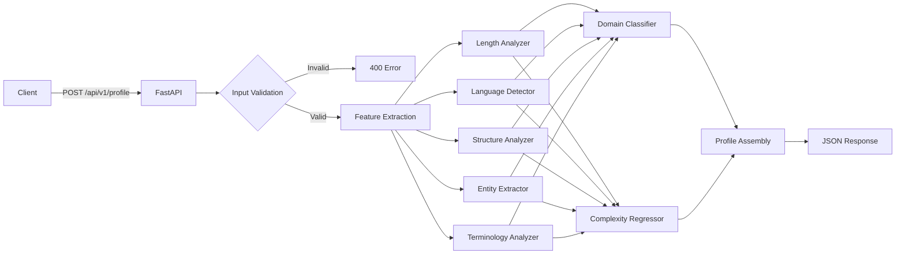
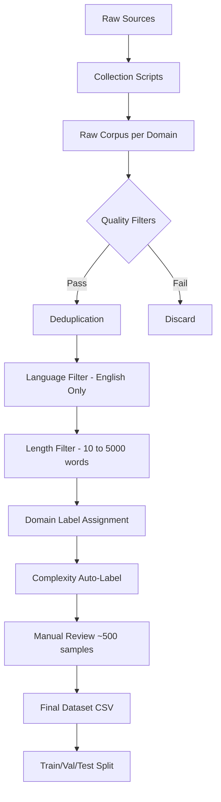
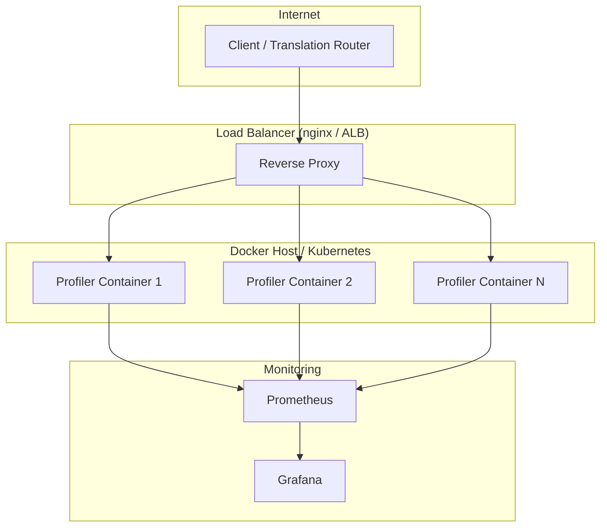
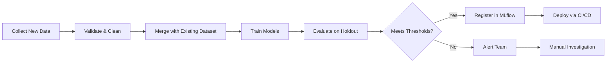
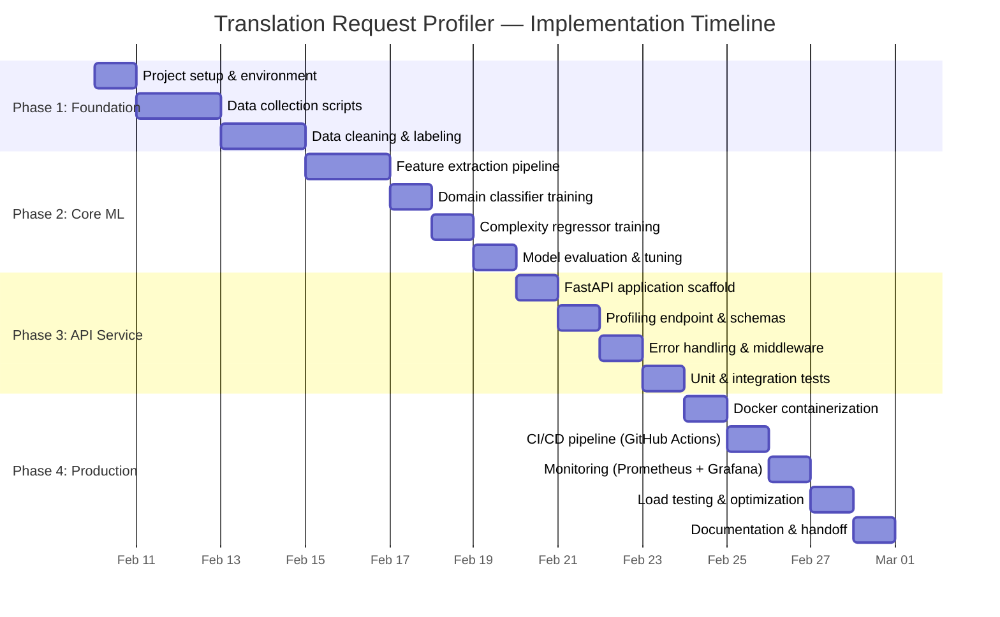

# Translation Request Profiler — Production Implementation Plan

> **Version**: 1.0 · **Date**: 2026-02-08 · **Status**: Draft
> **Context**: CPU-only, multi-signal profiler for translation request routing
> **Stack**: FastAPI · Docker · scikit-learn · fastText · spaCy

---

## Table of Contents

1. [Executive Summary](#1-executive-summary)
2. [Architecture Overview](#2-architecture-overview)
3. [A — Data Collection & Preparation](#3-a--data-collection--preparation)
4. [B — Feature Engineering & Model Training](#4-b--feature-engineering--model-training)
5. [C — Production Service Design](#5-c--production-service-design)
6. [D — Infrastructure & Deployment](#6-d--infrastructure--deployment)
7. [E — Dependencies & Environment](#7-e--dependencies--environment)
8. [F — Testing Strategy](#8-f--testing-strategy)
9. [G — Documentation & Maintenance](#9-g--documentation--maintenance)
10. [Implementation Timeline](#10-implementation-timeline)
11. [References](#11-references)

---

## 1. Executive Summary

The **Translation Request Profiler** is an independent, production-grade microservice that accepts raw text and returns a **multi-signal JSON profile** used to route translation requests to the optimal backend: small MT, domain-specific MT, or LLM.

### Key Design Decisions

| Decision | Choice | Rationale |
|----------|--------|-----------|
| Web framework | **FastAPI** | Async, auto-docs, Pydantic validation, fastest Python framework |
| Containerization | **Docker** (multi-stage) | Reproducible, portable, CI/CD friendly |
| Domain classifier | **TF-IDF + Logistic Regression** | Fast inference (<5ms), interpretable, low memory |
| Complexity model | **RandomForestRegressor** | Robust to outliers, no scaling needed, feature importance built-in |
| Language ID | **fastText lid.176.bin** | Best CPU accuracy for 176 languages, single file |
| NER | **spaCy en_core_web_sm** | Lightweight (~12MB), fast CPU inference |
| Model serving | **In-process (joblib)** | Simplest for sklearn; Triton reserved for future GPU models |
| Model versioning | **MLflow** | Industry standard, free, integrates with sklearn |
| Monitoring | **Prometheus + Grafana** | De-facto standard for service metrics |

### Why NOT Triton (for now)

NVIDIA Triton's FIL backend *does* support scikit-learn RandomForest and tree models, and would be appropriate if:
- You need to serve 10+ models behind a single endpoint
- You require dynamic batching or GPU acceleration
- You need A/B model routing at the inference-server level

For this system's scale (2 lightweight sklearn models + fastText + spaCy), **in-process serving via FastAPI** is simpler, faster to deploy, and avoids operational overhead. Triton can be introduced later when model count or traffic warrants it.

---

## 2. Architecture Overview

```
┌─────────────────────────────────────────────────────────────────────┐
│                        Client / Router                              │
│                    POST /api/v1/profile                              │
└────────────────────────────┬────────────────────────────────────────┘
                             │ JSON {text, source_lang?}
                             ▼
┌─────────────────────────────────────────────────────────────────────┐
│                     FastAPI Service (Docker)                         │
│  ┌──────────────┐  ┌──────────────┐  ┌───────────────┐              │
│  │ Input Valid.  │→ │  Feature     │→ │  ML Models    │              │
│  │ & Sanitize   │  │  Extractors  │  │               │              │
│  └──────────────┘  │              │  │ • Domain clf  │              │
│                    │ • Length     │  │ • Complexity  │              │
│                    │ • Language   │  │   regressor   │              │
│                    │ • Structure  │  └───────┬───────┘              │
│                    │ • Entities   │          │                      │
│                    │ • Terminol.  │          ▼                      │
│                    └──────┬───────┘  ┌───────────────┐              │
│                           │          │  Profile JSON  │              │
│                           └─────────→│  Assembly      │              │
│                                      └───────┬───────┘              │
│  ┌─────────────┐                             │                      │
│  │ Prometheus   │←── metrics ────────────────┘                      │
│  │ /metrics     │                                                   │
│  └─────────────┘                                                    │
└────────────────────────────┬────────────────────────────────────────┘
                             │ JSON Profile Response
                             ▼
                      Translation Router
```

### Mermaid: Request Flow



---

## 3. A — Data Collection & Preparation

### 3.1 Domain-Specific Data Sources

#### Medical (Target: 3,000–5,000 samples)

| Source | URL / Access | Format | Est. Size | Notes |
|--------|-------------|--------|-----------|-------|
| **PubMed Abstracts** | [PubMed E-utilities API](https://www.ncbi.nlm.nih.gov/books/NBK25501/) | XML/JSON | 39M+ records | Use `efetch` with MeSH terms; filter English abstracts |
| **PubMed 200k RCT** | [Hugging Face](https://huggingface.co/datasets/pubmed_qa) | CSV | 200k abstracts | Pre-segmented sentences, labeled by section |
| **WHO Fact Sheets** | [who.int/news-room/fact-sheets](https://www.who.int/news-room/fact-sheets) | HTML scrape | ~500 docs | Structured paragraphs, requires scraping |
| **MedQuAD** | [GitHub](https://github.com/abachaa/MedQuAD) | XML | 47k Q&A pairs | Medical Q&A from NIH |

**Collection script pattern:**
```python
# PubMed E-utilities example
import requests

def fetch_pubmed_abstracts(query: str, max_results: int = 5000) -> list[str]:
    """Fetch abstracts from PubMed using E-utilities API."""
    # Step 1: Search for IDs
    search_url = "https://eutils.ncbi.nlm.nih.gov/entrez/eutils/esearch.fcgi"
    params = {"db": "pubmed", "term": query, "retmax": max_results, "retmode": "json"}
    ids = requests.get(search_url, params=params).json()["esearchresult"]["idlist"]

    # Step 2: Fetch abstracts in batches of 200
    abstracts = []
    for i in range(0, len(ids), 200):
        batch = ",".join(ids[i:i+200])
        fetch_url = "https://eutils.ncbi.nlm.nih.gov/entrez/eutils/efetch.fcgi"
        resp = requests.get(fetch_url, params={
            "db": "pubmed", "id": batch, "rettype": "abstract", "retmode": "text"
        })
        abstracts.extend(parse_abstracts(resp.text))
    return abstracts
```


#### Legal (Target: 3,000–5,000 samples)

| Source | URL / Access | Format | Est. Size | Notes |
|--------|-------------|--------|-----------|-------|
| **Pile of Law** | [HuggingFace](https://huggingface.co/datasets/pile-of-law/pile-of-law) | JSONL | 256GB total | Court opinions, contracts, legislation; sample subset |
| **LEDGAR** | [HuggingFace](https://huggingface.co/datasets/lex_glue) | CSV | 80k+ clauses | SEC EDGAR contract clause classification |
| **CUAD** | [GitHub](https://github.com/TheAtticusProject/cuad) | JSON | 510 contracts | 41 clause types, expert-annotated |
| **Terms of Service (ToS;DR)** | [tosdr.org API](https://api.tosdr.org/) | JSON | ~1,000 services | Crowdsourced ToS summaries |

#### Technical (Target: 3,000–5,000 samples)

| Source | URL / Access | Format | Est. Size | Notes |
|--------|-------------|--------|-----------|-------|
| **StackOverflow Dataset** | [GitHub (jacoxu)](https://github.com/jacoxu/StackOverflow) | Text | 20k questions | Short-text, 20 tech categories |
| **GitHub READMEs** | [GitHub API](https://docs.github.com/en/rest/repos) | Markdown | Unlimited | Filter by stars > 100 for quality |
| **arXiv CS papers** | [arxiv.org API](https://arxiv.org/help/api) | XML | Millions | Filter cs.* categories; use abstracts |
| **Python/JS Docs** | Scraped | HTML | ~5k pages | Official docs from readthedocs, MDN |

#### Finance (Target: 3,000–5,000 samples)

| Source | URL / Access | Format | Est. Size | Notes |
|--------|-------------|--------|-----------|-------|
| **Financial PhraseBank** | [HuggingFace](https://huggingface.co/datasets/financial_phrasebank) | CSV | 4,840 sentences | Financial sentiment, analyst reports |
| **Reuters-21578** | [HuggingFace](https://huggingface.co/datasets/reuters21578) | Text | 21,578 articles | Classic news categorization |
| **SEC EDGAR 10-K** | [SEC EDGAR](https://www.sec.gov/cgi-bin/browse-edgar) | HTML/XML | Unlimited | Annual reports; use Item 1A (Risk Factors) |
| **FiQA** | [HuggingFace](https://huggingface.co/datasets/fiqa) | JSON | ~18,000 records | Financial Q&A and opinion mining |

#### Casual (Target: 3,000–5,000 samples)

| Source | URL / Access | Format | Est. Size | Notes |
|--------|-------------|--------|-----------|-------|
| **DailyDialog** | [HuggingFace](https://huggingface.co/datasets/daily_dialog) | Text | 13,118 dialogs | Multi-turn casual conversations |
| **Twitter Samples (NLTK)** | `nltk.download('twitter_samples')` | JSON | 30k tweets | Positive/negative/raw |
| **Reddit Comments** | [Pushshift API](https://api.pushshift.io/) | JSON | Billions | Filter casual subreddits (r/CasualConversation) |
| **Blog Authorship Corpus** | [Kaggle](https://www.kaggle.com/datasets/rtatman/blog-authorship-corpus) | CSV | 681k posts | Demographic-labeled blog posts |

#### General (Target: 3,000–5,000 samples)

| Source | URL / Access | Format | Est. Size | Notes |
|--------|-------------|--------|-----------|-------|
| **Wikipedia** | [Wikimedia API](https://en.wikipedia.org/api/rest_v1/) | JSON | 6.8M+ articles | Random article sampling |
| **News Category (HF)** | [HuggingFace](https://huggingface.co/datasets/Fraser/news-category-dataset) | JSON | 210k headlines+descriptions | Multi-category news |
| **Common Crawl** | [commoncrawl.org](https://commoncrawl.org/) | WARC | Petabytes | Use cc-news or WET files; heavy filtering needed |
| **OpenWebText** | [HuggingFace](https://huggingface.co/datasets/openwebtext) | Text | 8M docs | Web text, general content |

### 3.2 Data Collection Pipeline



**Collection tools:**
- **Web scraping**: `requests` + `BeautifulSoup4` for HTML sources
- **API access**: `requests` with rate limiting via `ratelimit` package
- **HuggingFace**: `datasets` library for pre-packaged datasets
- **Deduplication**: MinHash LSH via `datasketch` library
- **Storage**: Raw files → processed CSV in `data/` directory

### 3.3 Labeling Strategy

#### Domain Labels (source-based, high confidence)

Since texts are collected from domain-specific sources, domain labels are **inherently assigned**:
- PubMed abstract → `medical`
- CUAD contract → `legal`
- StackOverflow post → `technical`
- FiQA sentence → `finance`
- DailyDialog turn → `casual`
- Wikipedia article → `general`

**Quality assurance**: Manually review 100 random samples per domain (600 total) to verify < 5% label noise.

#### Complexity Labels (heuristic auto-label + manual correction)

**Step 1 — Heuristic auto-labeling** (all 15k–20k samples):

```python
def auto_label_complexity(text: str, domain: str) -> float:
    """Generate complexity score 0.0-1.0 using heuristics."""
    score = 0.0
    words = text.split()

    # Length component (0-0.25)
    word_count = len(words)
    if word_count > 200: score += 0.25
    elif word_count > 50: score += 0.15
    else: score += 0.05

    # Domain component (0-0.25)
    domain_weights = {
        "medical": 0.22, "legal": 0.22, "technical": 0.18,
        "finance": 0.15, "casual": 0.05, "general": 0.10
    }
    score += domain_weights.get(domain, 0.10)

    # Vocabulary component (0-0.25)
    avg_word_len = sum(len(w) for w in words) / max(len(words), 1)
    unique_ratio = len(set(w.lower() for w in words)) / max(len(words), 1)
    score += min(0.25, (avg_word_len / 30) + (unique_ratio * 0.15))

    # Structural component (0-0.25)
    sentences = text.count('.') + text.count('!') + text.count('?')
    avg_sent_len = word_count / max(sentences, 1)
    if avg_sent_len > 25: score += 0.20
    elif avg_sent_len > 15: score += 0.12
    else: score += 0.05

    return min(1.0, score)
```

**Step 2 — Manual correction** (~500 samples):
- Stratified sample: ~85 per domain, balanced across LOW/MEDIUM/HIGH buckets
- Review interface: Simple Streamlit app or Label Studio
- Annotator guidelines document with 20+ examples per complexity level
- Inter-annotator agreement target: Cohen's κ ≥ 0.7

### 3.4 Data Validation & Quality Checks

| Check | Rule | Action |
|-------|------|--------|
| **Empty text** | `len(text.strip()) == 0` | Discard |
| **Too short** | `word_count < 3` | Discard |
| **Too long** | `word_count > 10,000` | Truncate to 5,000 words |
| **Encoding** | Not valid UTF-8 | Discard |
| **Language** | Primary language ≠ English | Move to multilingual split |
| **Duplicates** | Jaccard similarity > 0.85 | Keep first occurrence only |
| **Domain balance** | Any domain < 2,000 samples | Augment with more sources |
| **Complexity balance** | Any bucket < 20% of domain | Resample or manually add |

### 3.5 Final Dataset Schema

**File**: `data/profiler_dataset.csv`

| Column | Type | Description | Example |
|--------|------|-------------|---------|
| `id` | string | Unique identifier | `med_pubmed_00142` |
| `text` | string | Raw input text | `"The patient presented with..."` |
| `domain` | string | One of 6 domain labels | `medical` |
| `complexity_score` | float | 0.0–1.0 continuous score | `0.72` |
| `complexity_level` | string | LOW / MEDIUM / HIGH | `HIGH` |
| `source` | string | Origin dataset/URL | `pubmed_abstracts` |
| `word_count` | int | Pre-computed word count | `184` |
| `is_manually_reviewed` | bool | Whether human-verified | `false` |
| `split` | string | train / val / test | `train` |

**Split ratio**: 80% train / 10% validation / 10% test (stratified by domain × complexity_level)

**Expected final size**: ~18,000 samples (3,000 per domain × 6 domains)

---

## 4. B — Feature Engineering & Model Training

### 4.1 Complete Feature Extraction Pipeline

The feature extraction pipeline computes **6 signal groups** from raw text. Each extractor is a standalone, stateless function that can be unit-tested independently.

#### Feature Extractor Architecture

```
┌─────────────────────────────────────────────────────────────┐
│                    FeatureExtractor                          │
│                                                             │
│  ┌─────────────────┐  ┌────────────────┐  ┌──────────────┐ │
│  │ LengthAnalyzer  │  │ LanguageDetect │  │ StructAnalyz │ │
│  │                 │  │                │  │              │ │
│  │ • char_count    │  │ • primary_lang │  │ • punct_ratio│ │
│  │ • word_count    │  │ • num_langs    │  │ • special_r  │ │
│  │ • sent_count    │  │ • mix_ratio    │  │ • digit_ratio│ │
│  │ • avg_sent_len  │  │ • lang_switches│  │ • caps_ratio │ │
│  │ • length_bucket │  │                │  │              │ │
│  └─────────────────┘  └────────────────┘  └──────────────┘ │
│                                                             │
│  ┌─────────────────┐  ┌────────────────┐                    │
│  │ TerminologyAnlz │  │ EntityExtract  │                    │
│  │                 │  │                │                    │
│  │ • avg_word_len  │  │ • entity_count │                    │
│  │ • unique_ratio  │  │ • entity_dens  │                    │
│  │ • rare_word_r   │  │ • entity_types │                    │
│  │ • long_word_r   │  │                │                    │
│  └─────────────────┘  └────────────────┘                    │
└─────────────────────────────────────────────────────────────┘
```

#### Implementation: `request_profiler/features.py`

```python
"""Feature extraction pipeline for the Translation Request Profiler."""
import re
import string
from dataclasses import dataclass, field
from typing import Optional

import fasttext
import spacy


# ── 1. Length Features ────────────────────────────────────────────────
@dataclass
class LengthFeatures:
    char_count: int
    word_count: int
    sentence_count: int
    avg_sentence_len: float
    bucket: str  # SHORT | MEDIUM | LONG

def extract_length(text: str) -> LengthFeatures:
    words = text.split()
    # Use regex for sentence boundary detection (simple but effective)
    sentences = [s.strip() for s in re.split(r'[.!?]+', text) if s.strip()]
    word_count = len(words)
    sent_count = max(len(sentences), 1)

    if word_count <= 20:
        bucket = "SHORT"
    elif word_count <= 150:
        bucket = "MEDIUM"
    else:
        bucket = "LONG"

    return LengthFeatures(
        char_count=len(text),
        word_count=word_count,
        sentence_count=sent_count,
        avg_sentence_len=round(word_count / sent_count, 2),
        bucket=bucket,
    )


# ── 2. Language Features ─────────────────────────────────────────────
@dataclass
class LanguageFeatures:
    primary: str           # ISO 639-1 code
    num_languages: int
    mix_ratio: float       # 0.0 = monolingual, 1.0 = fully mixed
    language_switches: int

_ft_model: Optional[fasttext.FastText._FastText] = None

def _get_ft_model(model_path: str = "models/lid.176.bin"):
    """Lazy-load fastText model (singleton)."""
    global _ft_model
    if _ft_model is None:
        _ft_model = fasttext.load_model(model_path)
    return _ft_model

def extract_language(text: str, model_path: str = "models/lid.176.bin") -> LanguageFeatures:
    model = _get_ft_model(model_path)
    # Detect at sentence level for mix detection
    sentences = [s.strip() for s in re.split(r'[.!?]+', text) if len(s.strip()) > 5]
    if not sentences:
        sentences = [text]

    langs = []
    for sent in sentences:
        # fastText returns ('__label__en',) format
        predictions = model.predict(sent.replace('\n', ' '), k=1)
        lang = predictions[0][0].replace('__label__', '')
        langs.append(lang)

    from collections import Counter
    lang_counts = Counter(langs)
    primary = lang_counts.most_common(1)[0][0]
    total = len(langs)

    # Mix ratio: 1 - (primary_count / total)
    mix_ratio = round(1.0 - (lang_counts[primary] / total), 2) if total > 0 else 0.0

    # Count language switches (transitions between different languages)
    switches = sum(1 for i in range(1, len(langs)) if langs[i] != langs[i-1])

    return LanguageFeatures(
        primary=primary,
        num_languages=len(lang_counts),
        mix_ratio=mix_ratio,
        language_switches=switches,
    )


# ── 3. Structure Features ────────────────────────────────────────────
@dataclass
class StructureFeatures:
    punctuation_ratio: float
    special_char_ratio: float
    digit_ratio: float
    uppercase_ratio: float

def extract_structure(text: str) -> StructureFeatures:
    n = max(len(text), 1)
    punct_count = sum(1 for c in text if c in string.punctuation)
    special_count = sum(1 for c in text if not c.isalnum() and not c.isspace())
    digit_count = sum(1 for c in text if c.isdigit())
    upper_count = sum(1 for c in text if c.isupper())

    return StructureFeatures(
        punctuation_ratio=round(punct_count / n, 4),
        special_char_ratio=round(special_count / n, 4),
        digit_ratio=round(digit_count / n, 4),
        uppercase_ratio=round(upper_count / n, 4),
    )


# ── 4. Terminology Features ──────────────────────────────────────────
# Rare words = words not in the top 10k most common English words
COMMON_WORDS: set[str] = set()  # Loaded from file at startup

@dataclass
class TerminologyFeatures:
    avg_word_length: float
    unique_ratio: float
    rare_word_ratio: float
    long_word_ratio: float   # words > 10 chars

def load_common_words(path: str = "data/common_words_10k.txt"):
    global COMMON_WORDS
    with open(path) as f:
        COMMON_WORDS = {line.strip().lower() for line in f}

def extract_terminology(text: str) -> TerminologyFeatures:
    words = re.findall(r'\b[a-zA-Z]+\b', text)
    if not words:
        return TerminologyFeatures(0.0, 0.0, 0.0, 0.0)

    n = len(words)
    lower_words = [w.lower() for w in words]

    return TerminologyFeatures(
        avg_word_length=round(sum(len(w) for w in words) / n, 2),
        unique_ratio=round(len(set(lower_words)) / n, 4),
        rare_word_ratio=round(
            sum(1 for w in lower_words if w not in COMMON_WORDS) / n, 4
        ) if COMMON_WORDS else 0.0,
        long_word_ratio=round(sum(1 for w in words if len(w) > 10) / n, 4),
    )


# ── 5. Entity Features ───────────────────────────────────────────────
_nlp: Optional[spacy.language.Language] = None

@dataclass
class EntityFeatures:
    entity_count: int
    entity_density: float
    entity_types: dict[str, int]  # e.g., {"PERSON": 3, "ORG": 2}

def _get_spacy_model():
    global _nlp
    if _nlp is None:
        _nlp = spacy.load("en_core_web_sm", disable=["parser", "lemmatizer"])
    return _nlp

def extract_entities(text: str) -> EntityFeatures:
    nlp = _get_spacy_model()
    # Process with max length guard
    doc = nlp(text[:100_000])  # spaCy default max is 1M chars
    ents = doc.ents

    word_count = max(len(text.split()), 1)
    type_counts: dict[str, int] = {}
    for ent in ents:
        type_counts[ent.label_] = type_counts.get(ent.label_, 0) + 1

    return EntityFeatures(
        entity_count=len(ents),
        entity_density=round(len(ents) / word_count, 4),
        entity_types=type_counts,
    )


# ── 6. Combined Feature Vector (for ML models) ──────────────────────
def extract_numeric_features(text: str) -> list[float]:
    """Extract all numeric features as a flat vector for ML models."""
    length = extract_length(text)
    structure = extract_structure(text)
    terminology = extract_terminology(text)
    entities = extract_entities(text)
    language = extract_language(text)

    return [
        length.char_count,
        length.word_count,
        length.sentence_count,
        length.avg_sentence_len,
        structure.punctuation_ratio,
        structure.special_char_ratio,
        structure.digit_ratio,
        structure.uppercase_ratio,
        terminology.avg_word_length,
        terminology.unique_ratio,
        terminology.rare_word_ratio,
        terminology.long_word_ratio,
        entities.entity_count,
        entities.entity_density,
        language.num_languages,
        language.mix_ratio,
        language.language_switches,
    ]

FEATURE_NAMES = [
    "char_count", "word_count", "sentence_count", "avg_sentence_len",
    "punctuation_ratio", "special_char_ratio", "digit_ratio", "uppercase_ratio",
    "avg_word_length", "unique_ratio", "rare_word_ratio", "long_word_ratio",
    "entity_count", "entity_density",
    "num_languages", "mix_ratio", "language_switches",
]
```

### 4.2 Model Selection & Rationale

#### Domain Classifier: TF-IDF + Logistic Regression

| Aspect | Detail |
|--------|--------|
| **Why this model** | Best speed/accuracy tradeoff for text classification with <50k samples. No GPU needed. Inference <5ms. |
| **Alternative considered** | LinearSVC — similar accuracy but no probability output. Chosen LR for `predict_proba` support. |
| **TF-IDF config** | `max_features=5000`, `ngram_range=(1,2)`, `sublinear_tf=True`, `min_df=2` |
| **LR config** | `C=1.0`, `solver='lbfgs'`, `max_iter=1000`, `class_weight='balanced'`, `multi_class='multinomial'` |
| **Expected accuracy** | 92–96% on 6-class domain classification (based on published benchmarks) |

#### Complexity Regressor: RandomForestRegressor

| Aspect | Detail |
|--------|--------|
| **Why this model** | Handles mixed feature types (counts, ratios), no scaling needed, built-in feature importance. |
| **Alternative considered** | GradientBoostingRegressor — slightly higher accuracy but slower to train and more hyperparameters. |
| **Config** | `n_estimators=300`, `max_depth=15`, `min_samples_leaf=5`, `max_features='sqrt'`, `n_jobs=-1` |
| **Output** | Continuous 0.0–1.0 score, bucketed to LOW/MEDIUM/HIGH |
| **Expected performance** | RMSE < 0.12 on held-out test set |

### 4.3 Training Procedure

#### Implementation: `request_profiler/train.py`

```python
"""Training pipeline for domain classifier and complexity regressor."""
import json
import logging
from pathlib import Path

import joblib
import mlflow
import numpy as np
import pandas as pd
from sklearn.ensemble import RandomForestRegressor
from sklearn.linear_model import LogisticRegression
from sklearn.feature_extraction.text import TfidfVectorizer
from sklearn.metrics import (
    accuracy_score, classification_report, f1_score,
    mean_squared_error, mean_absolute_error, r2_score,
)
from sklearn.model_selection import StratifiedKFold, cross_val_score, GridSearchCV
from sklearn.pipeline import Pipeline

from features import extract_numeric_features, FEATURE_NAMES

logger = logging.getLogger(__name__)


def train_domain_classifier(
    texts: list[str],
    labels: list[str],
    output_path: str = "models/domain_pipeline.pkl",
) -> dict:
    """Train TF-IDF + Logistic Regression domain classifier."""

    pipeline = Pipeline([
        ("tfidf", TfidfVectorizer(
            max_features=5000,
            ngram_range=(1, 2),
            sublinear_tf=True,
            min_df=2,
            strip_accents="unicode",
        )),
        ("clf", LogisticRegression(
            C=1.0,
            solver="lbfgs",
            max_iter=1000,
            class_weight="balanced",
            multi_class="multinomial",
            random_state=42,
        )),
    ])

    # 5-fold stratified CV
    cv = StratifiedKFold(n_splits=5, shuffle=True, random_state=42)
    cv_scores = cross_val_score(pipeline, texts, labels, cv=cv, scoring="f1_macro")

    # Final fit on all data
    pipeline.fit(texts, labels)
    joblib.dump(pipeline, output_path)

    metrics = {
        "cv_f1_macro_mean": float(np.mean(cv_scores)),
        "cv_f1_macro_std": float(np.std(cv_scores)),
        "n_samples": len(texts),
        "n_classes": len(set(labels)),
    }
    logger.info(f"Domain classifier trained: {metrics}")
    return metrics


def train_complexity_regressor(
    texts: list[str],
    scores: list[float],
    output_path: str = "models/complexity_regressor.pkl",
) -> dict:
    """Train RandomForestRegressor for complexity scoring."""

    # Extract numeric features
    logger.info("Extracting features for complexity model...")
    X = np.array([extract_numeric_features(t) for t in texts])
    y = np.array(scores)

    # Hyperparameter grid search
    param_grid = {
        "n_estimators": [200, 300, 500],
        "max_depth": [10, 15, 20, None],
        "min_samples_leaf": [3, 5, 10],
    }

    rf = RandomForestRegressor(max_features="sqrt", n_jobs=-1, random_state=42)
    grid_search = GridSearchCV(
        rf, param_grid, cv=5, scoring="neg_mean_squared_error",
        n_jobs=-1, verbose=1,
    )
    grid_search.fit(X, y)

    best_model = grid_search.best_estimator_
    joblib.dump(best_model, output_path)

    # Save feature names alongside the model
    joblib.dump(FEATURE_NAMES, output_path.replace(".pkl", "_features.pkl"))

    # Evaluate
    y_pred = best_model.predict(X)
    metrics = {
        "best_params": grid_search.best_params_,
        "rmse": float(np.sqrt(mean_squared_error(y, y_pred))),
        "mae": float(mean_absolute_error(y, y_pred)),
        "r2": float(r2_score(y, y_pred)),
        "n_samples": len(texts),
    }
    logger.info(f"Complexity regressor trained: {metrics}")
    return metrics
```

### 4.4 Hyperparameter Tuning Strategy

| Model | Method | Search Space | Budget |
|-------|--------|-------------|--------|
| **Domain (LR)** | `GridSearchCV` | `C: [0.01, 0.1, 1.0, 10.0]`, `max_features: [3000, 5000, 8000]`, `ngram_range: [(1,1), (1,2)]` | 5-fold × 24 combos = 120 fits (~2 min) |
| **Complexity (RF)** | `GridSearchCV` | `n_estimators: [200, 300, 500]`, `max_depth: [10, 15, 20, None]`, `min_samples_leaf: [3, 5, 10]` | 5-fold × 36 combos = 180 fits (~5 min) |

**Note**: On a MacBook Air M4, the full grid search completes in under 10 minutes for 18k samples. No need for Bayesian optimization (Optuna) at this scale.

### 4.5 Model Evaluation Metrics

#### Domain Classifier

| Metric | Target | Purpose |
|--------|--------|---------|
| **Macro F1** | ≥ 0.92 | Overall multi-class performance |
| **Per-class F1** | ≥ 0.85 per class | No domain should be weak |
| **Confusion matrix** | Inspected visually | Identify systematic misclassifications |
| **Top-2 accuracy** | ≥ 0.98 | Correct domain in top 2 predictions |

#### Complexity Regressor

| Metric | Target | Purpose |
|--------|--------|---------|
| **RMSE** | ≤ 0.12 | Primary error metric |
| **MAE** | ≤ 0.08 | Robust to outliers |
| **R²** | ≥ 0.80 | Variance explained |
| **Bucket accuracy** | ≥ 0.88 | LOW/MEDIUM/HIGH correct |
| **Feature importance** | Top 5 reported | Interpretability |

### 4.6 Model Versioning & Storage (MLflow)

```python
# MLflow integration in train.py
import mlflow
from mlflow.sklearn import log_model

def train_with_tracking(df: pd.DataFrame):
    """Full training pipeline with MLflow tracking."""
    mlflow.set_tracking_uri("sqlite:///mlruns.db")  # Local SQLite for dev
    mlflow.set_experiment("request_profiler")

    with mlflow.start_run(run_name="v1.0_initial"):
        # Log parameters
        mlflow.log_params({
            "domain_max_features": 5000,
            "domain_ngram_range": "(1,2)",
            "complexity_n_estimators": 300,
            "dataset_size": len(df),
        })

        # Train and log domain model
        domain_metrics = train_domain_classifier(df["text"].tolist(), df["domain"].tolist())
        mlflow.log_metrics({f"domain_{k}": v for k, v in domain_metrics.items()
                          if isinstance(v, (int, float))})
        mlflow.log_artifact("models/domain_pipeline.pkl")

        # Train and log complexity model
        complexity_metrics = train_complexity_regressor(
            df["text"].tolist(), df["complexity_score"].tolist()
        )
        mlflow.log_metrics({f"complexity_{k}": v for k, v in complexity_metrics.items()
                          if isinstance(v, (int, float))})
        mlflow.log_artifact("models/complexity_regressor.pkl")

        # Log dataset info
        mlflow.log_artifact("data/profiler_dataset.csv")
```

**Model directory structure:**
```
models/
├── domain_pipeline.pkl          # TF-IDF + LR pipeline (serialized)
├── complexity_regressor.pkl     # RandomForest model
├── complexity_regressor_features.pkl  # Feature name list (for validation)
├── lid.176.bin                  # fastText language ID (126MB)
├── model_metadata.json          # Version, training date, metrics summary
└── mlruns.db                    # MLflow tracking database (dev)
```

**`model_metadata.json` schema:**
```json
{
  "version": "1.0.0",
  "trained_at": "2026-02-08T14:30:00Z",
  "dataset_version": "v1_18k",
  "models": {
    "domain_classifier": {
      "type": "sklearn.pipeline.Pipeline",
      "file": "domain_pipeline.pkl",
      "metrics": {"f1_macro": 0.94, "accuracy": 0.95}
    },
    "complexity_regressor": {
      "type": "sklearn.ensemble.RandomForestRegressor",
      "file": "complexity_regressor.pkl",
      "metrics": {"rmse": 0.098, "r2": 0.85}
    }
  },
  "feature_count": 17,
  "feature_names": ["char_count", "word_count", "..."]
}
```

---

## 5. C — Production Service Design

### 5.1 API Specification

#### Base URL
```
http://<host>:8000/api/v1
```

#### Endpoints

| Method | Path | Description |
|--------|------|-------------|
| `POST` | `/api/v1/profile` | Profile a translation request |
| `POST` | `/api/v1/profile/batch` | Profile multiple texts (up to 50) |
| `GET` | `/api/v1/health` | Health check / readiness probe |
| `GET` | `/api/v1/health/ready` | Deep health check (model loaded) |
| `GET` | `/api/v1/info` | Model version & metadata |
| `GET` | `/metrics` | Prometheus metrics endpoint |

---

#### `POST /api/v1/profile` — Request Schema

```json
{
  "text": "The patient was administered 500mg of amoxicillin for the bacterial infection.",
  "source_lang": "en",
  "options": {
    "include_entities": true,
    "include_language_detection": true
  }
}
```

**JSON Schema (Pydantic model):**

```python
from pydantic import BaseModel, Field, field_validator
from typing import Optional

class ProfileOptions(BaseModel):
    include_entities: bool = True
    include_language_detection: bool = True

class ProfileRequest(BaseModel):
    text: str = Field(
        ...,
        min_length=1,
        max_length=50_000,
        description="Text to profile. Must be 1-50,000 characters.",
        examples=["The patient was administered 500mg of amoxicillin."],
    )
    source_lang: Optional[str] = Field(
        default=None,
        pattern=r"^[a-z]{2}$",
        description="ISO 639-1 language code hint (optional).",
    )
    options: ProfileOptions = Field(default_factory=ProfileOptions)

    @field_validator("text")
    @classmethod
    def validate_text_content(cls, v: str) -> str:
        stripped = v.strip()
        if not stripped:
            raise ValueError("Text must not be empty or whitespace-only")
        if len(stripped.split()) < 2:
            raise ValueError("Text must contain at least 2 words")
        return stripped
```

---

#### `POST /api/v1/profile` — Response Schema

**Success (200 OK):**

```json
{
  "request_id": "req_a1b2c3d4",
  "profile": {
    "length": {
      "char_count": 77,
      "word_count": 12,
      "sentence_count": 1,
      "avg_sentence_len": 12.0,
      "bucket": "SHORT"
    },
    "language": {
      "primary": "en",
      "num_languages": 1,
      "mix_ratio": 0.0,
      "language_switches": 0
    },
    "domain": {
      "label": "medical",
      "confidence": 0.94,
      "top_3": [
        {"label": "medical", "confidence": 0.94},
        {"label": "technical", "confidence": 0.03},
        {"label": "general", "confidence": 0.02}
      ]
    },
    "structure": {
      "entity_density": 0.17,
      "terminology_density": 0.25,
      "numeric_density": 0.08,
      "entity_types": {"QUANTITY": 1, "PRODUCT": 1}
    },
    "scores": {
      "complexity_score": 0.62,
      "complexity_level": "HIGH",
      "feature_contributions": {
        "terminology_density": 0.18,
        "entity_density": 0.15,
        "avg_sentence_len": 0.12
      }
    }
  },
  "metadata": {
    "model_version": "1.0.0",
    "processing_time_ms": 23,
    "timestamp": "2026-02-08T14:30:00.123Z"
  }
}
```

**Pydantic response models:**

```python
from pydantic import BaseModel
from datetime import datetime

class LengthProfile(BaseModel):
    char_count: int
    word_count: int
    sentence_count: int
    avg_sentence_len: float
    bucket: str  # SHORT | MEDIUM | LONG

class LanguageProfile(BaseModel):
    primary: str
    num_languages: int
    mix_ratio: float
    language_switches: int

class DomainPrediction(BaseModel):
    label: str
    confidence: float

class DomainProfile(BaseModel):
    label: str
    confidence: float
    top_3: list[DomainPrediction]

class StructureProfile(BaseModel):
    entity_density: float
    terminology_density: float
    numeric_density: float
    entity_types: dict[str, int]

class ScoresProfile(BaseModel):
    complexity_score: float
    complexity_level: str  # LOW | MEDIUM | HIGH
    feature_contributions: dict[str, float]

class ProfileResult(BaseModel):
    length: LengthProfile
    language: LanguageProfile
    domain: DomainProfile
    structure: StructureProfile
    scores: ScoresProfile

class ResponseMetadata(BaseModel):
    model_version: str
    processing_time_ms: int
    timestamp: datetime

class ProfileResponse(BaseModel):
    request_id: str
    profile: ProfileResult
    metadata: ResponseMetadata
```

---

### 5.2 Error Handling

#### Error Response Format

All errors return a consistent JSON structure:

```json
{
  "error": {
    "code": "VALIDATION_ERROR",
    "message": "Text must contain at least 2 words.",
    "details": {
      "field": "text",
      "constraint": "min_words",
      "value_received": "Hello"
    }
  },
  "request_id": "req_a1b2c3d4",
  "timestamp": "2026-02-08T14:30:00.123Z"
}
```

#### Error Code Catalog

| HTTP Status | Error Code | Scenario | Message |
|------------|-----------|----------|---------|
| `400` | `VALIDATION_ERROR` | Empty text, too short, too long | "Text must be 1-50,000 characters" |
| `400` | `INVALID_ENCODING` | Non-UTF-8 bytes | "Request body must be valid UTF-8" |
| `400` | `INVALID_LANGUAGE_CODE` | Bad `source_lang` | "Language code must be ISO 639-1 (2 lowercase letters)" |
| `400` | `BATCH_SIZE_EXCEEDED` | >50 texts in batch | "Batch size exceeds maximum of 50" |
| `408` | `TIMEOUT` | Processing exceeds limit | "Request timed out after 30 seconds" |
| `413` | `PAYLOAD_TOO_LARGE` | Body > 5MB | "Request body exceeds 5MB limit" |
| `422` | `UNPROCESSABLE_TEXT` | Text with only control chars | "Text could not be processed" |
| `429` | `RATE_LIMITED` | Too many requests | "Rate limit exceeded. Retry after {n} seconds" |
| `500` | `MODEL_ERROR` | Model prediction failure | "Internal model error" |
| `503` | `MODEL_NOT_LOADED` | Models not ready | "Service is starting up. Models not yet loaded." |
| `503` | `SERVICE_UNAVAILABLE` | Health check fails | "Service temporarily unavailable" |

#### Error Handler Implementation

```python
from fastapi import FastAPI, Request, HTTPException
from fastapi.responses import JSONResponse
from fastapi.exceptions import RequestValidationError
import uuid
from datetime import datetime, timezone

app = FastAPI()

class ProfilerError(Exception):
    def __init__(self, code: str, message: str, status: int = 500, details: dict = None):
        self.code = code
        self.message = message
        self.status = status
        self.details = details or {}

@app.exception_handler(ProfilerError)
async def profiler_error_handler(request: Request, exc: ProfilerError):
    return JSONResponse(
        status_code=exc.status,
        content={
            "error": {
                "code": exc.code,
                "message": exc.message,
                "details": exc.details,
            },
            "request_id": getattr(request.state, "request_id", str(uuid.uuid4())),
            "timestamp": datetime.now(timezone.utc).isoformat(),
        },
    )

@app.exception_handler(RequestValidationError)
async def validation_error_handler(request: Request, exc: RequestValidationError):
    errors = exc.errors()
    return JSONResponse(
        status_code=400,
        content={
            "error": {
                "code": "VALIDATION_ERROR",
                "message": "Invalid request parameters",
                "details": [
                    {"field": ".".join(str(l) for l in e["loc"]), "message": e["msg"]}
                    for e in errors
                ],
            },
            "request_id": getattr(request.state, "request_id", str(uuid.uuid4())),
            "timestamp": datetime.now(timezone.utc).isoformat(),
        },
    )
```

### 5.3 Input Validation & Sanitization

| Rule | Implementation | Rationale |
|------|---------------|-----------|
| **Min length** | ≥ 1 char, ≥ 2 words | Single words are not meaningful for profiling |
| **Max length** | ≤ 50,000 chars (~8,000 words) | Prevents OOM; 99.9% of translation requests are shorter |
| **Encoding** | UTF-8 only (FastAPI default) | Consistent processing |
| **Whitespace normalization** | Strip leading/trailing, collapse internal | Clean input for models |
| **Control characters** | Remove `\x00`–`\x1f` except `\n`, `\t` | Prevents model confusion |
| **HTML stripping** | Optional via `bleach.clean()` | Some sources may include HTML tags |
| **Max request body** | 5 MB | Prevents abuse; set at ASGI/nginx level |

**Sanitization middleware:**

```python
import re
from fastapi import Request, Response
from starlette.middleware.base import BaseHTTPMiddleware

class TextSanitizationMiddleware(BaseHTTPMiddleware):
    CONTROL_CHAR_RE = re.compile(r'[\x00-\x08\x0b\x0c\x0e-\x1f\x7f]')

    async def dispatch(self, request: Request, call_next):
        # Add request ID
        request.state.request_id = f"req_{uuid.uuid4().hex[:8]}"
        response = await call_next(request)
        response.headers["X-Request-ID"] = request.state.request_id
        return response
```

### 5.4 Performance Requirements

| Metric | Target | Measurement |
|--------|--------|-------------|
| **P50 latency** | ≤ 30ms | Single text, ~100 words |
| **P95 latency** | ≤ 80ms | Single text, ~500 words |
| **P99 latency** | ≤ 200ms | Single text, ~2000 words |
| **Throughput** | ≥ 100 req/s | Concurrent users, single container |
| **Startup time** | ≤ 15s | Cold start (model loading) |
| **Memory usage** | ≤ 512MB | Steady-state RSS |
| **Batch throughput** | ≥ 500 texts/s | Batch endpoint, 50 texts per request |

**Latency budget breakdown (P50, ~100 words):**

| Step | Budget |
|------|--------|
| Input validation + sanitization | ~1ms |
| Length extraction | ~0.1ms |
| Structure extraction | ~0.2ms |
| Terminology extraction | ~0.3ms |
| Language detection (fastText) | ~2ms |
| Entity extraction (spaCy) | ~8ms |
| Domain classification (TF-IDF + LR) | ~3ms |
| Complexity regression (RF) | ~2ms |
| Response serialization | ~0.5ms |
| **Total** | **~17ms** |

**Optimization strategies:**
1. **Model preloading**: Load all models at startup in `lifespan` event
2. **spaCy `disable` list**: Only load NER component (`disable=["parser", "lemmatizer", "tagger"]`)
3. **fastText `.ftz` model**: Use compressed model (`lid.176.ftz`, ~900KB vs 126MB) for even faster language ID
4. **Feature parallelism**: Use `asyncio.gather` or `concurrent.futures` to parallelize independent feature extractors
5. **Uvicorn workers**: Run 2–4 worker processes with `--workers` flag

### 5.5 Rate Limiting

```python
from slowapi import Limiter, _rate_limit_exceeded_handler
from slowapi.util import get_remote_address

limiter = Limiter(key_func=get_remote_address)
app.state.limiter = limiter
app.add_exception_handler(429, _rate_limit_exceeded_handler)

@app.post("/api/v1/profile")
@limiter.limit("100/minute")
async def profile_text(request: Request, body: ProfileRequest):
    ...
```

### 5.6 Logging & Monitoring

#### Structured Logging

```python
import structlog

logger = structlog.get_logger()

# Log every request
logger.info(
    "profile_request",
    request_id=request_id,
    text_length=len(text),
    domain=profile.domain.label,
    complexity=profile.scores.complexity_level,
    processing_time_ms=elapsed_ms,
    client_ip=request.client.host,
)
```

#### Prometheus Metrics

```python
from prometheus_client import Counter, Histogram, Gauge, Info
from prometheus_fastapi_instrumentator import Instrumentator

# Auto-instrument all endpoints
Instrumentator().instrument(app).expose(app, endpoint="/metrics")

# Custom metrics
PROFILE_REQUESTS = Counter(
    "profiler_requests_total",
    "Total profile requests",
    ["domain", "complexity_level", "status"],
)
PROFILE_LATENCY = Histogram(
    "profiler_latency_seconds",
    "Profile request latency",
    buckets=[0.01, 0.025, 0.05, 0.1, 0.25, 0.5, 1.0],
)
MODEL_VERSION = Info(
    "profiler_model",
    "Current model version info",
)
TEXT_LENGTH = Histogram(
    "profiler_text_length_words",
    "Distribution of input text lengths",
    buckets=[10, 25, 50, 100, 250, 500, 1000, 5000],
)
```

#### Grafana Dashboard Panels

| Panel | Metric | Alert |
|-------|--------|-------|
| Request rate | `rate(profiler_requests_total[5m])` | < 1 req/min for 10 min → warn |
| P95 latency | `histogram_quantile(0.95, profiler_latency_seconds)` | > 200ms → warn |
| Error rate | `rate(profiler_requests_total{status="error"}[5m])` | > 5% → critical |
| Domain distribution | `profiler_requests_total` by domain | N/A |
| Text length distribution | `profiler_text_length_words` | N/A |
| Memory usage | `process_resident_memory_bytes` | > 1GB → warn |

---

## 6. D — Infrastructure & Deployment

### 6.1 Hosting Platform Recommendation

| Option | Recommendation | Rationale |
|--------|---------------|-----------|
| **Dev/Staging** | Docker on local machine | Fast iteration, no cloud costs |
| **Production (small)** | Docker on a single VM (AWS EC2 `t3.medium` / GCP `e2-medium`) | ~$30/month, sufficient for <100 req/s |
| **Production (scale)** | Kubernetes (EKS/GKE) with HPA | Auto-scale on CPU/latency, zero-downtime deploys |
| **Serverless** | ❌ Not recommended | Cold start too slow (model loading takes ~10s); fastText + spaCy need persistent memory |

### 6.2 Docker Configuration

#### Multi-stage Dockerfile

```dockerfile
# ── Stage 1: Build ────────────────────────────────────────────────────
FROM python:3.11-slim AS builder

WORKDIR /build

# Install build dependencies
RUN apt-get update && apt-get install -y --no-install-recommends \
    build-essential \
    && rm -rf /var/lib/apt/lists/*

# Install Python dependencies
COPY requirements.txt .
RUN pip install --no-cache-dir --prefix=/install -r requirements.txt

# Download spaCy model
RUN pip install --no-cache-dir --prefix=/install spacy \
    && /install/bin/python -m spacy download en_core_web_sm

# ── Stage 2: Runtime ──────────────────────────────────────────────────
FROM python:3.11-slim AS runtime

WORKDIR /app

# Copy installed packages from builder
COPY --from=builder /install /usr/local

# Copy application code
COPY request_profiler/ ./request_profiler/
COPY models/ ./models/
COPY data/common_words_10k.txt ./data/common_words_10k.txt

# Non-root user for security
RUN adduser --disabled-password --gecos "" appuser
USER appuser

# Health check
HEALTHCHECK --interval=30s --timeout=5s --start-period=20s --retries=3 \
    CMD python -c "import urllib.request; urllib.request.urlopen('http://localhost:8000/api/v1/health')"

EXPOSE 8000

# Run with uvicorn
CMD ["uvicorn", "request_profiler.main:app", \
     "--host", "0.0.0.0", \
     "--port", "8000", \
     "--workers", "2", \
     "--limit-concurrency", "100", \
     "--timeout-keep-alive", "30"]
```

#### Docker Compose (dev + monitoring stack)

```yaml
# docker-compose.yml
version: "3.9"

services:
  profiler:
    build: .
    ports:
      - "8000:8000"
    volumes:
      - ./models:/app/models:ro
    environment:
      - LOG_LEVEL=info
      - MODEL_DIR=/app/models
    deploy:
      resources:
        limits:
          memory: 1G
          cpus: "2.0"
    healthcheck:
      test: ["CMD", "curl", "-f", "http://localhost:8000/api/v1/health"]
      interval: 30s
      timeout: 5s
      retries: 3

  prometheus:
    image: prom/prometheus:latest
    ports:
      - "9090:9090"
    volumes:
      - ./infra/prometheus.yml:/etc/prometheus/prometheus.yml:ro

  grafana:
    image: grafana/grafana:latest
    ports:
      - "3000:3000"
    environment:
      - GF_SECURITY_ADMIN_PASSWORD=admin
    volumes:
      - ./infra/grafana/dashboards:/var/lib/grafana/dashboards
```

### 6.3 CI/CD Pipeline (GitHub Actions)

```yaml
# .github/workflows/ci.yml
name: CI/CD Pipeline

on:
  push:
    branches: [main, develop]
  pull_request:
    branches: [main]

jobs:
  test:
    runs-on: ubuntu-latest
    steps:
      - uses: actions/checkout@v4
      - uses: actions/setup-python@v5
        with:
          python-version: "3.11"
          cache: "pip"
      - run: pip install -r requirements.txt -r requirements-dev.txt
      - run: python -m spacy download en_core_web_sm
      - run: pytest tests/ -v --cov=request_profiler --cov-report=xml
      - run: ruff check request_profiler/
      - run: mypy request_profiler/ --ignore-missing-imports

  build:
    needs: test
    runs-on: ubuntu-latest
    if: github.ref == 'refs/heads/main'
    steps:
      - uses: actions/checkout@v4
      - uses: docker/setup-buildx-action@v3
      - uses: docker/login-action@v3
        with:
          registry: ghcr.io
          username: ${{ github.actor }}
          password: ${{ secrets.GITHUB_TOKEN }}
      - uses: docker/build-push-action@v5
        with:
          push: true
          tags: ghcr.io/${{ github.repository }}/profiler:${{ github.sha }}
          cache-from: type=gha
          cache-to: type=gha,mode=max

  deploy:
    needs: build
    runs-on: ubuntu-latest
    if: github.ref == 'refs/heads/main'
    environment: production
    steps:
      - name: Deploy to production
        run: |
          # Example: SSH deploy or kubectl apply
          echo "Deploying ghcr.io/${{ github.repository }}/profiler:${{ github.sha }}"
```

### 6.4 Deployment Architecture



### 6.5 Scalability Considerations

| Dimension | Strategy | Implementation |
|-----------|----------|---------------|
| **Horizontal** | Add more container replicas | K8s HPA on CPU > 60% or P95 latency > 100ms |
| **Vertical** | Increase container CPU/memory | From 2 vCPU/1GB to 4 vCPU/2GB per pod |
| **Concurrency** | Uvicorn workers (2–4 per container) | `--workers` flag; 1 worker per CPU core |
| **Caching** | Optional Redis for repeated texts | LRU cache with TTL; keyed on text hash |
| **Batching** | Batch endpoint for bulk processing | Up to 50 texts; process with `joblib.Parallel` |

### 6.6 Model Serving Strategy

**Chosen: In-process serving (joblib.load at startup)**

```python
from contextlib import asynccontextmanager
import joblib

class ModelRegistry:
    """Singleton that holds all loaded models."""
    domain_pipeline = None
    complexity_model = None
    ft_model = None
    nlp = None

    @classmethod
    def load_all(cls, model_dir: str = "models/"):
        cls.domain_pipeline = joblib.load(f"{model_dir}/domain_pipeline.pkl")
        cls.complexity_model = joblib.load(f"{model_dir}/complexity_regressor.pkl")
        cls.ft_model = fasttext.load_model(f"{model_dir}/lid.176.bin")
        cls.nlp = spacy.load("en_core_web_sm", disable=["parser", "lemmatizer"])

    @classmethod
    def is_ready(cls) -> bool:
        return all([
            cls.domain_pipeline, cls.complexity_model,
            cls.ft_model, cls.nlp,
        ])

@asynccontextmanager
async def lifespan(app: FastAPI):
    """Load models on startup, clean up on shutdown."""
    logger.info("Loading models...")
    ModelRegistry.load_all()
    logger.info("All models loaded successfully.")
    yield
    logger.info("Shutting down profiler service.")

app = FastAPI(lifespan=lifespan)
```

**When to graduate to Triton Inference Server:**
- When you have >5 ML models to serve simultaneously
- When you need dynamic batching across requests
- When you add GPU-accelerated models (e.g., sentence transformers)
- When you need model A/B testing at the inference layer

---

## 7. E — Dependencies & Environment

### 7.1 Python Packages

#### `requirements.txt` (production)

```
# ── Core Framework ────────────────────────────────────────────────────
fastapi>=0.115.0,<1.0.0
uvicorn[standard]>=0.32.0,<1.0.0
pydantic>=2.9.0,<3.0.0

# ── ML / NLP ─────────────────────────────────────────────────────────
scikit-learn>=1.5.0,<2.0.0
fasttext-wheel>=0.9.2          # Prebuilt wheels (avoids C++ build issues)
spacy>=3.8.0,<4.0.0
numpy>=1.26.0,<3.0.0
pandas>=2.2.0,<3.0.0
joblib>=1.4.0,<2.0.0

# ── Monitoring & Observability ───────────────────────────────────────
prometheus-client>=0.21.0
prometheus-fastapi-instrumentator>=7.0.0
structlog>=24.4.0

# ── Rate Limiting ────────────────────────────────────────────────────
slowapi>=0.1.9

# ── Model Tracking (optional, for training) ──────────────────────────
mlflow>=2.17.0,<3.0.0
```

#### `requirements-dev.txt` (development + testing)

```
# ── Testing ──────────────────────────────────────────────────────────
pytest>=8.3.0
pytest-asyncio>=0.24.0
pytest-cov>=5.0.0
httpx>=0.27.0                  # For FastAPI TestClient
locust>=2.31.0                 # Load testing

# ── Code Quality ─────────────────────────────────────────────────────
ruff>=0.7.0                    # Linting + formatting
mypy>=1.12.0                   # Type checking

# ── Data Collection (optional) ───────────────────────────────────────
beautifulsoup4>=4.12.0
datasets>=3.1.0                # HuggingFace datasets
datasketch>=1.6.0              # Deduplication
ratelimit>=2.2.1
```

### 7.2 External Model Files

| File | Size | Source | Purpose |
|------|------|--------|---------|
| `lid.176.bin` | 126 MB | [fastText](https://dl.fbaipublicfiles.com/fasttext/supervised-models/lid.176.bin) | Language identification (176 languages) |
| `lid.176.ftz` | 917 KB | [fastText](https://dl.fbaipublicfiles.com/fasttext/supervised-models/lid.176.ftz) | Compressed version (lower accuracy, much smaller) |
| `en_core_web_sm` | ~12 MB | `python -m spacy download en_core_web_sm` | NER, tokenization |
| `common_words_10k.txt` | ~80 KB | [MIT word lists](https://github.com/first20hours/google-10000-english) | Rare word detection |
| `domain_pipeline.pkl` | ~5–15 MB | Trained locally | TF-IDF + LR domain classifier |
| `complexity_regressor.pkl` | ~10–30 MB | Trained locally | RandomForest complexity model |

**Download script** (`scripts/download_models.sh`):

```bash
#!/bin/bash
set -euo pipefail

MODEL_DIR="${1:-models}"
mkdir -p "$MODEL_DIR"

echo "Downloading fastText language ID model..."
wget -q -O "$MODEL_DIR/lid.176.bin" \
    https://dl.fbaipublicfiles.com/fasttext/supervised-models/lid.176.bin

echo "Downloading spaCy English model..."
python -m spacy download en_core_web_sm

echo "Downloading common words list..."
wget -q -O "$MODEL_DIR/../data/common_words_10k.txt" \
    https://raw.githubusercontent.com/first20hours/google-10000-english/master/google-10000-english-no-swears.txt

echo "All models downloaded successfully."
```

### 7.3 System Requirements

| Resource | Minimum | Recommended | Notes |
|----------|---------|-------------|-------|
| **CPU** | 2 cores | 4 cores | ARM (Apple Silicon) or x86-64 |
| **RAM** | 1 GB | 2 GB | fastText model is memory-mapped (~126MB) |
| **Disk** | 500 MB | 1 GB | Models + Docker image |
| **Python** | 3.10 | 3.11 | 3.12 works but some deps may lag |
| **Docker** | 24.0+ | Latest | Multi-stage builds require BuildKit |
| **OS** | Linux / macOS | Linux (Docker) | Windows via WSL2 |

### 7.4 Project Structure (Final)

```
request_profiler/
├── request_profiler/           # Main application package
│   ├── __init__.py
│   ├── main.py                 # FastAPI app, lifespan, routes
│   ├── features.py             # Feature extraction pipeline
│   ├── profiler.py             # Orchestrates feature extraction + ML
│   ├── models_registry.py      # Model loading and management
│   ├── schemas.py              # Pydantic request/response models
│   ├── errors.py               # Custom exceptions and handlers
│   ├── middleware.py            # Request ID, sanitization, timing
│   ├── config.py               # Settings via pydantic-settings
│   └── metrics.py              # Prometheus metric definitions
├── models/                     # Trained model artifacts (git-ignored)
│   ├── domain_pipeline.pkl
│   ├── complexity_regressor.pkl
│   ├── lid.176.bin
│   └── model_metadata.json
├── data/                       # Training data and word lists
│   ├── profiler_dataset.csv
│   └── common_words_10k.txt
├── scripts/                    # Utility scripts
│   ├── download_models.sh
│   ├── collect_data.py
│   └── train.py
├── tests/                      # Test suite
│   ├── __init__.py
│   ├── test_features.py
│   ├── test_profiler.py
│   ├── test_api.py
│   ├── test_schemas.py
│   └── conftest.py
├── infra/                      # Infrastructure configs
│   ├── prometheus.yml
│   └── grafana/
│       └── dashboards/
├── Dockerfile
├── docker-compose.yml
├── requirements.txt
├── requirements-dev.txt
├── pyproject.toml              # Project metadata + tool configs
├── .github/
│   └── workflows/
│       └── ci.yml
└── .gitignore
```

---

## 8. F — Testing Strategy

### 8.1 Unit Tests for Feature Extractors

```python
# tests/test_features.py
import pytest
from request_profiler.features import (
    extract_length, extract_structure, extract_terminology,
    extract_entities, extract_language, LengthFeatures,
)


class TestLengthExtractor:
    def test_short_text(self):
        result = extract_length("Hello world.")
        assert result.word_count == 2
        assert result.sentence_count == 1
        assert result.bucket == "SHORT"

    def test_medium_text(self):
        text = " ".join(["word"] * 50) + "."
        result = extract_length(text)
        assert result.bucket == "MEDIUM"

    def test_long_text(self):
        text = " ".join(["word"] * 200) + "."
        result = extract_length(text)
        assert result.bucket == "LONG"

    def test_empty_text_handled(self):
        """Empty text should not crash (validation catches this before)."""
        result = extract_length("")
        assert result.word_count == 0

    def test_multiple_sentences(self):
        text = "First sentence. Second sentence. Third sentence."
        result = extract_length(text)
        assert result.sentence_count == 3

    def test_avg_sentence_length(self):
        text = "One two three. Four five six."
        result = extract_length(text)
        assert result.avg_sentence_len == 3.0


class TestStructureExtractor:
    def test_all_zeros_for_alpha_text(self):
        result = extract_structure("hello world")
        assert result.digit_ratio == 0.0

    def test_digit_ratio(self):
        result = extract_structure("abc 123")
        assert result.digit_ratio > 0

    def test_punctuation_ratio(self):
        result = extract_structure("Hello, world!")
        assert result.punctuation_ratio > 0

    def test_uppercase_ratio(self):
        result = extract_structure("ABC def")
        assert result.uppercase_ratio > 0


class TestTerminologyExtractor:
    def test_unique_ratio_all_unique(self):
        result = extract_terminology("alpha beta gamma delta")
        assert result.unique_ratio == 1.0

    def test_unique_ratio_repeated(self):
        result = extract_terminology("the the the cat")
        assert result.unique_ratio == 0.5

    def test_long_word_ratio(self):
        result = extract_terminology("hypothalamic corticotropin simple cat")
        assert result.long_word_ratio >= 0.25

    def test_empty_text(self):
        result = extract_terminology("")
        assert result.avg_word_length == 0.0


class TestEntityExtractor:
    def test_detects_persons(self):
        result = extract_entities("Barack Obama met with Angela Merkel in Berlin.")
        assert result.entity_count > 0
        assert "PERSON" in result.entity_types or "GPE" in result.entity_types

    def test_no_entities_in_simple_text(self):
        result = extract_entities("The cat sat on the mat.")
        # May have 0 entities or very few
        assert result.entity_density < 0.5

    def test_entity_density_calculation(self):
        result = extract_entities("Apple Inc. and Google LLC are in California.")
        assert result.entity_density == result.entity_count / 8  # 8 words


class TestLanguageDetector:
    def test_english_detection(self):
        result = extract_language("This is a simple English sentence for testing.")
        assert result.primary == "en"
        assert result.num_languages == 1
        assert result.mix_ratio == 0.0

    def test_mixed_language(self):
        text = "This is English. Dies ist Deutsch. Esto es español."
        result = extract_language(text)
        assert result.num_languages >= 2
        assert result.mix_ratio > 0

    def test_language_switches(self):
        text = "Hello world. Bonjour le monde. Hello again."
        result = extract_language(text)
        assert result.language_switches >= 1
```

### 8.2 Integration Tests (Full API Pipeline)

```python
# tests/test_api.py
import pytest
from httpx import AsyncClient, ASGITransport
from request_profiler.main import app


@pytest.fixture
def client():
    transport = ASGITransport(app=app)
    return AsyncClient(transport=transport, base_url="http://test")


@pytest.mark.asyncio
class TestProfileEndpoint:
    async def test_simple_english_text(self, client):
        resp = await client.post("/api/v1/profile", json={
            "text": "The patient was diagnosed with pneumonia and prescribed antibiotics."
        })
        assert resp.status_code == 200
        data = resp.json()
        assert "profile" in data
        assert data["profile"]["domain"]["label"] in [
            "medical", "legal", "technical", "finance", "casual", "general"
        ]
        assert 0.0 <= data["profile"]["scores"]["complexity_score"] <= 1.0
        assert data["profile"]["scores"]["complexity_level"] in ["LOW", "MEDIUM", "HIGH"]

    async def test_empty_text_rejected(self, client):
        resp = await client.post("/api/v1/profile", json={"text": ""})
        assert resp.status_code == 400 or resp.status_code == 422

    async def test_whitespace_only_rejected(self, client):
        resp = await client.post("/api/v1/profile", json={"text": "   \n\t  "})
        assert resp.status_code == 400 or resp.status_code == 422

    async def test_very_long_text(self, client):
        text = "word " * 10000  # ~50,000 chars
        resp = await client.post("/api/v1/profile", json={"text": text})
        assert resp.status_code == 200  # Should handle gracefully

    async def test_text_exceeding_max_length(self, client):
        text = "a" * 60000  # > 50,000 chars
        resp = await client.post("/api/v1/profile", json={"text": text})
        assert resp.status_code == 422  # Validation error

    async def test_response_has_request_id(self, client):
        resp = await client.post("/api/v1/profile", json={
            "text": "A simple test sentence for validation."
        })
        data = resp.json()
        assert "request_id" in data

    async def test_response_has_metadata(self, client):
        resp = await client.post("/api/v1/profile", json={
            "text": "Testing metadata fields in the response."
        })
        data = resp.json()
        assert "metadata" in data
        assert "model_version" in data["metadata"]
        assert "processing_time_ms" in data["metadata"]

    async def test_optional_source_lang(self, client):
        resp = await client.post("/api/v1/profile", json={
            "text": "This is a test.", "source_lang": "en"
        })
        assert resp.status_code == 200

    async def test_invalid_source_lang(self, client):
        resp = await client.post("/api/v1/profile", json={
            "text": "This is a test.", "source_lang": "english"
        })
        assert resp.status_code == 422


class TestHealthEndpoints:
    async def test_health_check(self, client):
        resp = await client.get("/api/v1/health")
        assert resp.status_code == 200
        assert resp.json()["status"] == "ok"

    async def test_ready_check(self, client):
        resp = await client.get("/api/v1/health/ready")
        assert resp.status_code == 200
```


### 8.3 Load Testing with Locust

```python
# tests/locustfile.py
from locust import HttpUser, task, between
import random

SAMPLE_TEXTS = [
    # Short casual
    "Hey, can you translate this for me? Thanks!",
    # Medium medical
    "The patient presented with acute myocardial infarction and was administered "
    "intravenous thrombolytics within the recommended therapeutic window.",
    # Long technical
    "The microservices architecture employs an event-driven communication pattern "
    "using Apache Kafka as the message broker. Each service maintains its own "
    "database following the database-per-service pattern, ensuring loose coupling "
    "and independent deployability. The API gateway handles request routing, "
    "rate limiting, and authentication using JWT tokens. " * 5,
    # Legal
    "Notwithstanding any provision to the contrary herein, the indemnifying party "
    "shall hold harmless and indemnify the indemnified party against all claims, "
    "damages, losses, costs, and expenses arising from breach of representations.",
    # Financial
    "Q3 earnings exceeded analyst expectations with revenue of $4.2B, representing "
    "a 15% YoY increase. EBITDA margins expanded by 200bps to 32.5%, driven by "
    "operational efficiencies and favorable FX tailwinds.",
]


class ProfilerUser(HttpUser):
    wait_time = between(0.1, 0.5)

    @task(10)
    def profile_text(self):
        """Standard profile request."""
        self.client.post("/api/v1/profile", json={
            "text": random.choice(SAMPLE_TEXTS),
        })

    @task(2)
    def profile_with_source_lang(self):
        """Profile with source language hint."""
        self.client.post("/api/v1/profile", json={
            "text": random.choice(SAMPLE_TEXTS),
            "source_lang": "en",
        })

    @task(1)
    def health_check(self):
        """Health endpoint (lightweight)."""
        self.client.get("/api/v1/health")
```

**Running load tests:**

```bash
# Basic run: 50 users, ramp up 5/sec, run 2 minutes
locust -f tests/locustfile.py --host=http://localhost:8000 \
    --users 50 --spawn-rate 5 --run-time 2m --headless \
    --csv=results/load_test

# Performance targets:
# - P50 latency: ≤ 30ms
# - P95 latency: ≤ 80ms
# - P99 latency: ≤ 200ms
# - Error rate:  < 0.1%
# - Throughput:  ≥ 100 req/s (single container, 2 workers)
```

### 8.4 Edge Case & Security Tests

```python
# tests/test_edge_cases.py
import pytest
from httpx import AsyncClient, ASGITransport
from request_profiler.main import app


@pytest.fixture
def client():
    transport = ASGITransport(app=app)
    return AsyncClient(transport=transport, base_url="http://test")


@pytest.mark.asyncio
class TestEdgeCases:
    async def test_unicode_heavy_text(self, client):
        """CJK characters, emoji, RTL scripts."""
        text = "这是一个中文句子。 مرحبا بالعالم 🌍 こんにちは世界"
        resp = await client.post("/api/v1/profile", json={"text": text})
        assert resp.status_code == 200

    async def test_only_numbers(self, client):
        resp = await client.post("/api/v1/profile", json={"text": "123 456 789 000"})
        assert resp.status_code == 200
        data = resp.json()
        assert data["profile"]["structure"]["digit_ratio"] > 0.5

    async def test_only_punctuation(self, client):
        resp = await client.post("/api/v1/profile", json={"text": "... --- !!! ???"})
        assert resp.status_code == 200

    async def test_single_word_rejected(self, client):
        """Single word below minimum word count."""
        resp = await client.post("/api/v1/profile", json={"text": "hello"})
        assert resp.status_code in [400, 422]

    async def test_mixed_encodings(self, client):
        """Text with various Unicode blocks."""
        text = "Ñoño café résumé naïve Ürümqi Ångström"
        resp = await client.post("/api/v1/profile", json={"text": text})
        assert resp.status_code == 200

    async def test_html_in_text(self, client):
        """HTML tags should be handled (stripped or processed)."""
        text = "<p>This is <b>bold</b> text with <a href='url'>links</a>.</p>"
        resp = await client.post("/api/v1/profile", json={"text": text})
        assert resp.status_code == 200

    async def test_newlines_and_tabs(self, client):
        text = "First paragraph.\n\nSecond paragraph.\n\tIndented line."
        resp = await client.post("/api/v1/profile", json={"text": text})
        assert resp.status_code == 200

    async def test_repeated_text(self, client):
        """Repeated text should not crash but may show low uniqueness."""
        text = "the quick brown fox. " * 100
        resp = await client.post("/api/v1/profile", json={"text": text})
        assert resp.status_code == 200
        data = resp.json()
        assert data["profile"]["terminology"]["unique_ratio"] < 0.5

    async def test_concurrent_requests_consistency(self, client):
        """Same text should produce identical profiles."""
        text = "Consistent input for reproducibility testing across runs."
        import asyncio
        tasks = [
            client.post("/api/v1/profile", json={"text": text})
            for _ in range(5)
        ]
        responses = await asyncio.gather(*tasks)
        profiles = [r.json()["profile"] for r in responses]
        # All profiles should be identical
        for p in profiles[1:]:
            assert p == profiles[0]

    async def test_missing_text_field(self, client):
        resp = await client.post("/api/v1/profile", json={"not_text": "hello"})
        assert resp.status_code == 422

    async def test_wrong_content_type(self, client):
        resp = await client.post(
            "/api/v1/profile",
            content="plain text body",
            headers={"Content-Type": "text/plain"},
        )
        assert resp.status_code == 422
```

### 8.5 Test Coverage Summary

| Test Category | # Tests | Coverage Target | Key Assertions |
|--------------|---------|----------------|----------------|
| **Unit: Length** | 6 | 100% of `extract_length` | Word count, sentence count, buckets, edge cases |
| **Unit: Structure** | 4 | 100% of `extract_structure` | Digit/punctuation/uppercase ratios |
| **Unit: Terminology** | 4 | 100% of `extract_terminology` | Unique ratio, word length, rare words |
| **Unit: Entities** | 3 | 100% of `extract_entities` | Entity count, density, types |
| **Unit: Language** | 3 | 100% of `extract_language` | Primary lang, mix ratio, switches |
| **Integration: API** | 9 | Full request→response pipeline | Status codes, response schema, validation |
| **Edge cases** | 11 | Boundary conditions | Unicode, HTML, concurrency, malformed input |
| **Load testing** | 3 tasks | Performance under stress | Latency percentiles, error rate, throughput |
| **Total** | **~43** | **≥ 90% line coverage** | |

**Running tests:**

```bash
# All tests with coverage
pytest tests/ -v --cov=request_profiler --cov-report=term-missing --cov-fail-under=90

# Unit tests only (fast, no model loading)
pytest tests/test_features.py -v

# Integration tests (requires models)
pytest tests/test_api.py tests/test_edge_cases.py -v

# Load test
locust -f tests/locustfile.py --host=http://localhost:8000 --headless \
    --users 50 --spawn-rate 5 --run-time 2m
```

---

## 9. G — Documentation & Maintenance

### 9.1 API Documentation

**Auto-generated via FastAPI's built-in OpenAPI support:**

| Feature | URL | Notes |
|---------|-----|-------|
| **Swagger UI** | `/docs` | Interactive API explorer with "Try it out" |
| **ReDoc** | `/redoc` | Clean, readable API reference |
| **OpenAPI JSON** | `/openapi.json` | Machine-readable spec for code generation |

**Enhancing docs with FastAPI metadata:**

```python
from fastapi import FastAPI

app = FastAPI(
    title="Translation Request Profiler",
    description=(
        "Multi-signal profiling service for translation requests. "
        "Analyzes text to extract domain, complexity, language, structure, "
        "and terminology features to help route requests to the optimal "
        "translation model (small MT, domain-specific MT, or LLM)."
    ),
    version="1.0.0",
    docs_url="/docs",
    redoc_url="/redoc",
    contact={"name": "ML Platform Team", "email": "ml-platform@example.com"},
    license_info={"name": "MIT"},
    openapi_tags=[
        {"name": "Profiling", "description": "Core text profiling endpoints"},
        {"name": "Health", "description": "Service health and readiness checks"},
        {"name": "Batch", "description": "Bulk profiling for multiple texts"},
    ],
)
```

**Adding examples to Pydantic schemas:**

```python
from pydantic import BaseModel, Field

class ProfileRequest(BaseModel):
    text: str = Field(
        ...,
        min_length=1,
        max_length=50000,
        description="Source text to profile for translation routing.",
        json_schema_extra={
            "examples": [
                "The patient was diagnosed with bilateral pneumonia.",
                "Notwithstanding the foregoing provisions of this Agreement...",
            ]
        },
    )
    source_lang: str | None = Field(
        default=None,
        pattern=r"^[a-z]{2}$",
        description="ISO 639-1 language code hint (e.g., 'en', 'de').",
    )

    model_config = {
        "json_schema_extra": {
            "examples": [
                {
                    "text": "The patient was diagnosed with bilateral pneumonia and administered IV antibiotics.",
                    "source_lang": "en",
                }
            ]
        }
    }
```

### 9.2 Model Retraining Strategy

#### Retraining Triggers

| Trigger | Condition | Action |
|---------|-----------|--------|
| **Scheduled** | Every 30 days | Automated retraining pipeline via GitHub Actions cron |
| **Data drift** | Domain distribution shifts >10% from training data | Alert → manual review → retrain |
| **Performance degradation** | Accuracy drops >5% on validation holdout | Alert → immediate retrain |
| **New domain added** | Business requires new category | Collect data → retrain both models |
| **New data available** | >1,000 new labeled samples collected | Queue for next training cycle |

#### Retraining Pipeline



#### Automated Retraining Script

```python
# scripts/retrain.py
import mlflow
from sklearn.metrics import accuracy_score, mean_absolute_error
from request_profiler.training import train_domain_model, train_complexity_model

# Thresholds for auto-promotion
DOMAIN_ACCURACY_THRESHOLD = 0.85
COMPLEXITY_MAE_THRESHOLD = 0.12

def retrain_and_evaluate():
    with mlflow.start_run(run_name="scheduled_retrain"):
        # Train domain classifier
        domain_model, domain_metrics = train_domain_model("data/profiler_dataset.csv")
        mlflow.log_metrics({f"domain_{k}": v for k, v in domain_metrics.items()})

        # Train complexity regressor
        complexity_model, complexity_metrics = train_complexity_model("data/profiler_dataset.csv")
        mlflow.log_metrics({f"complexity_{k}": v for k, v in complexity_metrics.items()})

        # Gate: only promote if thresholds met
        if (domain_metrics["accuracy"] >= DOMAIN_ACCURACY_THRESHOLD
                and complexity_metrics["mae"] <= COMPLEXITY_MAE_THRESHOLD):
            mlflow.log_param("promoted", True)
            # Save models for deployment
            joblib.dump(domain_model, "models/domain_pipeline.pkl")
            joblib.dump(complexity_model, "models/complexity_regressor.pkl")
            print("✅ Models promoted to production.")
        else:
            mlflow.log_param("promoted", False)
            print("⚠️ Models did not meet thresholds. Manual review required.")
```


### 9.3 Monitoring & Alerting Runbook

#### Dashboard Layout (Grafana)

```
┌─────────────────────────────────────────────────────────────────┐
│  Translation Request Profiler — Production Dashboard            │
├──────────────────┬──────────────────┬───────────────────────────┤
│  Request Rate    │  Error Rate      │  P95 Latency              │
│  ██████████      │  ░░░░░░░░░░      │  ████░░░░░░               │
│  142 req/s       │  0.02%           │  45ms                     │
├──────────────────┼──────────────────┼───────────────────────────┤
│  Domain Distrib. │  Complexity Dist │  Memory / CPU             │
│  ▓▓░░░░░ med 32% │  LOW  45%        │  CPU: 38%                 │
│  ▓░░░░░░ leg 18% │  MED  35%        │  MEM: 412MB / 1GB        │
│  ▓░░░░░░ tch 22% │  HIGH 20%        │                           │
│  ░░░░░░░ other   │                  │                           │
├──────────────────┴──────────────────┴───────────────────────────┤
│  Request Latency Heatmap (last 1h)                              │
│  ████████████████████████████████████████████████████████████    │
└─────────────────────────────────────────────────────────────────┘
```

#### Alert Rules

| Alert | Condition | Severity | Response |
|-------|-----------|----------|----------|
| **High latency** | P95 > 200ms for 5 min | ⚠️ Warning | Check CPU usage; scale horizontally |
| **Error spike** | Error rate > 5% for 2 min | 🔴 Critical | Check logs; verify model health |
| **Service down** | Health check fails 3× | 🔴 Critical | Restart container; check model files |
| **Memory leak** | RSS > 1.5GB and rising | ⚠️ Warning | Restart workers; investigate leak |
| **Low throughput** | < 1 req/min for 15 min | 📋 Info | Verify upstream services are running |
| **Model staleness** | Model age > 45 days | ⚠️ Warning | Trigger retraining pipeline |
| **Disk space** | Volume > 80% full | ⚠️ Warning | Clean old logs/models |

#### Prometheus Alert Rules

```yaml
# infra/prometheus_alerts.yml
groups:
  - name: profiler_alerts
    rules:
      - alert: HighLatency
        expr: histogram_quantile(0.95, rate(profiler_latency_seconds_bucket[5m])) > 0.2
        for: 5m
        labels:
          severity: warning
        annotations:
          summary: "Profiler P95 latency exceeds 200ms"

      - alert: HighErrorRate
        expr: >
          rate(profiler_requests_total{status="error"}[5m])
          / rate(profiler_requests_total[5m]) > 0.05
        for: 2m
        labels:
          severity: critical
        annotations:
          summary: "Profiler error rate exceeds 5%"

      - alert: ServiceDown
        expr: up{job="profiler"} == 0
        for: 1m
        labels:
          severity: critical
        annotations:
          summary: "Profiler service is down"
```

### 9.4 Operational Runbook

#### Common Issues & Resolutions

| Issue | Symptoms | Diagnosis | Resolution |
|-------|----------|-----------|------------|
| **Model file missing** | 500 errors on `/profile`; health check fails | Check `models/` directory | Re-run `scripts/download_models.sh`; rebuild container |
| **OOM kill** | Container restarts; `docker logs` shows "Killed" | `docker stats` shows high memory | Increase memory limit; use `.ftz` model instead of `.bin` |
| **Slow responses** | P95 > 200ms | `htop` shows CPU saturation | Add workers or replicas; check for long input texts |
| **fastText load error** | Stack trace referencing `fasttext` | Model file corrupted or wrong arch | Re-download `lid.176.bin`; check CPU architecture match |
| **spaCy version mismatch** | `OSError: Can't find model 'en_core_web_sm'` | Model not installed in container | Add `python -m spacy download en_core_web_sm` to Dockerfile |
| **Stale predictions** | Domain accuracy drops on manual review | Data drift since last training | Trigger retraining pipeline; collect new samples |

#### Rolling Deployment Procedure

```bash
# 1. Build new image
docker build -t profiler:v1.2.0 .

# 2. Test locally
docker run -p 8001:8000 profiler:v1.2.0
curl -X POST http://localhost:8001/api/v1/profile \
  -H "Content-Type: application/json" \
  -d '{"text": "Smoke test sentence for deployment verification."}'

# 3. Tag and push
docker tag profiler:v1.2.0 ghcr.io/org/profiler:v1.2.0
docker push ghcr.io/org/profiler:v1.2.0

# 4. Rolling update (Kubernetes)
kubectl set image deployment/profiler profiler=ghcr.io/org/profiler:v1.2.0

# 5. Verify
kubectl rollout status deployment/profiler
curl -X POST https://profiler.prod.example.com/api/v1/profile \
  -H "Content-Type: application/json" \
  -d '{"text": "Post-deploy verification sentence."}'
```

---

## 10. Implementation Timeline

### 10.1 Phase Overview



### 10.2 Detailed Phase Breakdown

#### Phase 1: Foundation (Days 1–5, ~20 hours)

| Day | Task | Effort | Deliverable |
|-----|------|--------|-------------|
| **1** | Project scaffolding: repo structure, `pyproject.toml`, linting config, `.gitignore` | 2h | Working dev environment |
| **1** | Set up virtual env, install dependencies, download models (fastText, spaCy) | 1h | All deps installed |
| **1** | Write `scripts/collect_data.py` with API clients for each domain | 2h | Data collection scripts |
| **2–3** | Run data collection: PubMed, Pile of Law, StackOverflow, FiQA, DailyDialog, Wikipedia | 6h | Raw text files per domain |
| **4** | Data cleaning: dedup (MinHash), length filtering, encoding validation | 3h | Cleaned dataset |
| **4–5** | Labeling: source-based domain labels; heuristic complexity scores + ~500 manual corrections | 4h | `data/profiler_dataset.csv` (18K samples) |
| **5** | Train/val/test split (80/10/10, stratified); EDA notebook with distributions | 2h | Final dataset ready for training |

#### Phase 2: Core ML (Days 6–10, ~20 hours)

| Day | Task | Effort | Deliverable |
|-----|------|--------|-------------|
| **6** | Implement `features.py`: all 6 extractor functions with dataclasses | 4h | Feature extraction module |
| **7** | Unit tests for all feature extractors | 2h | `tests/test_features.py` passing |
| **7** | Extract feature matrix from dataset; analyze feature distributions | 2h | Feature analysis notebook |
| **8** | Train domain classifier: TF-IDF + Logistic Regression pipeline | 3h | `domain_pipeline.pkl` |
| **8** | Hyperparameter tuning: GridSearchCV over C, ngram_range, max_features | 1h | Tuned model |
| **9** | Train complexity regressor: RandomForest with cross-validation | 3h | `complexity_regressor.pkl` |
| **9** | Evaluate both models: classification report, confusion matrix, MAE, R² | 2h | Evaluation report |
| **10** | MLflow experiment logging; model versioning; final model selection | 3h | Models registered in MLflow |

#### Phase 3: API Service (Days 11–14, ~16 hours)

| Day | Task | Effort | Deliverable |
|-----|------|--------|-------------|
| **11** | FastAPI app scaffold: `main.py`, `config.py`, lifespan model loading | 3h | App starts, health check works |
| **11** | Pydantic schemas: `ProfileRequest`, `ProfileResponse`, all sub-models | 2h | `schemas.py` |
| **12** | `/api/v1/profile` endpoint: wire feature extraction → ML inference → response | 3h | Working profile endpoint |
| **12** | Error handling: custom exceptions, error response format, middleware | 2h | `errors.py`, `middleware.py` |
| **13** | Batch endpoint: `/api/v1/profile/batch` for multiple texts | 2h | Batch processing |
| **13** | Rate limiting, request ID tracking, structured logging | 1h | Production middleware |
| **14** | Integration tests: full API pipeline, edge cases, validation | 3h | `tests/test_api.py`, `tests/test_edge_cases.py` |

#### Phase 4: Production Readiness (Days 15–19, ~20 hours)

| Day | Task | Effort | Deliverable |
|-----|------|--------|-------------|
| **15** | Multi-stage Dockerfile; docker-compose with profiler service | 3h | Container builds and runs |
| **15** | Smoke test containerized service; fix any path/dependency issues | 1h | Container verified |
| **16** | GitHub Actions CI: lint, type check, test, build, push to GHCR | 3h | `.github/workflows/ci.yml` |
| **16** | Prometheus metrics: custom counters, histograms, info | 2h | `metrics.py`, `/metrics` endpoint |
| **17** | Docker-compose with Prometheus + Grafana; import dashboard | 3h | Monitoring stack running |
| **17** | Prometheus alert rules (latency, error rate, service down) | 1h | `infra/prometheus_alerts.yml` |
| **18** | Load testing with Locust: benchmark P50/P95/P99, throughput | 3h | Load test results |
| **18** | Performance optimization: identify and fix bottlenecks | 2h | Meet latency targets |
| **19** | API documentation polish (OpenAPI examples, descriptions) | 1h | `/docs` and `/redoc` ready |
| **19** | Operational runbook; deployment procedure documentation | 1h | Runbook complete |

### 10.3 Effort Summary

| Phase | Duration | Effort | Key Risk |
|-------|----------|--------|----------|
| **1. Foundation** | 5 days | ~20h | Data source APIs may have rate limits or change |
| **2. Core ML** | 5 days | ~20h | Complexity labeling quality; model accuracy thresholds |
| **3. API Service** | 4 days | ~16h | Low risk — standard FastAPI patterns |
| **4. Production** | 5 days | ~20h | Docker multi-arch builds; monitoring config |
| **Total** | **19 working days** | **~76 hours** | |

### 10.4 Accelerated Timeline (2-Day Sprint)

For a focused sprint as mentioned in the original design document:

| Timeframe | Tasks | Notes |
|-----------|-------|-------|
| **Day 1 (4–5h)** | Project setup → Feature extractors → Train both models → Basic FastAPI endpoint | Use pre-collected sample data (~500 per domain); skip hyperparameter tuning |
| **Day 2 (4–5h)** | Complete API (error handling, validation) → Docker → Basic tests → Deploy | Skip monitoring, load testing, CI/CD; manual deploy |
| **Post-sprint** | Add monitoring, CI/CD, load tests, expand dataset, retrain | Iterate over following week |

---

## 11. References & Resources

### Data Sources

| Domain | Source | URL |
|--------|--------|-----|
| Medical | PubMed Abstracts | https://pubmed.ncbi.nlm.nih.gov/ |
| Medical | PubMed 200k RCT | https://github.com/Franck-Dernoncourt/pubmed-rct |
| Legal | Pile of Law | https://huggingface.co/datasets/pile-of-law/pile-of-law |
| Legal | LEDGAR | https://metatext.io/datasets/ledgar |
| Technical | StackOverflow Data Dump | https://archive.org/details/stackexchange |
| Technical | arXiv Dataset | https://www.kaggle.com/datasets/Cornell-University/arxiv |
| Finance | FiQA Sentiment | https://sites.google.com/view/fiqa/ |
| Finance | SEC EDGAR Full-Text Search | https://efts.sec.gov/LATEST/search-index |
| Casual | DailyDialog | https://huggingface.co/datasets/daily_dialog |
| General | Wikipedia (Simple + Full) | https://dumps.wikimedia.org/ |

### Tools & Libraries

| Tool | Purpose | URL |
|------|---------|-----|
| FastAPI | Web framework | https://fastapi.tiangolo.com/ |
| scikit-learn | ML models | https://scikit-learn.org/ |
| fastText | Language ID | https://fasttext.cc/ |
| spaCy | NER | https://spacy.io/ |
| Pydantic | Data validation | https://docs.pydantic.dev/ |
| MLflow | Experiment tracking | https://mlflow.org/ |
| Prometheus | Metrics collection | https://prometheus.io/ |
| Grafana | Metrics visualization | https://grafana.com/ |
| Locust | Load testing | https://locust.io/ |
| Docker | Containerization | https://docs.docker.com/ |
| Ruff | Linting & formatting | https://docs.astral.sh/ruff/ |

### Research & Best Practices

- **FastAPI production deployment**: https://fastapi.tiangolo.com/deployment/
- **Docker multi-stage builds**: https://docs.docker.com/build/building/multi-stage/
- **scikit-learn pipeline persistence**: https://scikit-learn.org/stable/model_persistence.html
- **fastText language identification**: https://fasttext.cc/docs/en/language-identification.html
- **Prometheus best practices**: https://prometheus.io/docs/practices/naming/
- **NVIDIA Triton Inference Server**: https://developer.nvidia.com/triton-inference-server
- **MinHash deduplication**: https://ekzhu.com/datasketch/lsh.html

---

*Document generated: February 2026*
*Version: 1.0.0*
*Status: Implementation-ready*